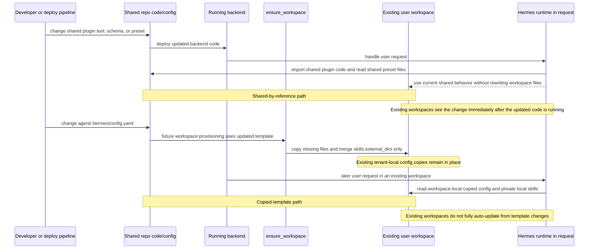

# Add Login Plan

## Summary

This document defines the design for:

- Feishu login for the Vibe-Trading web app
- Feishu chat auto-provisioning
- per-user isolated workspaces
- Hermes agent runtime integration
- Postgres-backed SaaS identity and configuration
- future per-user memory architecture

Relationship to [Multi-Tenant-Design.md](/home/chris/repo/Vibe-Trading/Multi-Tenant-Design.md):

- this document is the rollout and login integration plan
- [Multi-Tenant-Design.md](/home/chris/repo/Vibe-Trading/Multi-Tenant-Design.md) is the source of truth for shared vs personal asset boundaries
- implementation details here must stay consistent with that shared-vs-personal model

Core decisions:

- Feishu is the identity entry point for both web login and Feishu chat auto-provisioning.
- The app owns canonical user identity, tenant membership, roles, and profile mapping.
- The SaaS isolation boundary is the app-level user workspace.
- Hermes profiles are a separate Hermes framework concept for running multiple isolated Hermes agents.
- Hermes profiles must not be used as the primary SaaS end-user isolation primitive.
- End-user isolation is enforced by app workspace boundaries plus app auth/authorization.
- Recommended runtime model: one isolated Hermes runtime instance per user workspace.
- This means one `HERMES_HOME` per workspace, but not one Hermes CLI profile per end user.
- Hermes built-in memory should therefore be isolated by workspace-local Hermes homes, without conflating that with Hermes CLI profiles.
- Postgres is the long-term control-plane store.
- Session/run metadata moves to Postgres only after the login and workspace rollout is stable and tested.
- Filesystem or object storage remains the data-plane store.
- Hermes supports only one external memory provider at a time.
- A federated custom memory provider is a v3 option only, but the architecture should be ready for it from day one.

## Terms

Use these terms consistently:

- `user workspace`: the app-level tenant boundary under `workspaces/<workspace_id>/agent/`
- `workspace-local HERMES_HOME`: the Hermes runtime home for one user workspace
- `Hermes agent profile`: the Hermes CLI concept for multiple independent agent personas on one machine

Implementation rule:

- do not use Hermes agent profiles as the SaaS tenant primitive
- avoid using `profile` by itself in specs when `workspace` is the intended meaning

## Current Repo State

The current implementation is mostly file-backed and single-profile oriented:

- User/runtime data is scoped through `TERMINAL_CWD` and `get_data_root()` in [agent/runtime_env.py](/home/chris/repo/Vibe-Trading/agent/runtime_env.py).
- Session/run APIs and persistence are file-backed in [agent/api_server.py](/home/chris/repo/Vibe-Trading/agent/api_server.py) and [agent/src/session/store.py](/home/chris/repo/Vibe-Trading/agent/src/session/store.py).
- Feishu already exists as a messaging integration in [agent/api_server.py](/home/chris/repo/Vibe-Trading/agent/api_server.py), but not yet as the web login identity layer.
- `POSTGRES_URL` already exists in [agent/.env](/home/chris/repo/Vibe-Trading/agent/.env), but active user/profile/session code is not using it yet.

## Rollout Assumptions

The detailed boundary model lives in [Multi-Tenant-Design.md](/home/chris/repo/Vibe-Trading/Multi-Tenant-Design.md). This rollout plan assumes the following design decisions are already accepted:

- the app owns canonical user identity and workspace mapping
- the tenant boundary is the user workspace, not a Hermes CLI profile
- each authenticated workspace gets a workspace-local `HERMES_HOME`
- built-in Hermes memory remains per user by scoping it to the active workspace-local `HERMES_HOME`
- shared bootstrap skills are delivered through `skills.external_dirs`, not copied into every user home as the target model
- shared plugin capabilities are app-managed code, typically via installed Hermes entry-point plugins
- session and run artifacts remain in the filesystem or object storage data plane during the initial rollout

## Storage And Ownership Model For Rollout

During the login rollout:

- Postgres is the control-plane store for identity, workspace mapping, roles, entitlements, and future memory-provider configuration
- filesystem or object storage remains the data-plane store for workspace-local Hermes state, runs, sessions, uploads, artifacts, and reports
- session and run metadata should move to Postgres only after login and workspace isolation are stable

### Current Provisioning Split

The current implementation provisions from the shared template home at `/home/chris/repo/Vibe-Trading/agent/.hermes`, not from the entire `/home/chris/repo/Vibe-Trading/agent` tree.

Badge legend:

- [AUTO-UPDATED] shared-by-reference; existing workspaces see changes when the updated backend code is running
- [COPIED] copied or merged into workspace-local state; existing workspaces keep their local copy unless a migration updates it

/home/chris/repo/Vibe-Trading/
├── agent/                                                     [shared repo code]
│   ├── src/skills/                                             [AUTO-UPDATED]
│   │   ├── app-infra/                                          [AUTO-UPDATED]
│   │   └── domain/vibe-trading/                                [AUTO-UPDATED]
│   ├── src/plugins/vibe_trading/                               [AUTO-UPDATED]
│   └── .hermes/                                                [shared template source, not the tenant runtime]
│       ├── config.yaml                                         [COPIED]
│       ├── SOUL.md                                             [stays in shared template home; not copied]
│       ├── auth.json                                           [stays in shared template home; not copied]
│       ├── auth.lock                                           [stays in shared template home; not copied]
│       ├── memories/                                           [stays in shared template home; not copied]
│       ├── logs/                                               [stays in shared template home; not copied]
│       ├── sessions/                                           [stays in shared template home; not copied]
│       └── sandboxes/                                          [stays in shared template home; not copied]
├── hermes-agent/
│   └── skills/                                                 [AUTO-UPDATED]
│
├── ============================================================
├── WORKSPACE TENANCY BOUNDARY: per-user writable runtime state
├── ============================================================
│
└── workspaces/
    └── &lt;workspace_id&gt;/
        └── agent/
            ├── .hermes/                                        [workspace-local HERMES_HOME]
            │   ├── config.yaml                                 [tenant-local copy/merge result]
            │   ├── skills/                                     [private generated and user-curated local skills]
            │   ├── memories/                                   [private per-user memory]
            │   ├── logs/                                       [private runtime logs]
            │   ├── home/
            │   └── profiles/
            ├── sessions/                                       [private workspace session data]
            ├── runs/                                           [private workspace run data]
            ├── uploads/                                        [private workspace uploads]
            └── .swarm/                                         [private workspace swarm state]

Interpretation:

- `agent/src/skills/app-infra`, `agent/src/skills/domain/vibe-trading`, and `hermes-agent/skills` are the intended shared-by-reference skill sources.
- `agent/src/plugins/vibe_trading` is shared application capability, exposed through the installed Hermes entry-point plugin.
- `agent/.hermes/config.yaml` is used as a template source, but the resulting workspace `config.yaml` is tenant-local after provisioning.
- workspace-local `.hermes/skills` is tenant-private mutable runtime state, not a committed shared bootstrap library.
- workspace-local plugin directories are not part of the supported tenant model and should not be provisioned, copied, discovered, or installed into user workspaces.
- the workspace subtree under `workspaces/<workspace_id>/agent/` is the actual tenant boundary for writable runtime state.

### Update Propagation Summary

| Shared artifact | Source location | Delivery mode | Existing workspaces auto-update? | Why |
| --- | --- | --- | --- | --- |
| [AUTO-UPDATED] Vibe-Trading Hermes plugin tools | `agent/src/plugins/vibe_trading/` | loaded from shared repo code via installed entry-point plugin | yes | runtime imports the shared code directly rather than copying it into workspace homes |
| [AUTO-UPDATED] Vibe-Trading tool schemas | `agent/src/plugins/vibe_trading/schemas.py` and `agent/src/vibe_trading_helper.py` | loaded from shared repo code | yes | schemas are imported from shared Python modules at runtime |
| [AUTO-UPDATED] swarm preset configs | `agent/config/swarm/*.yaml` | loaded from shared repo files | yes | preset loader reads the repo config directory directly |
| [AUTO-UPDATED] shared skill overlays | `agent/src/skills/app-infra/`, `agent/src/skills/domain/vibe-trading/`, and `hermes-agent/skills/` | referenced via `skills.external_dirs` | yes, as long as the workspace config already includes those overlay paths | Hermes discovers those directories dynamically from config |
| [COPIED] template config defaults | `agent/.hermes/config.yaml` | copied on first provision, then partially merged | no, not generally | existing workspaces keep their tenant-local copy; only `skills.external_dirs` is currently merged forward |
| personal workspace skills | `workspaces/<workspace_id>/agent/.hermes/skills/` | created and managed inside the tenant runtime | not shared | these are local mutable skills owned by that workspace |
| policy decision | workspace-local `HERMES_HOME/plugins/` | banned | not applicable | application-level plugins are shared entry-point code, not tenant-installed artifacts |

### Auto-Update Sequence

Operational rule:

- if an artifact is loaded from shared repo code or shared repo config at runtime, existing workspaces see updates when the backend is running the new code
- if an artifact is copied into `workspaces/<workspace_id>/agent/.hermes/`, existing workspaces keep their local copy unless the provisioner or a migration explicitly updates it

## Login And Workspace Provisioning Flow

The delivery path for both web login and Feishu chat onboarding is:

1. resolve external identity
2. resolve or create app user and workspace mapping
3. create or reuse the workspace root
4. provision or refresh workspace-local Hermes defaults
5. run request-scoped Hermes execution inside that workspace boundary

The provisioner should:

- create `workspaces/<workspace_slug>/agent/.hermes/`
- seed `config.yaml` and `.env` defaults
- create empty private directories for memories, local skills, logs, and other private runtime state
- merge shared skill overlay config into the workspace config via `skills.external_dirs`
- surface app-owned shared skills from `agent/src/skills/app-infra` and `agent/src/skills/domain/vibe-trading` through `skills.external_dirs`
- expose approved shared plugin capabilities through installed app-managed entry-point plugins, not by copying shared plugins into workspaces
- ban workspace-local plugin provisioning, discovery, and installation for application-level plugins
- apply tenant entitlements
- run deterministic upgrades when shared bundles or schemas change

The runtime contract for every authenticated request or background task is:

- resolve workspace context before runtime execution
- use the workspace-local `HERMES_HOME`
- keep sessions, runs, uploads, swarm state, and memory inside that workspace boundary

## Memory Rollout Assumptions

For v1 and v2 planning:

- built-in Hermes memory is the default per-user memory layer
- only one Hermes external memory provider can be active at a time
- OpenViking and Hindsight can both be part of the long-term architecture, but not as two simultaneously active Hermes providers
- any future federated provider remains a v3 option only

## Backlog

### Shared Skill Publication

Design a deterministic backend function for promoting a workspace-local user skill into an approved shared skill location.

Proposed shape:

- `publish_workspace_skill(workspace_hermes_home, skill_name, actor, destination, approval_context)`

Required behavior:

- read only from the caller's workspace-local `HERMES_HOME`
- verify the actor is authorized to publish into the target shared scope
- require an explicit approval or moderation record before any copy occurs
- reuse deterministic path validation and security scanning from skill install/edit flows
- record provenance metadata: source workspace, publisher, approval record, publish time, source content hash
- reject prompt-driven direct file publication; the publish path must live in backend code
- support future scopes such as publish-to-org, publish-to-tenant, and publish-to-global without changing the call contract

### Hermes Runtime Isolation Follow-Up

Fix remaining import-time `HERMES_HOME` snapshots in the authenticated Hermes runtime so each request consistently uses `workspaces/<workspace_slug>/agent/.hermes`.

Priority areas:

- modules that cache `HERMES_HOME` or derived paths at import time
- `run_agent` startup that loads `.env` from `HERMES_HOME` before workspace context is applied
- authenticated session and swarm execution paths that isolate run/session directories but still rely on a process-wide Hermes home
- workspace-local `.env` handling: avoid per-request reload into `os.environ` inside the shared API process; secrets/config isolation needs a non-global config channel

### V3 Option: Federated Custom Memory Provider

Explicit v3 option:

- build a custom Vibe-Trading federated memory provider plugin
- it becomes the single active Hermes external provider
- internally it can route:
  - OpenViking for hierarchical knowledge assets and browse/retrieval
  - Hindsight for relationship recall and reflection

This is v3 only. Do not attempt it before:

- Feishu login is stable
- per-user Hermes profile isolation is stable
- initial Postgres identity rollout is stable in production

## Provider Notes

### OpenViking

OpenViking is a good fit when you want:

- self-hosted knowledge management
- filesystem-style hierarchy
- `viking://` browse/read workflows
- tiered context loading
- structured ingestion and categorized memory

References:

- <https://hermes-agent.nousresearch.com/docs/user-guide/features/memory-providers?_highlight=memory&_highlight=viki#openviking>
- [hermes-agent/plugins/memory/openviking/__init__.py](/home/chris/repo/Vibe-Trading/hermes-agent/plugins/memory/openviking/__init__.py)

### Hindsight

Hindsight is a good fit when you want:

- knowledge graph style recall
- relationship-heavy long-term memory
- reflection and synthesis
- local embedded PostgreSQL or cloud-backed operation
- auto-retain and auto-recall workflows

References:

- <https://hermes-agent.nousresearch.com/docs/user-guide/features/memory-providers?_highlight=memory&_highlight=viki#openviking>
- [hermes-agent/plugins/memory/hindsight/__init__.py](/home/chris/repo/Vibe-Trading/hermes-agent/plugins/memory/hindsight/__init__.py)

## Implementation Phases

1. Add Feishu-authenticated app user/profile mapping in Postgres.
2. Provision workspace-local Hermes homes with config defaults, empty private roots, and shared skill overlay config.
3. Make backend request handling workspace-scoped via per-request `HERMES_HOME`.
4. Keep Hermes built-in memory as the initial per-user memory solution.
5. Stabilize and test login and workspace isolation thoroughly.
6. Add Postgres-backed session/run metadata after the rollout is stable.
7. Add one optional external Hermes memory provider after workspace isolation is stable.
8. Treat a custom federated memory provider as a v3 option only.

## Risks And Constraints

- Current backend has process-global and file-global assumptions that are unsafe for SaaS multi-tenancy.
- If `HERMES_HOME` is set too late, users can leak memory, config, or session state across workspaces.
- cloning or copying full runtime homes is unsafe for new-user provisioning because it can copy private state into the wrong workspace.
- Built-in memory is frozen at session start, so mid-session memory writes do not affect the current prompt.
- Hermes supports only one external provider at a time.
- Native OpenViking + Hindsight simultaneous activation is not a supported runtime mode.
- A federated provider is a v3 option, not a v1 or v2 deliverable.
- Session/run metadata should not move into Postgres during the first login and workspace rollout because it increases migration surface area and makes tenant-isolation debugging harder.

## Acceptance Criteria

The implementation based on this plan must preserve these rules:

- the app, not Hermes, owns canonical user identity
- workspace-local `HERMES_HOME` is the per-user runtime boundary
- Postgres is used for control-plane state from day one
- session/run metadata moves to Postgres only after login and workspace rollout is stable and tested
- filesystem/object storage remains the runtime/data-plane store
- built-in Hermes memory remains enabled for every user
- only one external Hermes memory provider can be active at a time
- OpenViking and Hindsight can both be part of the long-term architecture, but not as two simultaneously active Hermes providers
- day-one architecture is ready for a future federated provider
- the federated memory provider is a v3 option explicitly, not a v1/v2 deliverable
