# Vibe-Trading Agent Architecture Design

## Overview

The Vibe-Trading Agent is a sophisticated AI-powered finance research and backtesting system built on a **ReAct (Reasoning + Acting)** architecture. It supports both single-agent workflows and multi-agent swarm teams for complex financial analysis tasks.

---

## 0. Architecture Comparison: Vibe-Trading Agent vs Hermes-Agent

### 0.1 Codebase Structure Comparison

| Aspect | Vibe-Trading Agent | Hermes-Agent |
|--------|-------------------|--------------|
| **Location** | `/agent/src/` | `/hermes-agent/` |
| **Total Lines** | ~5,400 (Python) | ~50,000+ (Python) |
| **Agent Core** | `agent/loop.py` (13.7K) | `run_agent.py` (9,600+), `agent_loop.py` (535) |
| **Tools Count** | 18 tools | 40+ tools |
| **Tool Organization** | Flat directory | Modular with toolsets and runtime plugins |
| **Multi-Agent** | Custom swarm implementation | Mixture of Agents + Swarm |
| **Session Storage** | File-based (JSON/JSONL) | SQLite + file hybrid |
| **Memory System** | WorkspaceMemory (simple dict) | Full memory manager with search |
| **CLI** | Fire-based (`cli.py` 55K) | Rich-based with progress UI |
| **API Server** | FastAPI (`api_server.py` 34K) | Multiple gateways |

### 0.2 Agent Loop Architecture Comparison

#### Vibe-Trading AgentLoop
```
┌─────────────────────────────────────────────────────────────┐
│                    Vibe-Trading AgentLoop                   │
│                      (~300 lines core)                      │
├─────────────────────────────────────────────────────────────┤
│                                                             │
│  ┌─────────────┐    ┌─────────────┐    ┌─────────────┐     │
│  │  Sync Loop  │───▶│  stream_chat│───▶│ Tool Exec   │     │
│  │  (blocking) │    │  (OpenAI)   │    │ (sequential)│     │
│  └─────────────┘    └─────────────┘    └──────┬──────┘     │
│                                                │            │
│  ┌─────────────────────────────────────────────┘            │
│  │                                                          │
│  ▼                                                          │
│  ┌─────────────┐    ┌─────────────┐    ┌─────────────┐     │
│  │3-Layer      │───▶│Background   │───▶│Trace Writer │     │
│  │Compression  │    │Task Notifs  │    │(JSONL)      │     │
│  └─────────────┘    └─────────────┘    └─────────────┘     │
│                                                             │
│  Features:                                                  │
│  • Simple sequential tool execution                         │
│  • 3-layer context compression                              │
│  • Background task notifications                            │
│  • Basic event callbacks                                    │
│  • File-based tracing                                       │
│                                                             │
└─────────────────────────────────────────────────────────────┘
```

#### Hermes-Agent AIAgent
```
┌──────────────────────────────────────────────────────────────────────┐
│                        Hermes-Agent AIAgent                          │
│                         (~1,500 lines core)                          │
├──────────────────────────────────────────────────────────────────────┤
│                                                                      │
│  ┌────────────────┐    ┌────────────────┐    ┌────────────────┐     │
│  │  Async Loop    │───▶│ Multi-Provider │───▶│ Parallel Tool  │     │
│  │  (asyncio)     │    │ Support        │    │ Execution      │     │
│  └────────────────┘    └────────────────┘    └───────┬────────┘     │
│                                                      │               │
│  ┌───────────────────────────────────────────────────┘               │
│  │                                                                    │
│  ▼                                                                    │
│  ┌────────────────┐    ┌────────────────┐    ┌────────────────┐      │
│  │Context         │───▶│Interrupt       │───▶│Subagent        │      │
│  │Compressor      │    │Handling        │    │Delegation      │      │
│  │(32K lines)     │    │                │    │                │      │
│  └────────────────┘    └────────────────┘    └────────────────┘      │
│                                                                      │
│  ┌────────────────┐    ┌────────────────┐    ┌────────────────┐      │
│  │Session Search  │───▶│Memory          │───▶│Provider        │      │
│  │& Recovery      │    │Management      │    │Routing         │      │
│  └────────────────┘    └────────────────┘    └────────────────┘      │
│                                                                      │
│  Features:                                                           │
│  • Async/await throughout                                            │
│  • Parallel tool execution with conflict detection                   │
│  • Multi-provider support (OpenAI, Anthropic, OpenRouter, etc.)      │
│  • Session persistence and search                                    │
│  • Subagent delegation with budget sharing                           │
│  • Interrupt handling for long-running tasks                         │
│  • Checkpoint/snapshot support                                       │
│  • Rich progress UI with spinners                                    │
│  • Credential pool for multi-key rotation                            │
│                                                                      │
└──────────────────────────────────────────────────────────────────────┘
```

### 0.3 Detailed Component Comparison

| Component | Vibe-Trading | Hermes-Agent | Analysis |
|-----------|--------------|--------------|----------|
| **Agent Loop** | `AgentLoop` class, sync | `AIAgent` class, async | Hermes has better concurrency |
| **Tool Execution** | Sequential | Parallel (8 workers) | Hermes faster for multi-tools |
| **Tool Registry** | Simple dict | Full registry with schemas | Hermes more robust |
| **Context Management** | 3-layer compression | 3-layer + smart compaction | Comparable |
| **Memory** | `WorkspaceMemory` (dict) | `MemoryManager` + search | Hermes has full RAG |
| **Session Storage** | File-based | SQLite + file | Hermes more queryable |
| **Streaming** | Basic text chunks | Full delta streaming | Hermes more responsive UI |
| **Multi-Agent** | Custom WorkflowRuntime | MoA + Swarm + Delegation | Hermes more mature |
| **Interrupts** | Cancel flag only | Full interrupt system | Hermes more user-friendly |
| **Subagents** | `SubagentTool` (basic) | Full delegation with budget | Hermes more powerful |
| **Backends** | Local only | Local, Docker, Modal, Daytona | Hermes more deployment options |
| **Testing** | Minimal | Extensive test suite | Hermes production-ready |

### 0.4 Tool System Comparison

#### Vibe-Trading Tools (18 total)
```python
# Core File Tools
- bash_tool.py        # Shell execution
- read_file_tool.py   # File reading
- write_file_tool.py  # File writing
- edit_file_tool.py   # String replacement editing

# Domain Tools (Finance)
- backtest_tool.py           # Strategy backtesting
- factor_analysis_tool.py    # Financial factor analysis
- options_pricing_tool.py    # Options calculations
- pattern_tool.py            # Pattern recognition

# Integration Tools
- web_reader_tool.py   # Web scraping
- doc_reader_tool.py   # PDF reading
- load_skill_tool.py   # Skill loading

# Multi-Agent
- subagent_tool.py     # Spawn sub-agent
- swarm_tool.py        # Run swarm preset

# Background Tasks
- background_tools.py  # Background task manager
- task_tools.py        # Task creation/management

# Utility
- compact_tool.py      # Context compression
```

#### Hermes-Agent Tools (40+ total)
```python
# File Operations (Advanced)
- file_operations.py   # Advanced file ops (patch, fuzzy match)
- file_tools.py        # Read/write with binary support

# Terminal/Execution
- terminal_tool.py     # Multi-backend terminal (local, docker, modal, daytona)
- code_execution_tool.py  # Sandboxed code execution

# Browser
- browser_tool.py      # Full browser automation (CamoFox)
- browser_camofox.py   # Stealth browser

# Memory & Context
- memory_tool.py       # Full memory system with RAG
- checkpoint_manager.py # State snapshots
- context_compressor.py # Advanced compression

# Web
- web_reader_tool.py   # Web scraping
- web_search_tool.py   # Search integration

# Multi-Agent
- delegate_tool.py     # Subagent delegation with full isolation
- mixture_of_agents_tool.py  # MoA pattern

# Integration
- mcp_tool.py          # MCP (Model Context Protocol)
- homeassistant_tool.py # Home Assistant
- image_generation_tool.py  # Image gen
- cronjob_tools.py     # Cron scheduling
- clarify_tool.py      # User clarification
- approval.py          # Human-in-the-loop approval
- interrupt.py         # Interrupt handling
# ... and many more
```

#### Current Vibe-Trading on Hermes Integration

The current migration path does **not** register Vibe-Trading tools as Hermes built-ins.

- Vibe-Trading tool definitions live in:
  - `/home/chris/repo/Vibe-Trading/agent/src/hermes_tool_adapter/vibe_trading_finance.py`
  - `/home/chris/repo/Vibe-Trading/agent/src/hermes_tool_adapter/vibe_trading_compat.py`
- Those modules export schemas and handlers, but do not call `registry.register(...)` at import time.
- Runtime registration is performed by a repo-local Hermes plugin:
  - `/home/chris/repo/Vibe-Trading/.hermes/plugins/vibe-trading/`
- Hermes discovers that plugin only when:
  - the working directory is `/home/chris/repo/Vibe-Trading`
  - `HERMES_ENABLE_PROJECT_PLUGINS=true`
This is the preferred SDK-style integration because it avoids source-level changes to Hermes core and keeps Vibe-Trading as a project-scoped extension.

Recommendation: do not rely on injecting the repo root into the model's ephemeral system prompt to make tools or plugins discoverable. Instead configure the agent runtime and file/terminal tools to start in the project root (for example by setting the `TERMINAL_CWD` environment variable or calling the repo helper `prepare_hermes_project_context()` before agent construction). Tools read `TERMINAL_CWD` at init time to determine their default working directory; setting it ensures plugin discovery and file operations begin from the correct repo root.

### 0.5 Can Vibe-Trading Agent Be Replaced by Hermes-Agent?

#### Answer: **Yes, with Customization**

Hermes-Agent is a **strict superset** of Vibe-Trading Agent functionality. Here's the migration analysis:

| Feature | Migration Path | Effort |
|---------|---------------|--------|
| **Core ReAct Loop** | Replace `AgentLoop` with `HermesAgentLoop` | Low |
| **Finance Tools** | Expose Vibe-Trading finance tools through Hermes runtime plugin registration | Medium |
| **Skills System** | Vibe-Trading skills are markdown-based; Hermes uses different skill format | Medium |
| **Swarm System** | Replace custom `WorkflowRuntime` with Hermes `SwarmTool` + presets | Low-Medium |
| **Session Management** | Replace file-based with Hermes SQLite session store | Low |
| **Backtest Runner** | Port `Runner` class to Hermes code execution tool | Medium |
| **Background Tasks** | Replace with Hermes cronjob tools or delegate tool | Low |

#### Migration Blockers (None Critical)

1. **Finance Domain Tools**: Need Hermes-compatible runtime registration and lifecycle management for ~4 finance-specific tools
2. **Skills Format**: Different markdown structure
3. **Artifact Handling**: Vibe-Trading has specific backtest artifact structure

#### Benefits of Migration

| Benefit | Explanation |
|---------|-------------|
| **More Tools** | 40+ vs 18 tools |
| **Better Terminal** | Multi-backend (Docker, Modal, Daytona) vs local only |
| **Parallel Execution** | Faster multi-tool operations |
| **Production Ready** | Extensive testing, interrupt handling, credential pools |
| **Memory System** | Full RAG vs simple dict |
| **Browser Automation** | CamoFox stealth browser |
| **MCP Support** | Model Context Protocol for external integrations |
| **Active Development** | Larger community, more contributors |

#### Migration Strategy

```
Phase 1: Tool Runtime Integration (1-2 weeks)
├── Extract Hermes-facing schemas/handlers from Vibe-Trading tools
├── Register finance tools via Hermes plugin runtime
├── Register compatibility aliases via Hermes plugin runtime
└── Remove hard-coded built-in imports from Hermes core

Phase 2: Skills Migration (1 week)
├── Convert skill format
└── Migrate 64 skills

Phase 3: Swarm Migration (3-5 days)
├── Convert swarm presets
└── Test multi-agent workflows

Phase 4: API/CLI Adaptation (3-5 days)
├── Update API endpoints
└── Adapt CLI commands

Phase 5: Testing (1 week)
├── Backtest verification
└── End-to-end testing
```

### 0.6 Recommendation

**Migrate to Hermes-Agent** for the following reasons:

1. **Strict Superset**: Hermes has everything Vibe-Trading has, plus much more
2. **Production Quality**: Better error handling, testing, stability
3. **Active Maintenance**: Regular updates, bug fixes
4. **Ecosystem**: Larger tool ecosystem, more integrations
5. **Future-Proof**: MCP support, multi-backend terminals

The Vibe-Trading Agent can be viewed as a **minimal viable implementation** that validated the concept. Hermes-Agent is the **production-grade evolution** of that concept.

---

---

## 1. System Architecture

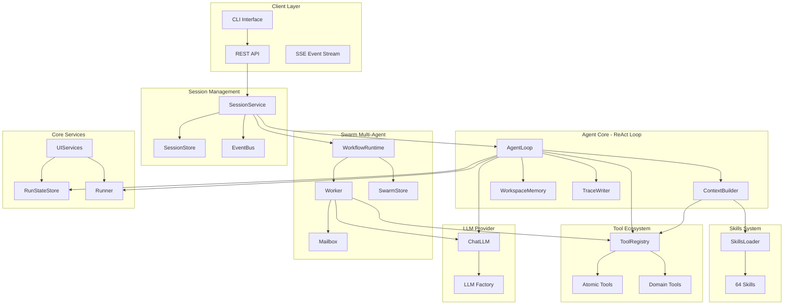
```mermaid
graph TB
    subgraph "Client Layer"
        CLI[CLI Interface]
        API[REST API]
        SSE[SSE Event Stream]
    end

    subgraph "Session Management"
        SS[SessionService]
        SM[SessionStore]
        EB[EventBus]
    end

    subgraph "Agent Core - ReAct Loop"
        AL[AgentLoop]
        CB[ContextBuilder]
        WM[WorkspaceMemory]
        TR[TraceWriter]
    end

    subgraph "LLM Provider"
        LLM[ChatLLM]
        LF[LLM Factory]
    end

    subgraph "Tool Ecosystem"
        BR[ToolRegistry]
        AT[Atomic Tools]
        DT[Domain Tools]
    end

    subgraph "Skills System"
        SL[SkillsLoader]
        SK[64 Skills]
    end

    subgraph "Swarm Multi-Agent"
        SR[WorkflowRuntime]
        SW[Worker]
        ST[SwarmStore]
        MB[Mailbox]
    end

    subgraph "Core Services"
        RS[RunStateStore]
        RN[Runner]
        UIS[UIServices]
    end

    CLI --> API
    API --> SS
    SS --> SM
    SS --> EB
    SS --> AL
    AL --> CB
    AL --> WM
    AL --> TR
    AL --> LLM
    AL --> BR
    CB --> SL
    CB --> BR
    BR --> AT
    BR --> DT
    SL --> SK
    SS --> SR
    SR --> SW
    SR --> ST
    SW --> MB
    SW --> LLM
    SW --> BR
    AL --> RS
    AL --> RN
    UIS --> RS
    UIS --> RN

    LLM --> LF
```

---

## 1.1 Deterministic Agent-Coding Run Bootstrap

This section defines the **deterministic workflow contract** for any session or swarm task that enters an **agent_coding** style workflow:

- generate files from a natural-language request
- execute tools against those files
- iteratively refine artifacts in a run directory

`backtest` is one important use case of this pattern, but it is not the pattern itself.

### 1.1.1 Problem Statement

The underlying problem is broader than backtesting:

- agent execution is probabilistic
- tool ordering can drift
- runtime state can be lost if not persisted to the run directory
- execution tools often require concrete filesystem artifacts that may not exist yet

The original Vibe-Trading `AgentLoop` always persisted the request into `req.json` before the agent started:

- `RunStateStore.save_request(run_dir, user_message, {"session_id": ...})`

During the Hermes migration, the session runtime preserved the run directory creation step but lost the **request persistence and deterministic preconditions** step. That created a failure mode where the LLM could invoke an execution tool before the required files existed.

The concrete incident that exposed this design gap was the backtest flow:

- `backtest(run_dir=...)` requires `config.json` and `code/signal_engine.py`
- the model sometimes called `backtest` first, producing:

- `config.json not found`

The design conclusion is general:

- any agent_coding workflow must be deterministic at the runtime boundary
- request persistence is mandatory
- domain-specific bootstrap may vary by workflow
- prompt instructions alone are insufficient

The signal-engine boundary also needs defensive normalization because generated
strategy code is not always syntactically valid for the active Python runtime.
One concrete failure came from Python 3.12 rejecting:

- `from typing import Dict, Series, DataFrame`

The runtime now treats `signal_engine.py` as a semi-structured artifact:

- `setup_backtest_run(...)` normalizes common bad annotations on write
- `backtest/runner.py` normalizes the same cases again before module execution
- strategy guidance now requires `pd.DataFrame` / `pd.Series` annotations
- optimizer sizing belongs in `config.json.optimizer`, not handwritten inside placeholder strategy code

### 1.1.2 Design Goals

1. Any agent_coding run must have a deterministic filesystem source of truth before the first meaningful tool call.
2. Session-mode Hermes execution must preserve the original Vibe-Trading run bootstrap behavior.
3. The run directory must always contain enough persisted context to reconstruct missing workflow inputs.
4. The design must work for:
   - session runtime
   - CLI runtime
   - swarm workers
   - domain-tool fallback recovery
5. The mechanism must separate:
   - generic run bootstrap responsibilities
   - workflow-specific artifact bootstrap responsibilities
6. Any bootstrap must be safe and minimal: create a valid executable substrate, then allow later refinement by the agent.

### 1.1.3 Deterministic Invariants

For any prompt entering an agent_coding workflow:

1. A unique `run_dir` is created before agent execution.
2. `req.json` is written to `run_dir` before the first tool call.
3. The saved request must include the original natural-language prompt.
4. The generic bootstrap layer persists request intent independent of the model’s internal reasoning state.
5. A workflow-specific bootstrap layer may materialize starter files required by execution tools.
6. If the agent reaches a strict execution tool too early, that tool may recover by consulting `req.json` and the workflow bootstrap layer.
7. The LLM prompt is advisory; the filesystem bootstrap is authoritative.

### 1.1.4 Generic vs Workflow-Specific Responsibilities

| Layer | Scope | Responsibility |
|------|-------|----------------|
| Generic agent_coding bootstrap | All coding/generation workflows | create `run_dir`, persist `req.json`, maintain deterministic run-level context |
| Workflow bootstrap | Domain-specific | derive starter artifacts needed for a particular execution path |
| Execution tool fallback | Domain-specific | recover from missing files using persisted request context |

In the current implementation:

- the **generic** layer is `RunStateStore.save_request(...)` plus session runtime run-dir creation
- the **workflow-specific** layer is `src.backtest.bootstrap`
- the **execution fallback** layer is `backtest_tool.run_backtest(...)`

### 1.1.5 Runtime Components

| Component | Responsibility |
|----------|----------------|
| `RunStateStore` | Creates `run_dir` and persists `req.json` for all agent_coding runs |
| `SessionService` | Restores original pre-agent request persistence and dispatches workflow bootstrap |
| Workflow bootstrap module | Domain-specific starter artifact generation |
| Domain execution tool | Final recovery layer when the agent calls execution too early |
| `ContextBuilder` / Hermes ephemeral prompt | Advisory instructions only; not the deterministic layer |

| Working directory configuration | File/terminal tools should be anchored by runtime config (e.g. `TERMINAL_CWD`) rather than by prompt text |

### 1.1.6 Sequence Diagram

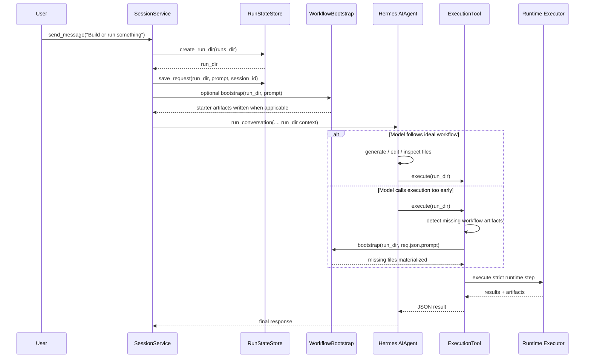
```mermaid
sequenceDiagram
    participant U as User
    participant SS as SessionService
    participant RS as RunStateStore
    participant WB as WorkflowBootstrap
    participant AI as Hermes AIAgent
    participant ET as ExecutionTool
    participant EX as Runtime Executor

    U->>SS: send_message("Build or run something")
    SS->>RS: create_run_dir(runs_dir)
    RS-->>SS: run_dir
    SS->>RS: save_request(run_dir, prompt, session_id)
    SS->>WB: optional bootstrap(run_dir, prompt)
    WB-->>SS: starter artifacts written when applicable
    SS->>AI: run_conversation(..., run_dir context)

    alt Model follows ideal workflow
        AI->>AI: generate / edit / inspect files
        AI->>ET: execute(run_dir)
    else Model calls execution too early
        AI->>ET: execute(run_dir)
        ET->>ET: detect missing workflow artifacts
        ET->>WB: bootstrap(run_dir, req.json.prompt)
        WB-->>ET: missing files materialized
    end

    ET->>EX: execute strict runtime step
    EX-->>ET: results + artifacts
    ET-->>AI: JSON result
    AI-->>SS: final response
```

### 1.1.7 Backtest Specialization Sequence

The current backtest implementation is a specialization of the generic pattern:

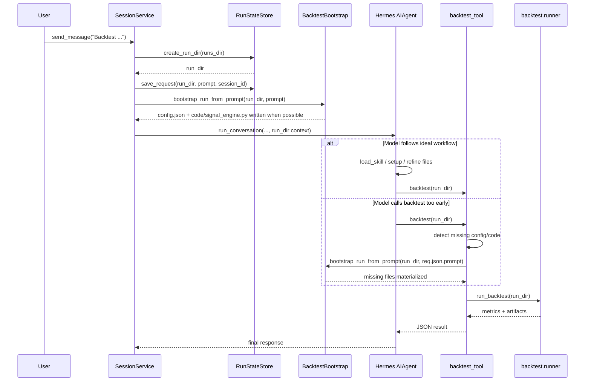
```mermaid
sequenceDiagram
    participant U as User
    participant SS as SessionService
    participant RS as RunStateStore
    participant BR as BacktestBootstrap
    participant AI as Hermes AIAgent
    participant BT as backtest_tool
    participant EN as backtest.runner

    U->>SS: send_message("Backtest ...")
    SS->>RS: create_run_dir(runs_dir)
    RS-->>SS: run_dir
    SS->>RS: save_request(run_dir, prompt, session_id)
    SS->>BR: bootstrap_run_from_prompt(run_dir, prompt)
    BR-->>SS: config.json + code/signal_engine.py written when possible
    SS->>AI: run_conversation(..., run_dir context)

    alt Model follows ideal workflow
        AI->>AI: load_skill / setup / refine files
        AI->>BT: backtest(run_dir)
    else Model calls backtest too early
        AI->>BT: backtest(run_dir)
        BT->>BT: detect missing config/code
        BT->>BR: bootstrap_run_from_prompt(run_dir, req.json.prompt)
        BR-->>BT: missing files materialized
    end

    BT->>EN: run_backtest(run_dir)
    EN-->>BT: metrics + artifacts
    BT-->>AI: JSON result
    AI-->>SS: final response
```

### 1.1.8 Class Diagram

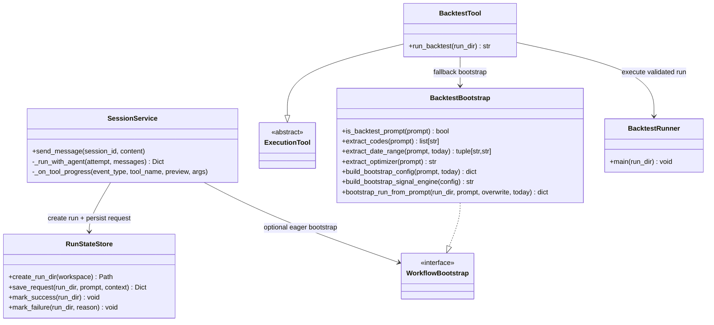
```mermaid
classDiagram
    class SessionService {
        +send_message(session_id, content)
        -_run_with_agent(attempt, messages) Dict
        -_on_tool_progress(event_type, tool_name, preview, args)
    }

    class RunStateStore {
        +create_run_dir(workspace) Path
        +save_request(run_dir, prompt, context) Dict
        +mark_success(run_dir) void
        +mark_failure(run_dir, reason) void
    }

    class WorkflowBootstrap {
        <<interface>>
    }

    class BacktestBootstrap {
        +is_backtest_prompt(prompt) bool
        +extract_codes(prompt) list[str]
        +extract_date_range(prompt, today) tuple[str,str]
        +extract_optimizer(prompt) str
        +build_bootstrap_config(prompt, today) dict
        +build_bootstrap_signal_engine(config) str
        +bootstrap_run_from_prompt(run_dir, prompt, overwrite, today) dict
    }

    class ExecutionTool {
        <<abstract>>
    }

    class BacktestTool {
        +run_backtest(run_dir) str
    }

    class BacktestRunner {
        +main(run_dir) void
    }

    SessionService --> RunStateStore : create run + persist request
    SessionService --> WorkflowBootstrap : optional eager bootstrap
    BacktestBootstrap ..|> WorkflowBootstrap
    BacktestTool --|> ExecutionTool
    BacktestTool --> BacktestBootstrap : fallback bootstrap
    BacktestTool --> BacktestRunner : execute validated run
```

### 1.1.9 Control Flow

#### Step 1: Run directory creation

The runtime creates a fresh run directory using `RunStateStore.create_run_dir(...)`.

#### Step 2: Request persistence

Before the LLM starts, the runtime writes:

- `run_dir/req.json`

This restores the original `AgentLoop` behavior and creates a durable source of truth for later recovery.

**Path contract**

- Session runtime path: `backend/runs/<run_id>/req.json`
- Swarm runtime path: `<swarm_run_dir>/.../req.json` if the same bootstrap contract is applied at worker/task scope
- The file is always written at the **root of the active run directory**, not under `artifacts/` or `logs/`

**Current session-mode implementation**

- `RunStateStore.save_request(run_dir, prompt, {"session_id": sid})`
- This produces `req.json` at:
  - `/home/chris/repo/Vibe-Trading/backend/runs/<run_id>/req.json`

**File schema**

```json
{
  "prompt": "Backtest AAPL and MSFT for full-year 2024",
  "context": {
    "session_id": "4374cc29a546"
  }
}
```

**Required fields**

| Field | Type | Required | Meaning |
|------|------|----------|---------|
| `prompt` | `string` | Yes | Original natural-language user request for deterministic recovery |
| `context` | `object` | Yes | Runtime metadata associated with the request |
| `context.session_id` | `string` | Yes in session mode | Session identifier used by the runtime |

**Why this file matters**

- It is the authoritative recovery input for workflow bootstrap modules
- It allows strict execution tools to reconstruct missing workflow artifacts
- It preserves original-user intent independently of LLM tool-order decisions

#### Step 3: Workflow bootstrap

After request persistence, the runtime may optionally invoke a workflow-specific bootstrap module.

This layer is **not generic by artifact shape**. Different workflows may need different starter files.

Current specialization:

`src.backtest.bootstrap.bootstrap_run_from_prompt(...)` attempts to derive:

- `codes`
- `start_date`
- `end_date`
- `optimizer`

from the natural-language prompt and writes:

- `run_dir/config.json`
- `run_dir/code/signal_engine.py`

The generated `SignalEngine` is intentionally simple:

- equal-weight starter engine by default
- optimizer-friendly constant directional weights when an optimizer is requested

This is not meant to be the final strategy implementation. It is a **valid executable substrate** that lets the rest of the workflow proceed deterministically.

#### Step 4: LLM-guided refinement

The agent may still:

- replace `config.json`
- replace `code/signal_engine.py`
- call `setup_backtest_run(...)`
- iterate after observing metrics

The deterministic bootstrap does not remove flexibility. It removes the invalid initial state.

#### Step 5: Execution-tool fallback recovery

Each strict execution tool may implement a domain-specific recovery path.

Current specialization:

If the agent still calls `backtest(run_dir=...)` before writing files, `backtest_tool.run_backtest(...)`:

1. checks for `config.json` and `code/signal_engine.py`
2. reads `req.json` if they are missing
3. re-runs `bootstrap_run_from_prompt(...)`
4. only returns a missing-file error if recovery still fails

This makes `backtest` the final guardrail in the deterministic workflow.

### 1.1.10 Why Prompt Instructions Alone Are Insufficient

Prompt instructions help, but they are not a correctness boundary. In this system:

- model behavior is probabilistic
- tool order can drift between turns
- swarm and session runtimes can differ
- user prompts can be underspecified

Therefore the invariant must be enforced in the runtime and filesystem contract, not just the prompt contract.

### 1.1.11 Compatibility With the Original Agent

This design intentionally preserves the original Vibe-Trading agent principle:

- the run directory is the source of truth
- the request is persisted before execution
- downstream tools operate on files, not hidden in-memory state

The Hermes runtime keeps its richer tool ecosystem and session model, but the backtest workflow now honors the original Vibe-Trading deterministic run semantics.

### 1.1.12 Regression Coverage

The deterministic design is covered by regression tests:

| Test | Guarantee |
|------|-----------|
| `test_run_with_agent_persists_req_json_before_agent_execution` | Generic agent_coding request persistence happens before Hermes execution |
| `test_run_with_agent_injects_backtest_setup_workflow_prompt` | Advisory prompt still instructs correct tool order |
| `test_bootstrap_run_from_prompt_generates_config_and_signal` | Backtest specialization creates valid starter `config.json` and `signal_engine.py` |
| `test_run_backtest_bootstraps_from_req_when_config_missing` | Backtest execution fallback recovers from missing files using `req.json` |

These tests live in:

- [test_hermes_sse_regression.py](/home/chris/repo/Vibe-Trading/backend/tests/regression/test_hermes_sse_regression.py)
- [test_backtest_bootstrap.py](/home/chris/repo/Vibe-Trading/backend/tests/regression/test_backtest_bootstrap.py)

Any future refactor of session runtime, swarm runtime, or backtest tool behavior must preserve these invariants.

---

## 2. Dual Agent Architecture Patterns

The system implements **two complementary agent loop patterns** for different use cases:

### 2.1 Pattern Comparison

| Aspect | `AIAgent` (run_agent.py) | `HermesAgentLoop` (agent_loop.py) |
|--------|--------------------------|-----------------------------------|
| **Purpose** | Full-featured CLI/API agent | Lightweight RL environment agent |
| **Use Case** | Interactive user sessions | Training & benchmarking |
| **Lines of Code** | ~9,600 | ~535 |
| **Dependencies** | Full hermes-agent stack | Minimal (tools, server interface) |
| **Context Management** | 3-layer compression | Budget-based persistence |
| **Parallel Tool Execution** | Yes (thread pool) | Yes (thread pool) |
| **Session Persistence** | Full | Ephemeral |
| **Subagent Support** | Yes | No |
| **Interrupt Handling** | Yes | No |

### 2.2 Class Diagram - Dual Agent Patterns

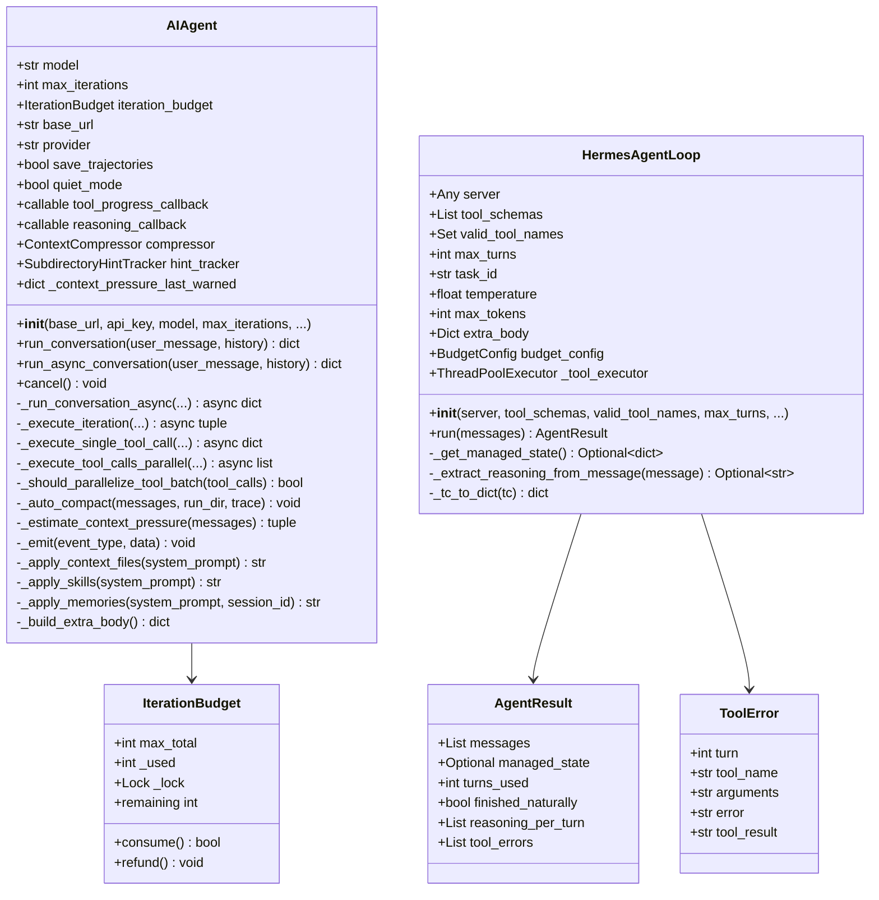
```mermaid
classDiagram
    class AIAgent {
        +str model
        +int max_iterations
        +IterationBudget iteration_budget
        +str base_url
        +str provider
        +bool save_trajectories
        +bool quiet_mode
        +callable tool_progress_callback
        +callable reasoning_callback
        +ContextCompressor compressor
        +SubdirectoryHintTracker hint_tracker
        +dict _context_pressure_last_warned
        +__init__(base_url, api_key, model, max_iterations, ...)
        +run_conversation(user_message, history) dict
        +run_async_conversation(user_message, history) dict
        +cancel() void
        -_run_conversation_async(...) async dict
        -_execute_iteration(...) async tuple
        -_execute_single_tool_call(...) async dict
        -_execute_tool_calls_parallel(...) async list
        -_should_parallelize_tool_batch(tool_calls) bool
        -_auto_compact(messages, run_dir, trace) void
        -_estimate_context_pressure(messages) tuple
        -_emit(event_type, data) void
        -_apply_context_files(system_prompt) str
        -_apply_skills(system_prompt) str
        -_apply_memories(system_prompt, session_id) str
        -_build_extra_body() dict
    }

    class HermesAgentLoop {
        +Any server
        +List tool_schemas
        +Set valid_tool_names
        +int max_turns
        +str task_id
        +float temperature
        +int max_tokens
        +Dict extra_body
        +BudgetConfig budget_config
        +ThreadPoolExecutor _tool_executor
        +__init__(server, tool_schemas, valid_tool_names, max_turns, ...)
        +run(messages) AgentResult
        -_get_managed_state() Optional~dict~
        -_extract_reasoning_from_message(message) Optional~str~
        -_tc_to_dict(tc) dict
    }

    class IterationBudget {
        +int max_total
        +int _used
        +Lock _lock
        +consume() bool
        +refund() void
        +remaining int
    }

    class AgentResult {
        +List messages
        +Optional managed_state
        +int turns_used
        +bool finished_naturally
        +List reasoning_per_turn
        +List tool_errors
    }

    class ToolError {
        +int turn
        +str tool_name
        +str arguments
        +str error
        +str tool_result
    }

    AIAgent --> IterationBudget
    HermesAgentLoop --> AgentResult
    HermesAgentLoop --> ToolError
```

### 2.3 AIAgent (Full-Featured Pattern)

**Location**: `hermes-agent/run_agent.py:437`

**Key Responsibilities**:
- Full conversational agent with interactive capabilities
- 3-layer context compression (micro/auto/manual)
- Parallel tool execution with safety checks
- Session memory and persistence
- Subagent delegation
- Provider-specific optimizations (OpenRouter, Anthropic, etc.)
- Trajectory saving for analysis
- Interrupt handling for long-running operations

**Design Patterns Used**:
- **ReAct**: Core reasoning loop (Thought → Action → Observation)
- **Circuit Breaker**: Context pressure handling
- **Strategy**: Provider-specific implementations
- **Observer**: Event callbacks for UI updates
- **Budget**: Iteration budget for controlling loop execution

### 2.4 HermesAgentLoop (RL-Optimized Pattern)

**Location**: `hermes-agent/environments/agent_loop.py:119`

**Key Responsibilities**:
- Minimal overhead for training environments
- Standard OpenAI tool calling spec
- Thread pool for async-safe tool execution
- Per-loop TodoStore for ephemeral task tracking
- Budget-based tool result persistence
- ManagedServer state extraction for RL training

**Design Patterns Used**:
- **ReAct**: Simplified reasoning loop
- **Template Method**: Standardized run() method
- **Thread Pool**: Concurrent tool execution
- **Data Transfer Object**: AgentResult for clean return values

---

## 3. Agent Reasoning to Action Process

### 3.1 ReAct Pattern Implementation

Both agents implement the **ReAct (Reasoning + Acting)** pattern:

```
┌─────────────────────────────────────────────────────────────────┐
│                        ReAct Loop                               │
├─────────────────────────────────────────────────────────────────┤
│                                                                 │
│  ┌──────────┐    ┌──────────┐    ┌──────────┐    ┌──────────┐  │
│  │  Thought │───▶│  Action  │───▶│Observation│───▶│  Thought │  │
│  │ (Reason) │    │  (Tool)  │    │ (Result)  │    │ (Update) │  │
│  └──────────┘    └──────────┘    └──────────┘    └─────┬────┘  │
│                                                        │       │
│  ┌─────────────────────────────────────────────────────┘       │
│  │                                                             │
│  ▼                                                             │
│  ┌──────────┐                                                  │
│  │  Final   │  ◀── When no tool calls needed                   │
│  │  Answer  │                                                  │
│  └──────────┘                                                  │
│                                                                 │
└─────────────────────────────────────────────────────────────────┘
```

### 3.2 Sequence Diagram - AIAgent ReAct Loop

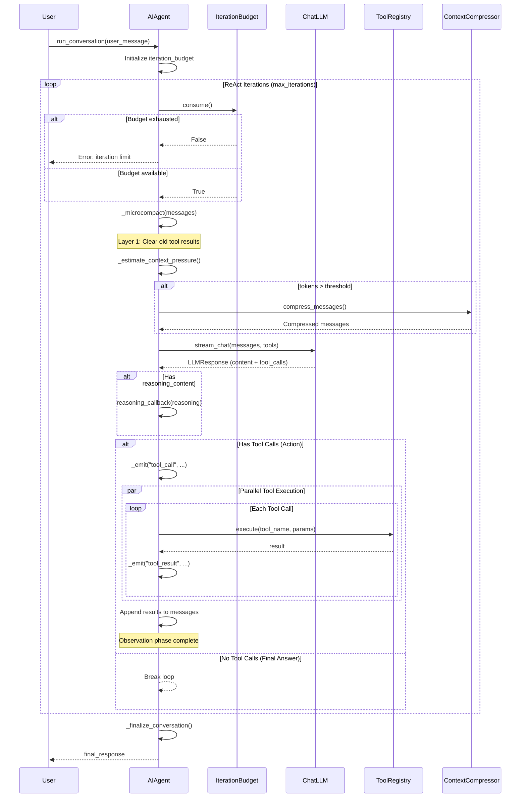
```mermaid
sequenceDiagram
    participant U as User
    participant AA as AIAgent
    participant IB as IterationBudget
    participant LLM as ChatLLM
    participant TC as ToolRegistry
    participant CC as ContextCompressor

    U->>AA: run_conversation(user_message)
    AA->>AA: Initialize iteration_budget

    loop ReAct Iterations (max_iterations)
        AA->>IB: consume()
        alt Budget exhausted
            IB-->>AA: False
            AA-->>U: Error: iteration limit
        else Budget available
            IB-->>AA: True
        end

        AA->>AA: _microcompact(messages)
        Note over AA: Layer 1: Clear old tool results

        AA->>AA: _estimate_context_pressure()
        alt tokens > threshold
            AA->>CC: compress_messages()
            CC-->>AA: Compressed messages
        end

        AA->>LLM: stream_chat(messages, tools)
        LLM-->>AA: LLMResponse (content + tool_calls)

        alt Has reasoning_content
            AA->>AA: reasoning_callback(reasoning)
        end

        alt Has Tool Calls (Action)
            AA->>AA: _emit("tool_call", ...)

            par Parallel Tool Execution
                loop Each Tool Call
                    AA->>TC: execute(tool_name, params)
                    TC-->>AA: result
                    AA->>AA: _emit("tool_result", ...)
                end
            end

            AA->>AA: Append results to messages
            Note over AA: Observation phase complete

        else No Tool Calls (Final Answer)
            AA-->>AA: Break loop
        end
    end

    AA->>AA: _finalize_conversation()
    AA-->>U: final_response
```

### 3.3 Sequence Diagram - HermesAgentLoop ReAct Loop

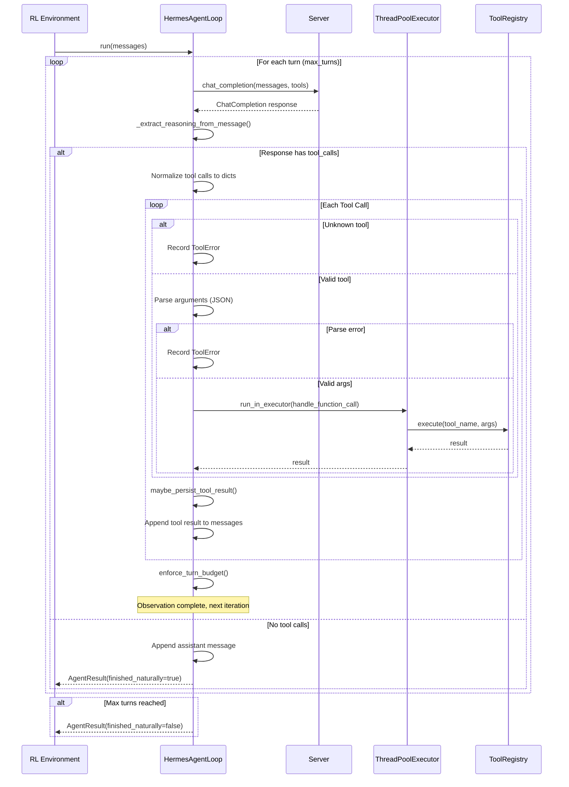
```mermaid
sequenceDiagram
    participant Env as RL Environment
    participant HAL as HermesAgentLoop
    participant S as Server
    participant TE as ThreadPoolExecutor
    participant TC as ToolRegistry

    Env->>HAL: run(messages)

    loop For each turn (max_turns)
        HAL->>S: chat_completion(messages, tools)
        S-->>HAL: ChatCompletion response

        HAL->>HAL: _extract_reasoning_from_message()

        alt Response has tool_calls
            HAL->>HAL: Normalize tool calls to dicts

            loop Each Tool Call
                alt Unknown tool
                    HAL->>HAL: Record ToolError
                else Valid tool
                    HAL->>HAL: Parse arguments (JSON)

                    alt Parse error
                        HAL->>HAL: Record ToolError
                    else Valid args
                        HAL->>TE: run_in_executor(handle_function_call)
                        TE->>TC: execute(tool_name, args)
                        TC-->>TE: result
                        TE-->>HAL: result
                    end
                end

                HAL->>HAL: maybe_persist_tool_result()
                HAL->>HAL: Append tool result to messages
            end

            HAL->>HAL: enforce_turn_budget()
            Note over HAL: Observation complete, next iteration

        else No tool calls
            HAL->>HAL: Append assistant message
            HAL-->>Env: AgentResult(finished_naturally=true)
        end
    end

    alt Max turns reached
        HAL-->>Env: AgentResult(finished_naturally=false)
    end
```

### 3.4 State Machine - Agent Execution

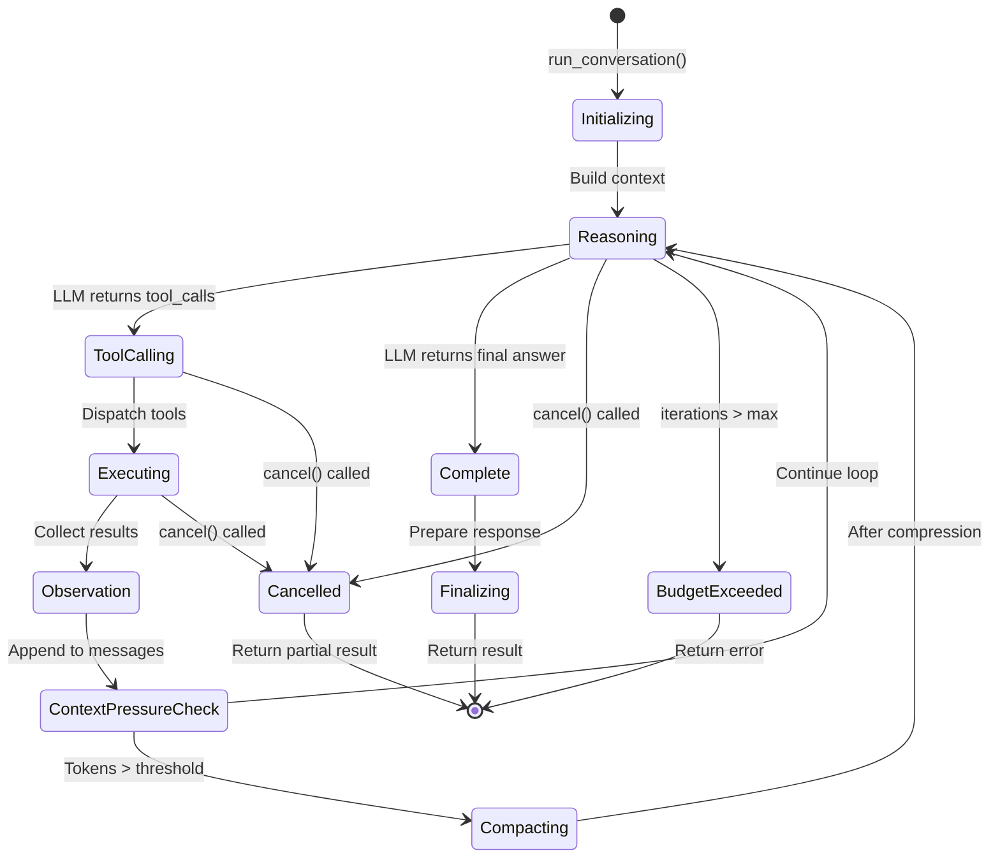
```mermaid
stateDiagram-v2
    [*] --> Initializing: run_conversation()

    Initializing --> Reasoning: Build context

    Reasoning --> ToolCalling: LLM returns tool_calls
    Reasoning --> Complete: LLM returns final answer

    ToolCalling --> Executing: Dispatch tools

    Executing --> Observation: Collect results

    Observation --> ContextPressureCheck: Append to messages

    ContextPressureCheck --> Reasoning: Continue loop
    ContextPressureCheck --> Compacting: Tokens > threshold

    Compacting --> Reasoning: After compression

    Complete --> Finalizing: Prepare response

    Finalizing --> [*]: Return result

    Reasoning --> Cancelled: cancel() called
    ToolCalling --> Cancelled: cancel() called
    Executing --> Cancelled: cancel() called
    Cancelled --> [*]: Return partial result

    Reasoning --> BudgetExceeded: iterations > max
    BudgetExceeded --> [*]: Return error
```

---

## 4. Class Diagrams

### 4.1 Core Agent Classes

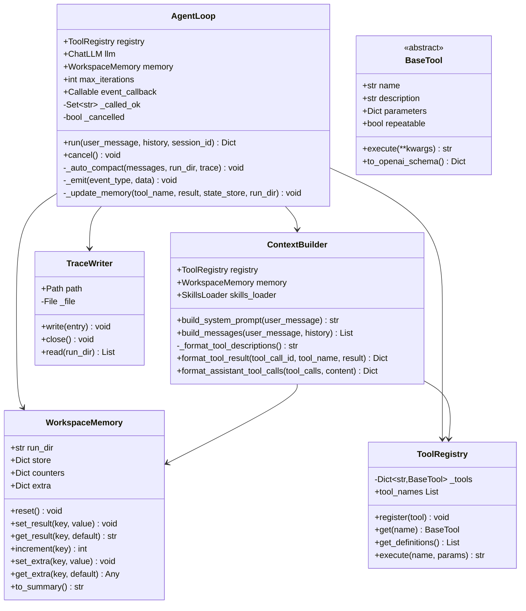
```mermaid
classDiagram
    class AgentLoop {
        +ToolRegistry registry
        +ChatLLM llm
        +WorkspaceMemory memory
        +int max_iterations
        +Callable event_callback
        -Set~str~ _called_ok
        -bool _cancelled
        +run(user_message, history, session_id) Dict
        +cancel() void
        -_auto_compact(messages, run_dir, trace) void
        -_emit(event_type, data) void
        -_update_memory(tool_name, result, state_store, run_dir) void
    }

    class ContextBuilder {
        +ToolRegistry registry
        +WorkspaceMemory memory
        +SkillsLoader skills_loader
        +build_system_prompt(user_message) str
        +build_messages(user_message, history) List
        -_format_tool_descriptions() str
        +format_tool_result(tool_call_id, tool_name, result) Dict
        +format_assistant_tool_calls(tool_calls, content) Dict
    }

    class WorkspaceMemory {
        +str run_dir
        +Dict store
        +Dict counters
        +Dict extra
        +reset() void
        +set_result(key, value) void
        +get_result(key, default) str
        +increment(key) int
        +set_extra(key, value) void
        +get_extra(key, default) Any
        +to_summary() str
    }

    class TraceWriter {
        +Path path
        -File _file
        +write(entry) void
        +close() void
        +read(run_dir) List
    }

    class ToolRegistry {
        -Dict~str,BaseTool~ _tools
        +register(tool) void
        +get(name) BaseTool
        +get_definitions() List
        +execute(name, params) str
        +tool_names List
    }

    class BaseTool {
        <<abstract>>
        +str name
        +str description
        +Dict parameters
        +bool repeatable
        +execute(**kwargs) str
        +to_openai_schema() Dict
    }

    AgentLoop --> ContextBuilder
    AgentLoop --> WorkspaceMemory
    AgentLoop --> TraceWriter
    AgentLoop --> ToolRegistry
    ContextBuilder --> WorkspaceMemory
    ContextBuilder --> ToolRegistry
```

### 4.2 Provider & LLM Classes

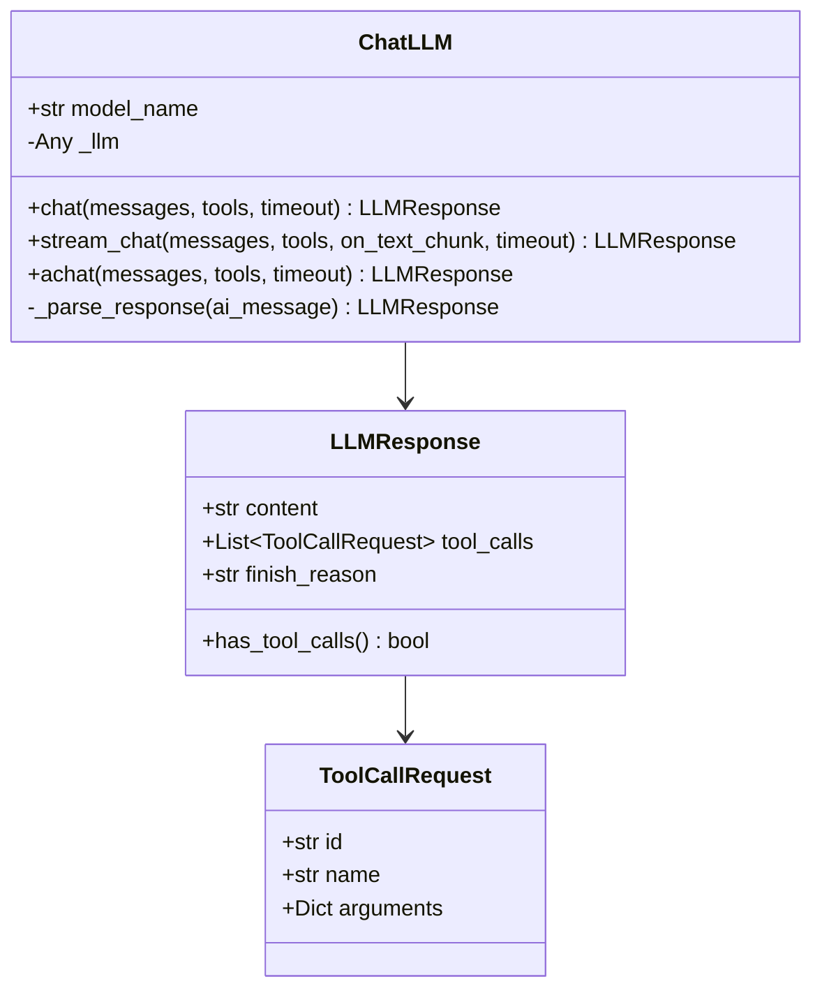
```mermaid
classDiagram
    class ChatLLM {
        +str model_name
        -Any _llm
        +chat(messages, tools, timeout) LLMResponse
        +stream_chat(messages, tools, on_text_chunk, timeout) LLMResponse
        +achat(messages, tools, timeout) LLMResponse
        -_parse_response(ai_message) LLMResponse
    }

    class LLMResponse {
        +str content
        +List~ToolCallRequest~ tool_calls
        +str finish_reason
        +has_tool_calls() bool
    }

    class ToolCallRequest {
        +str id
        +str name
        +Dict arguments
    }

    ChatLLM --> LLMResponse
    LLMResponse --> ToolCallRequest
```

### 4.3 Session Management Classes

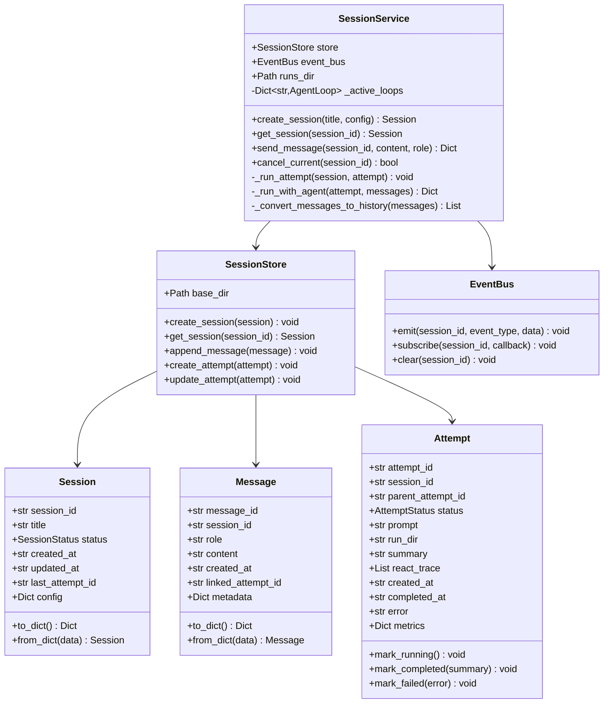
```mermaid
classDiagram
    class SessionService {
        +SessionStore store
        +EventBus event_bus
        +Path runs_dir
        -Dict~str,AgentLoop~ _active_loops
        +create_session(title, config) Session
        +get_session(session_id) Session
        +send_message(session_id, content, role) Dict
        +cancel_current(session_id) bool
        -_run_attempt(session, attempt) void
        -_run_with_agent(attempt, messages) Dict
        -_convert_messages_to_history(messages) List
    }

    class Session {
        +str session_id
        +str title
        +SessionStatus status
        +str created_at
        +str updated_at
        +str last_attempt_id
        +Dict config
        +to_dict() Dict
        +from_dict(data) Session
    }

    class Message {
        +str message_id
        +str session_id
        +str role
        +str content
        +str created_at
        +str linked_attempt_id
        +Dict metadata
        +to_dict() Dict
        +from_dict(data) Message
    }

    class Attempt {
        +str attempt_id
        +str session_id
        +str parent_attempt_id
        +AttemptStatus status
        +str prompt
        +str run_dir
        +str summary
        +List react_trace
        +str created_at
        +str completed_at
        +str error
        +Dict metrics
        +mark_running() void
        +mark_completed(summary) void
        +mark_failed(error) void
    }

    class SessionStore {
        +Path base_dir
        +create_session(session) void
        +get_session(session_id) Session
        +append_message(message) void
        +create_attempt(attempt) void
        +update_attempt(attempt) void
    }

    class EventBus {
        +emit(session_id, event_type, data) void
        +subscribe(session_id, callback) void
        +clear(session_id) void
    }

    SessionService --> SessionStore
    SessionService --> EventBus
    SessionStore --> Session
    SessionStore --> Message
    SessionStore --> Attempt
```

### 4.4 Swarm Multi-Agent Classes

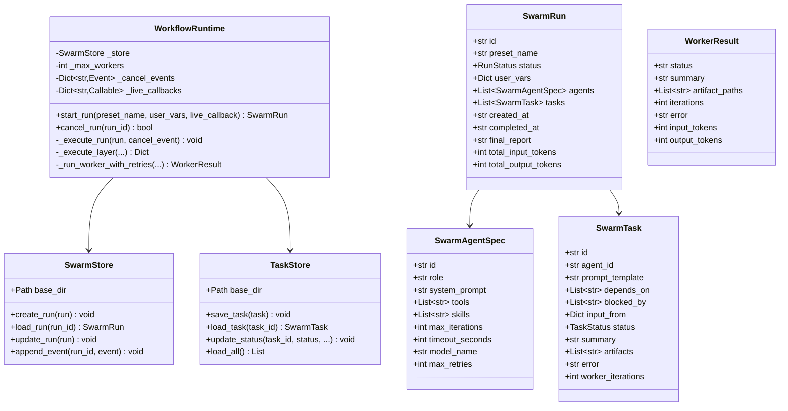
```mermaid
classDiagram
    class WorkflowRuntime {
        -SwarmStore _store
        -int _max_workers
        -Dict~str,Event~ _cancel_events
        -Dict~str,Callable~ _live_callbacks
        +start_run(preset_name, user_vars, live_callback) SwarmRun
        +cancel_run(run_id) bool
        -_execute_run(run, cancel_event) void
        -_execute_layer(...) Dict
        -_run_worker_with_retries(...) WorkerResult
    }

    class SwarmRun {
        +str id
        +str preset_name
        +RunStatus status
        +Dict user_vars
        +List~SwarmAgentSpec~ agents
        +List~SwarmTask~ tasks
        +str created_at
        +str completed_at
        +str final_report
        +int total_input_tokens
        +int total_output_tokens
    }

    class SwarmAgentSpec {
        +str id
        +str role
        +str system_prompt
        +List~str~ tools
        +List~str~ skills
        +int max_iterations
        +int timeout_seconds
        +str model_name
        +int max_retries
    }

    class SwarmTask {
        +str id
        +str agent_id
        +str prompt_template
        +List~str~ depends_on
        +List~str~ blocked_by
        +Dict input_from
        +TaskStatus status
        +str summary
        +List~str~ artifacts
        +str error
        +int worker_iterations
    }

    class WorkerResult {
        +str status
        +str summary
        +List~str~ artifact_paths
        +int iterations
        +str error
        +int input_tokens
        +int output_tokens
    }

    class SwarmStore {
        +Path base_dir
        +create_run(run) void
        +load_run(run_id) SwarmRun
        +update_run(run) void
        +append_event(run_id, event) void
    }

    class TaskStore {
        +Path base_dir
        +save_task(task) void
        +load_task(task_id) SwarmTask
        +update_status(task_id, status, ...) void
        +load_all() List
    }

    WorkflowRuntime --> SwarmStore
    WorkflowRuntime --> TaskStore
    SwarmRun --> SwarmAgentSpec
    SwarmRun --> SwarmTask
```

### 4.5 Core Services Classes

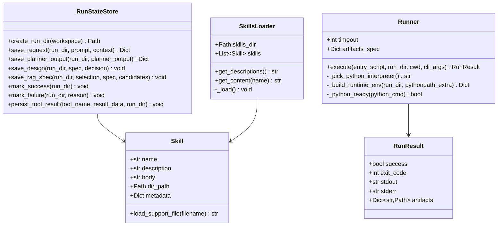
```mermaid
classDiagram
    class RunStateStore {
        +create_run_dir(workspace) Path
        +save_request(run_dir, prompt, context) Dict
        +save_planner_output(run_dir, planner_output) Dict
        +save_design(run_dir, spec, decision) void
        +save_rag_spec(run_dir, selection, spec, candidates) void
        +mark_success(run_dir) void
        +mark_failure(run_dir, reason) void
        +persist_tool_result(tool_name, result_data, run_dir) void
    }

    class Runner {
        +int timeout
        +Dict artifacts_spec
        +execute(entry_script, run_dir, cwd, cli_args) RunResult
        -_pick_python_interpreter() str
        -_build_runtime_env(run_dir, pythonpath_extra) Dict
        -_python_ready(python_cmd) bool
    }

    class RunResult {
        +bool success
        +int exit_code
        +str stdout
        +str stderr
        +Dict~str,Path~ artifacts
    }

    class SkillsLoader {
        +Path skills_dir
        +List~Skill~ skills
        +get_descriptions() str
        +get_content(name) str
        -_load() void
    }

    class Skill {
        +str name
        +str description
        +str body
        +Path dir_path
        +Dict metadata
        +load_support_file(filename) str
    }

    RunStateStore --> Skill
    SkillsLoader --> Skill
    Runner --> RunResult
```

### 4.6 Tool Hierarchy


```mermaid
classDiagram
    class BaseTool {
        <<abstract>>
        +str name
        +str description
        +Dict parameters
        +bool repeatable
        +execute(**kwargs)* str
        +to_openai_schema() Dict
    }

    class BashTool {
        +execute(command, run_dir) str
    }

    class ReadFileTool {
        +execute(path, run_dir) str
    }

    class WriteFileTool {
        +execute(path, content, run_dir) str
    }

    class EditFileTool {
        +execute(path, old_string, new_string, run_dir) str
    }

    class BacktestTool {
        +execute(run_dir) str
    }

    class LoadSkillTool {
        +execute(skill_name) str
    }

    class SubagentTool {
        +execute(prompt, tools, skills, model) str
    }

    class SwarmTool {
        +execute(prompt) str
    }

    class FactorAnalysisTool {
        +execute(...) str
    }

    class OptionsPricingTool {
        +execute(...) str
    }

    class WebReaderTool {
        +execute(url) str
    }

    class DocReaderTool {
        +execute(path) str
    }

    class TaskCreateTool {
        +execute(title, description) str
    }

    class BackgroundRunTool {
        +execute(prompt, tools) str
    }

    BaseTool <|-- BashTool
    BaseTool <|-- ReadFileTool
    BaseTool <|-- WriteFileTool
    BaseTool <|-- EditFileTool
    BaseTool <|-- BacktestTool
    BaseTool <|-- LoadSkillTool
    BaseTool <|-- SubagentTool
    BaseTool <|-- SwarmTool
    BaseTool <|-- FactorAnalysisTool
    BaseTool <|-- OptionsPricingTool
    BaseTool <|-- WebReaderTool
    BaseTool <|-- DocReaderTool
    BaseTool <|-- TaskCreateTool
    BaseTool <|-- BackgroundRunTool
```

---

## 5. Sequence Diagrams

### 5.1 Single Agent Execution Flow

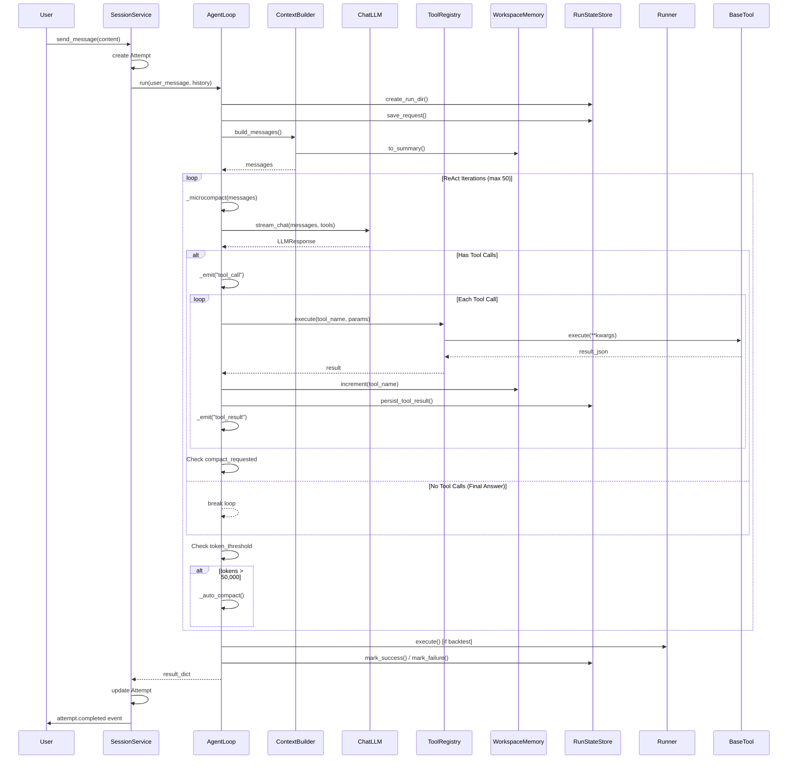
```mermaid
sequenceDiagram
    participant U as User
    participant SS as SessionService
    participant AL as AgentLoop
    participant CB as ContextBuilder
    participant LLM as ChatLLM
    participant TR as ToolRegistry
    participant WM as WorkspaceMemory
    participant RS as RunStateStore
    participant RN as Runner

    U->>SS: send_message(content)
    SS->>SS: create Attempt
    SS->>AL: run(user_message, history)

    AL->>RS: create_run_dir()
    AL->>RS: save_request()
    AL->>CB: build_messages()
    CB->>WM: to_summary()
    CB-->>AL: messages

    loop ReAct Iterations (max 50)
        AL->>AL: _microcompact(messages)
        AL->>LLM: stream_chat(messages, tools)
        LLM-->>AL: LLMResponse

        alt Has Tool Calls
            AL->>AL: _emit("tool_call")

            loop Each Tool Call
                AL->>TR: execute(tool_name, params)
                TR->>BaseTool: execute(**kwargs)
                BaseTool-->>TR: result_json
                TR-->>AL: result

                AL->>WM: increment(tool_name)
                AL->>RS: persist_tool_result()
                AL->>AL: _emit("tool_result")
            end

            AL->>AL: Check compact_requested
        else No Tool Calls (Final Answer)
            AL-->>AL: break loop
        end

        AL->>AL: Check token_threshold
        alt tokens > 50,000
            AL->>AL: _auto_compact()
        end
    end

    AL->>RN: execute() [if backtest]
    AL->>RS: mark_success() / mark_failure()
    AL-->>SS: result_dict
    SS->>SS: update Attempt
    SS->>U: attempt.completed event
```

### 5.2 Swarm Multi-Agent Execution Flow

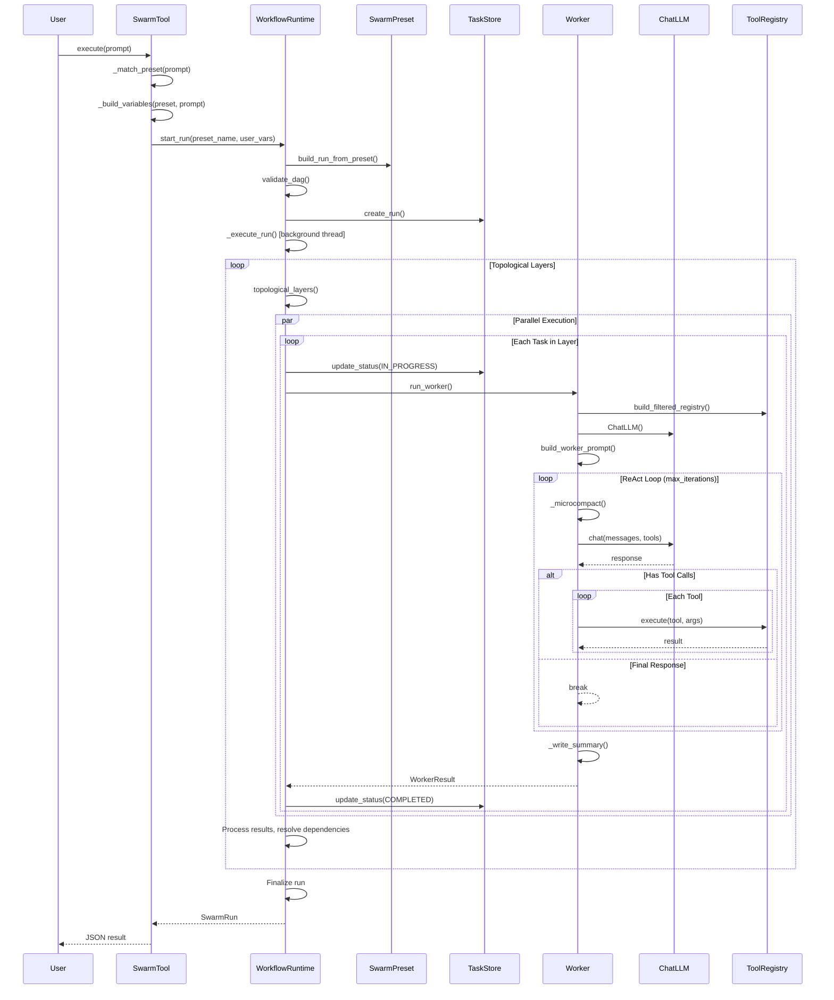
```mermaid
sequenceDiagram
    participant U as User
    participant ST as SwarmTool
    participant SR as WorkflowRuntime
    participant SP as SwarmPreset
    participant STor as TaskStore
    participant SW as Worker
    participant LLM as ChatLLM
    participant TR as ToolRegistry

    U->>ST: execute(prompt)
    ST->>ST: _match_preset(prompt)
    ST->>ST: _build_variables(preset, prompt)

    ST->>SR: start_run(preset_name, user_vars)
    SR->>SP: build_run_from_preset()
    SR->>SR: validate_dag()
    SR->>STor: create_run()

    SR->>SR: _execute_run() [background thread]

    loop Topological Layers
        SR->>SR: topological_layers()

        par Parallel Execution
            loop Each Task in Layer
                SR->>STor: update_status(IN_PROGRESS)
                SR->>SW: run_worker()

                SW->>TR: build_filtered_registry()
                SW->>LLM: ChatLLM()
                SW->>SW: build_worker_prompt()

                loop ReAct Loop (max_iterations)
                    SW->>SW: _microcompact()
                    SW->>LLM: chat(messages, tools)
                    LLM-->>SW: response

                    alt Has Tool Calls
                        loop Each Tool
                            SW->>TR: execute(tool, args)
                            TR-->>SW: result
                        end
                    else Final Response
                        SW-->>SW: break
                    end
                end

                SW->>SW: _write_summary()
                SW-->>SR: WorkerResult
                SR->>STor: update_status(COMPLETED)
            end
        end

        SR->>SR: Process results, resolve dependencies
    end

    SR->>SR: Finalize run
    SR-->>ST: SwarmRun
    ST-->>U: JSON result
```

### 5.3 Backtest Execution Flow

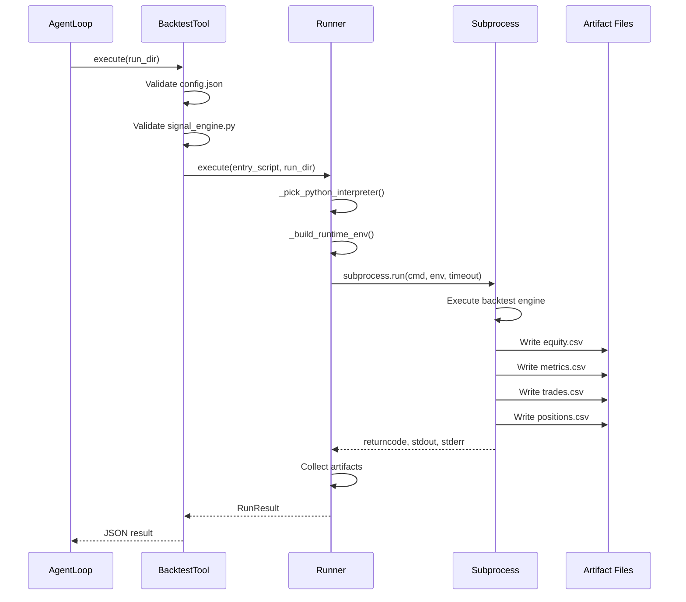
```mermaid
sequenceDiagram
    participant AL as AgentLoop
    participant BT as BacktestTool
    participant RN as Runner
    participant SP as Subprocess
    participant AF as Artifact Files

    AL->>BT: execute(run_dir)
    BT->>BT: Validate config.json
    BT->>BT: Validate signal_engine.py
    BT->>RN: execute(entry_script, run_dir)

    RN->>RN: _pick_python_interpreter()
    RN->>RN: _build_runtime_env()
    RN->>SP: subprocess.run(cmd, env, timeout)

    SP->>SP: Execute backtest engine
    SP->>AF: Write equity.csv
    SP->>AF: Write metrics.csv
    SP->>AF: Write trades.csv
    SP->>AF: Write positions.csv
    SP-->>RN: returncode, stdout, stderr

    RN->>RN: Collect artifacts
    RN-->>BT: RunResult
    BT-->>AL: JSON result
```

### 5.4 Context Compression Flow (3-Layer)

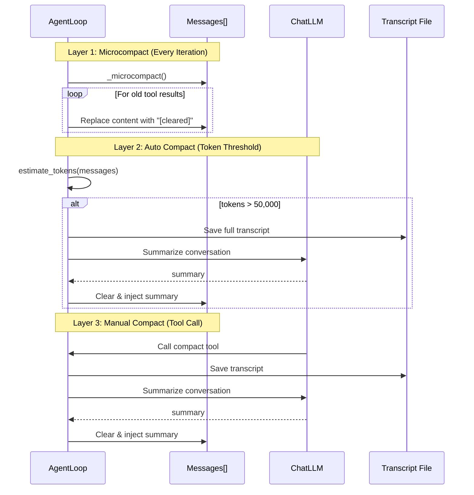
```mermaid
sequenceDiagram
    participant AL as AgentLoop
    participant MSG as Messages[]
    participant LLM as ChatLLM
    participant FILE as Transcript File

    Note over AL,MSG: Layer 1: Microcompact (Every Iteration)
    AL->>MSG: _microcompact()
    loop For old tool results
        AL->>MSG: Replace content with "[cleared]"
    end

    Note over AL,LLM: Layer 2: Auto Compact (Token Threshold)
    AL->>AL: estimate_tokens(messages)
    alt tokens > 50,000
        AL->>FILE: Save full transcript
        AL->>LLM: Summarize conversation
        LLM-->>AL: summary
        AL->>MSG: Clear & inject summary
    end

    Note over AL,MSG: Layer 3: Manual Compact (Tool Call)
    LLM->>AL: Call compact tool
    AL->>FILE: Save transcript
    AL->>LLM: Summarize conversation
    LLM-->>AL: summary
    AL->>MSG: Clear & inject summary
```

### 5.5 Tool Registration Flow

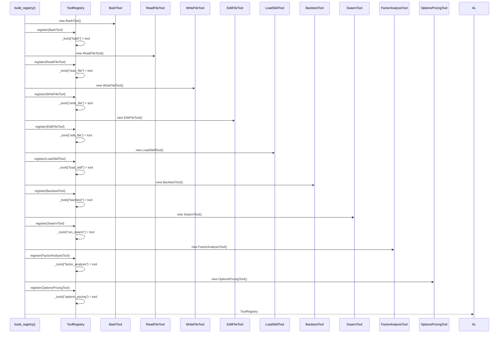
```mermaid
sequenceDiagram
    participant BR as build_registry()
    participant TR as ToolRegistry
    participant BT as BashTool
    participant RT as ReadFileTool
    participant WT as WriteFileTool
    participant ET as EditFileTool
    participant LT as LoadSkillTool
    participant Bat as BacktestTool
    participant ST as SwarmTool
    participant FT as FactorAnalysisTool
    participant OT as OptionsPricingTool

    BR->>BT: new BashTool()
    BR->>TR: register(BashTool)
    TR->>TR: _tools["bash"] = tool

    BR->>RT: new ReadFileTool()
    BR->>TR: register(ReadFileTool)
    TR->>TR: _tools["read_file"] = tool

    BR->>WT: new WriteFileTool()
    BR->>TR: register(WriteFileTool)
    TR->>TR: _tools["write_file"] = tool

    BR->>ET: new EditFileTool()
    BR->>TR: register(EditFileTool)
    TR->>TR: _tools["edit_file"] = tool

    BR->>LT: new LoadSkillTool()
    BR->>TR: register(LoadSkillTool)
    TR->>TR: _tools["load_skill"] = tool

    BR->>Bat: new BacktestTool()
    BR->>TR: register(BacktestTool)
    TR->>TR: _tools["backtest"] = tool

    BR->>ST: new SwarmTool()
    BR->>TR: register(SwarmTool)
    TR->>TR: _tools["run_swarm"] = tool

    BR->>FT: new FactorAnalysisTool()
    BR->>TR: register(FactorAnalysisTool)
    TR->>TR: _tools["factor_analysis"] = tool

    BR->>OT: new OptionsPricingTool()
    BR->>TR: register(OptionsPricingTool)
    TR->>TR: _tools["options_pricing"] = tool

    BR-->>AL: ToolRegistry
```

---

## 6. Component Details

### 6.0 Component File Path Dependency Diagrams (Current Repo Layout)

The earlier architecture diagrams are conceptual. The following maps pin each major runtime concern to the **actual file paths in this repository** so contributors can trace dependencies quickly.

> **Note:** In the current layout, most first-party implementation lives under `agent/src/**`; repo-root files such as `agent/api_server.py`, `agent/cli.py`, and `agent/mcp_server.py` act as entrypoints.

#### 6.0.1 API → Session Runtime → Filesystem

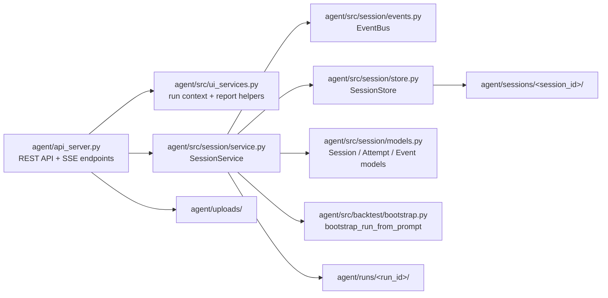
```mermaid
flowchart LR
    API["agent/api_server.py<br/>REST API + SSE endpoints"]
    UI["agent/src/ui_services.py<br/>run context + report helpers"]
    SVC["agent/src/session/service.py<br/>SessionService"]
    EVT["agent/src/session/events.py<br/>EventBus"]
    STORE["agent/src/session/store.py<br/>SessionStore"]
    MODELS["agent/src/session/models.py<br/>Session / Attempt / Event models"]
    BOOT["agent/src/backtest/bootstrap.py<br/>bootstrap_run_from_prompt"]
    SESSDIR["agent/sessions/&lt;session_id&gt;/"]
    RUNSDIR["agent/runs/&lt;run_id&gt;/"]
    UPLOADS["agent/uploads/"]

    API --> SVC
    API --> UI
    API --> UPLOADS
    SVC --> EVT
    SVC --> STORE
    SVC --> MODELS
    SVC --> BOOT
    STORE --> SESSDIR
    SVC --> RUNSDIR
```

#### 6.0.2 Hermes Plugin → Finance Tools → Backtest Runner

```mermaid
flowchart LR
    PLUGIN[".hermes/plugins/vibe-trading/plugin.yaml<br/>project plugin entry"]
    ADAPTER["agent/src/hermes_tool_adapter/vibe_trading_finance.py<br/>tool schemas + handlers"]
    TOOL["agent/src/tools/backtest_tool.py<br/>run_backtest()"]
    BOOT["agent/src/backtest/bootstrap.py<br/>prompt-to-run bootstrap"]
    CORE["agent/src/core/runner.py<br/>Runner subprocess wrapper"]
    ENGINE["agent/backtest/runner.py<br/>built-in execution engine"]
    RUNDIR["agent/runs/&lt;run_id&gt;/"]
    CFG["config.json"]
    SIG["code/signal_engine.py"]
    ART["artifacts/*.csv"]

    PLUGIN --> ADAPTER
    ADAPTER --> TOOL
    TOOL --> BOOT
    TOOL --> CORE
    CORE --> ENGINE
    TOOL --> RUNDIR
    RUNDIR --> CFG
    RUNDIR --> SIG
    RUNDIR --> ART
```

#### 6.0.3 Swarm Orchestration → Worker Files → Swarm State

```mermaid
flowchart LR
    PRESETS["agent/src/swarm/presets.py<br/>preset loader"]
    RUNTIME["agent/src/swarm/runtime.py<br/>WorkflowRuntime"]
    WORKER["agent/src/swarm/worker.py<br/>per-agent executor"]
    STORE["agent/src/swarm/store.py<br/>SwarmStore"]
    TASKS["agent/src/swarm/task_store.py<br/>DAG validation + layers"]
    MAIL["agent/src/swarm/mailbox.py<br/>cross-task message passing"]
    SWARMDIR["agent/.swarm/runs/&lt;run_id&gt;/"]

    PRESETS --> RUNTIME
    RUNTIME --> WORKER
    RUNTIME --> STORE
    RUNTIME --> TASKS
    WORKER --> MAIL
    STORE --> SWARMDIR
```

#### 6.0.4 Quick File Path Map

| Concern | Primary entry file(s) | Main dependencies | Persistent output |
|---------|------------------------|-------------------|-------------------|
| API + streaming | `agent/api_server.py` | `agent/src/session/service.py`, `agent/src/ui_services.py` | `agent/runs/`, `agent/sessions/`, `agent/uploads/` |
| Session lifecycle | `agent/src/session/service.py` | `store.py`, `events.py`, `models.py`, `src/backtest/bootstrap.py` | `agent/sessions/<session_id>/` |
| Hermes finance tools | `.hermes/plugins/vibe-trading/plugin.yaml` | `agent/src/hermes_tool_adapter/vibe_trading_finance.py`, `vibe_trading_compat.py` | Registers runtime tools |
| Backtest execution | `agent/src/tools/backtest_tool.py` | `agent/src/core/runner.py`, `agent/backtest/runner.py` | `agent/runs/<run_id>/artifacts/` |
| Swarm execution | `agent/src/swarm/runtime.py` | `worker.py`, `store.py`, `task_store.py`, `mailbox.py`, `presets.py` | `agent/.swarm/runs/<run_id>/` |

### 6.1 ReAct Agent Loop (`agent/loop.py`)

The core reasoning engine implementing the ReAct (Reasoning + Acting) pattern:

| Feature | Description |
|---------|-------------|
| **Max Iterations** | 50 (configurable) |
| **Token Threshold** | 50,000 (auto-compact trigger) |
| **Microcompact** | Keep last 3 tool results, clear older ones |
| **Streaming** | Real-time thinking text via `on_text_chunk` |
| **Event System** | Callback-based event emission for UI updates |

**Three-Layer Context Management:**
1. **Layer 1 (Microcompact)**: Silently prunes old tool results each iteration
2. **Layer 2 (Auto-compact)**: LLM summarizes when token count exceeds threshold
3. **Layer 3 (Compact Tool)**: Model explicitly calls compact tool

### 6.2 AIAgent Full Loop (`hermes-agent/run_agent.py`)

Extended ReAct implementation with production features:

| Feature | Description |
|---------|-------------|
| **Max Iterations** | 90 (default), shared with subagents |
| **Iteration Budget** | Thread-safe counter with refund support |
| **Parallel Tools** | Concurrent execution for independent tools |
| **Context Compression** | 3-layer with provider-specific optimization |
| **Provider Routing** | OpenRouter provider preferences |
| **Reasoning Extraction** | Extracts thinking from multiple formats |
| **Interrupt Handling** | Graceful cancellation support |
| **Session Management** | Memory persistence and search |

### 6.3 HermesAgentLoop (`hermes-agent/environments/agent_loop.py`)

Streamlined loop for RL training environments:

| Feature | Description |
|---------|-------------|
| **Max Turns** | 30 (configurable) |
| **Thread Pool** | 128 workers for concurrent tool execution |
| **Tool Budget** | Per-tool and per-turn result persistence limits |
| **Reasoning Extraction** | Multi-format (OpenRouter, standard) |
| **ManagedServer** | State extraction for RL training |
| **Fallback Parser** | Client-side tool call parsing |

### 6.4 Tool System (`tools/`)

19 tools organized into two categories:

**Atomic Tools:**
- `bash` - Execute shell commands
- `read_file` - Read file contents
- `write_file` - Write file contents
- `edit_file` - Edit file with string replacement
- `load_skill` - Load skill documentation

**Domain Tools:**
- `backtest` - Run trading strategy backtest
- `factor_analysis` - Financial factor analysis
- `options_pricing` - Options pricing calculations
- `run_swarm` - Launch multi-agent swarm
- `subagent` - Spawn sub-agent task
- `read_url` - Web page reading
- `read_document` - PDF document reading
- `pattern` - Pattern recognition
- `compact` - Context compression

For the Hermes-based migration, these Vibe-Trading-specific tools are not treated as Hermes built-ins. They are surfaced as plugin-provided Hermes toolsets:

- `vibe_trading_finance`
- `compat`

The runtime registration flow is:

1. Hermes starts in the Vibe-Trading repo root.
2. Hermes project plugins are enabled with `HERMES_ENABLE_PROJECT_PLUGINS=true`.
3. Hermes discovers `.hermes/plugins/vibe-trading/plugin.yaml`.
4. The plugin imports the exported tool specs from:
   - `agent/src/hermes_tool_adapter/vibe_trading_finance.py`
   - `agent/src/hermes_tool_adapter/vibe_trading_compat.py`
5. The plugin registers those tools through `PluginContext.register_tool(...)`.

### 6.5 Skills System (`skills/`)

64 specialist skills organized by domain:

| Category | Skills |
|----------|--------|
| **Technical Analysis** | candlestick, ichimoku, elliott-wave, harmonic, technical-basic |
| **Advanced Strategies** | chanlun, smc (Smart Money Concepts), pair-trading, multi-factor |
| **Volatility** | volatility, minute-analysis |
| **Fundamental** | fundamental-filter |
| **Seasonal** | seasonal |
| **Data Sources** | tushare, okx-market |

Each skill contains:
- `SKILL.md` - Documentation with API contracts
- `example_signal_engine.py` - Reference implementation

### 6.6 Swarm Multi-Agent (`swarm/`)

29 multi-agent preset teams:

| Preset | Purpose |
|--------|---------|
| `equity_research_team` | Stock research reports |
| `quant_strategy_desk` | Quantitative strategy development |
| `risk_committee` | Risk audit and assessment |
| `global_allocation_committee` | Cross-market asset allocation |
| `investment_committee` | Investment decision making |
| `technical_analysis_panel` | Technical analysis |
| `macro_strategy_forum` | Macro strategy research |
| `crypto_research_lab` | Cryptocurrency research |
| `ml_quant_lab` | Machine learning quant |

**Worker Execution:**
- Filtered tool registry per agent
- Filtered skill descriptions per agent
- Upstream context injection via `input_from`
- Automatic retry with `max_retries`

### 6.7 Session Management (`session/`)

**Session Lifecycle:**
```
session.created
  → message.received
    → attempt.created
      → attempt.started
        → [ReAct Loop Execution]
          → attempt.completed / attempt.failed
```

**Attempt States:**
- `PENDING` → `RUNNING` → `COMPLETED` | `FAILED` | `WAITING_USER` | `CANCELLED`

### 6.8 Provider System (`providers/`)

**Supported LLM Providers:**
- OpenAI
- Azure OpenAI
- OpenRouter
- DeepSeek
- Qwen

**Environment Configuration:**
- `LANGCHAIN_MODEL_NAME` - Model selection
- `LANGCHAIN_PROVIDER` - Provider selection
- `LANGCHAIN_TEMPERATURE` - Temperature setting
- Provider-specific API keys

---

### 6.9 File I/O Rules

This section records the mandatory constraints for how skills and tools interact with the filesystem, and how the runtime enforces them.

#### 6.9.1 Rules

| Rule | Applies To | Requirement |
|------|-----------|-------------|
| **No direct file operations in skills** | All skill markdown files (`SKILL.md`, `examples.md`, references) | Skills must not instruct the model to use Python's `open()`, `Path.read_text()`, `Path.write_text()`, `shutil`, or any equivalent direct I/O. Skills may only reference Hermes file tools (`read_file`, `write_file`, `patch`, `search_files`) or shell tools (`bash`). |
| **No absolute paths in skills** | All skill markdown files | Skills must not contain hardcoded absolute paths (`/home/...`, `/Users/...`, `/root/...`, etc.). All file references must be relative (e.g. `code/signal_engine.py`, `artifacts/metrics.csv`). |
| **No absolute paths in tool schemas** | All tool `parameters` descriptions exposed to the model | Tool schema descriptions must describe paths as relative to `run_dir`. The model must never be told to supply an absolute path. |
| **Absolute path resolution is the tool layer's responsibility** | `edit_file_tool.py`, `factor_analysis_tool.py`, and any tool accepting path parameters | Tools resolve relative paths to absolute using `safe_path(relative, run_dir)` internally. The model only ever supplies relative paths. |
| **Data root is config, not prompt** | `api_server.py`, `session/service.py`, `task_tools.py` | All runtime output directories (`runs/`, `sessions/`, `uploads/`, `.tasks/`, `.swarm/`) are derived from `TERMINAL_CWD` at startup. No absolute path is injected into the agent prompt. |

#### 6.9.2 `TERMINAL_CWD` — File-Tool Sandbox Root

`TERMINAL_CWD` is the single configuration variable that controls where all runtime-generated files land.

**Resolution logic** (applied in `api_server.py` and `session/service.py`):

```
TERMINAL_CWD=chris   →  agent/chris/          (relative: resolved under agent/)
TERMINAL_CWD=/data   →  /data/                (absolute: used as-is)
TERMINAL_CWD=<unset> →  agent/                (fallback)
```

**Output directory layout** (all under `DATA_ROOT`):

```
DATA_ROOT/
├── runs/           ← backtest run directories
├── sessions/       ← session store + uploads
│   └── <sid>/
│       └── uploads/
├── uploads/        ← legacy fallback uploads dir
└── .swarm/runs/    ← swarm run directories
```

`DATA_ROOT` is computed once at process startup in `api_server.py` and passed into `SessionService`, `SwarmStore`, and `SessionStore` as constructor arguments. No component derives its output path independently from `__file__`.

**Per-session tool-layer CWD** is pinned via `register_task_env_overrides(session_id, {"cwd": str(file_root)})` so that Hermes file tools (`search_files`, `read_file`, `write_file`) resolve relative paths from the correct root for each session without any absolute path appearing in the prompt.

#### 6.9.3 Skill Compliance — Syntax Validation Pattern

Skills that need to validate generated Python code must use `py_compile` via `bash`, not `open()`:

```
# Compliant
bash("python -m py_compile code/signal_engine.py && echo OK")

# Forbidden — uses open() directly
bash("python -c \"import ast; ast.parse(open('code/signal_engine.py').read()); print('OK')\"")
```

`py_compile` reads the file itself as a subprocess — the skill never touches the file directly.

#### 6.9.4 Tool Compliance — Path Resolution Contract

Any tool that accepts a path parameter must:

1. Accept a **relative** path from the model (enforced by schema description)
2. Require `run_dir` as a separate parameter
3. Resolve the absolute path internally via `safe_path(relative, Path(run_dir))`
4. Never pass a raw model-supplied path to any filesystem operation

```python
# Compliant pattern (edit_file_tool.py, factor_analysis_tool.py)
resolved = _safe_path(kwargs["path"], Path(run_dir))
resolved.read_text(...)

# Forbidden — passes model-supplied path directly to filesystem
Path(kwargs["path"]).read_text(...)
```

#### 6.9.5 Internal Tool State — `task_tools.py`

`TaskManager`'s `.tasks` directory is derived from `DATA_ROOT` (via `TERMINAL_CWD`) at module import time, not hardcoded relative to the source file:

```python
# Resolved from TERMINAL_CWD at startup
TASKS_DIR = DATA_ROOT / ".tasks"

# Forbidden
TASKS_DIR = Path(__file__).resolve().parents[2] / ".tasks"
```

#### 6.9.6 Design-Time vs Runtime Directories in `agent/`

Exactly four subdirectories under `agent/` are **design-time application code** checked into source control. Everything else is a **runtime artifact** created by Hermes file tools and therefore governed by the file I/O rules above.

**Design-time directories (source code — do not apply file I/O rules here):**

| Directory | Contents |
|-----------|----------|
| `agent/backtest/` | Backtest execution engine: `runner.py`, `engines/`, `loaders/`, `optimizers/`, `metrics.py` |
| `agent/config/swarm/` | Swarm preset YAML configurations |
| `agent/src/` | Full application source: session management, tools, skills, swarm runtime, hermes adapter, etc. |
| `agent/tests/` | Test suite |

**Runtime artifact directories (created by Hermes tools — governed by file I/O rules):**

| Directory | Purpose | Governed by |
|-----------|---------|-------------|
| `runs/<run_id>/` | Per-run backtest artifacts | `DATA_ROOT` via `TERMINAL_CWD` |
| `sessions/<sid>/` | Session store + uploads | `DATA_ROOT` via `TERMINAL_CWD` |
| `uploads/` | Legacy upload fallback | `DATA_ROOT` via `TERMINAL_CWD` |
| `.swarm/runs/<run_id>/` | Swarm run state | `DATA_ROOT` via `TERMINAL_CWD` |
| `.tasks/` | Task manager state | `TASKS_DIR` via `TERMINAL_CWD` |
| `<TERMINAL_CWD>/` (e.g. `chris/`) | User-scoped sandbox root | `TERMINAL_CWD` env var |

**`agent/scripts/` does not exist.** It was deleted after being identified as a directory of stale model-generated artifacts produced by the old wrong-`TERMINAL_CWD` era. There is no developer-authored `agent/scripts/` and none should be created. The Hermes agent must never write into `agent/scripts/`.

**The only legitimate `scripts/` directories in this repo are skill-local ones.** A skill may contain a `scripts/` subdirectory holding source-tracked example files that document the skill's API:

| Skill | Path | Status |
|-------|------|--------|
| `okx-market` | `agent/src/skills/okx-market/scripts/` | Source-tracked — `market_data_example.py`, `candle_data_example.py` |
| `tushare` | `agent/src/skills/tushare/scripts/` | Source-tracked — `stock_data_example.py`, `fund_data_example.py` |
| *(future skills)* | `agent/src/skills/<skill-name>/scripts/` | Source-tracked when added |

These files are skill documentation support files linked from `SKILL.md`. They are read by the agent via `read_file` as reference material, but the agent never writes to them. Any new skill may add its own `scripts/` subdir following the same convention — developer-authored, source-tracked, read-only at runtime.

#### 6.9.7 Where and When Agent-Generated Scripts Are Created

When the agent produces any Python script during a session (data fetching, analysis, factor computation, etc.), it must write the file into the run directory — **never into any design-time directory**.

**Convention for agent-generated scripts:**

```
runs/<run_id>/
├── req.json
├── config.json
├── code/
│   └── signal_engine.py        ← strategy module (backtest-specific)
├── scripts/
│   └── <anything>.py           ← other agent-generated Python scripts
└── artifacts/
    ├── equity.csv
    └── ...
```

| Path pattern | Created when | Owner |
|-------------|-------------|-------|
| `runs/<run_id>/code/signal_engine.py` | Backtest workflow — hardcoded by `backtest/runner.py` | Agent writes via file tools |
| `runs/<run_id>/scripts/<name>.py` | Any other script the agent generates (data fetch, analysis, etc.) | Agent writes via file tools |
| `agent/scripts/<name>.py` | **Never** — read-only at runtime | Developer writes, source-tracked |
| `agent/src/skills/*/scripts/<name>.py` | **Never** — read-only at runtime | Developer writes, source-tracked |

**Triggering conditions for script creation:**

- The user asks to fetch or analyse data that doesn't fit an existing tool
- The agent decides to write a helper script and execute it via `bash`
- A skill instructs the agent to produce supporting code

In all these cases the correct location is `runs/<run_id>/scripts/` (relative path: `scripts/<name>.py` from within the run directory), governed by `TERMINAL_CWD` via `DATA_ROOT`.

**Skills must instruct the agent to write scripts into `scripts/`, not the run-dir root, `agent/scripts/`, or any absolute path.** The skill-local `scripts/` subdirectory (e.g. `skills/tushare/scripts/`) contains only static examples; the agent loads those as references via `read_file` but does not write to them.

#### 6.9.8 The `code/` Subdirectory Convention in Run Directories

Each run directory contains a `code/` subdirectory for the model-generated strategy code:

```
runs/<run_id>/
├── req.json                    ← request persistence
├── config.json                 ← backtest config
├── code/
│   └── signal_engine.py        ← model-generated strategy (runtime artifact)
└── artifacts/
    ├── equity.csv
    ├── metrics.csv
    └── ...
```

`backtest/runner.py` hardcodes this convention:
```python
signal_path = run_dir / "code" / "signal_engine.py"
```

This `code/` subdir is **not related to `agent/scripts/`**:

| Path | Kind | Owner |
|------|------|-------|
| `runs/<run_id>/code/signal_engine.py` | Runtime artifact — model-generated strategy | Hermes file tools write it |
| `agent/scripts/*.py` | Design-time — static hand-written analysis scripts | Checked into source control |

**Why a separate `code/` dir?** The `code/` subdir within each run directory separates the importable Python module (`signal_engine.py`) from the data artifacts in `artifacts/`. The backtest runner loads it as a Python module via `importlib`, which requires a stable relative path — `code/signal_engine.py` is that stable path.

**Common misfire:** If `TERMINAL_CWD` is misconfigured to point at the `agent/` root, the model writing `code/signal_engine.py` creates `agent/code/signal_engine.py` — a stale artifact outside any run directory. The fix is to ensure `TERMINAL_CWD` always resolves to the user-scoped sandbox root (e.g. `agent/chris/`) so `runs/` exists under it and the model writes into `agent/chris/runs/<run_id>/code/signal_engine.py` as intended.

---

## 7. Known Design Patterns

### 7.1 ReAct (Reasoning + Acting)

**Pattern**: The core agent loop follows the ReAct pattern where the LLM reasons about the task, takes actions via tool calls, and observes the results to update its reasoning.

**Implementation**:
```
Thought (LLM reasoning) → Action (Tool call) → Observation (Tool result) → ... → Final Answer
```

**Used in**: `AIAgent`, `HermesAgentLoop`, `Worker` (Swarm)

### 7.2 Circuit Breaker

**Pattern**: Prevents cascade failures by stopping execution when thresholds are exceeded.

**Implementation**:
- Token threshold monitoring
- Iteration budget enforcement
- Context pressure warnings with cooldown

**Used in**: `AIAgent._estimate_context_pressure()`, `IterationBudget`

### 7.3 Registry Pattern

**Pattern**: Central registry for tool discovery and dispatch.

**Implementation**:
- `ToolRegistry` maintains `_tools` dict
- Built-in Hermes tools may self-register via `register()`
- Project-scoped extensions should prefer runtime registration via Hermes plugins
- Schema generation via `get_definitions()`

**Used in**: `ToolRegistry`, tool loading

### 7.4 Strategy Pattern

**Pattern**: Provider-specific implementations with common interface.

**Implementation**:
- `ChatLLM` abstracts provider differences
- `api_mode` selects implementation strategy
- Provider-specific schema adjustments

**Used in**: `ChatLLM`, provider adapters

### 7.5 Observer Pattern

**Pattern**: Event-driven updates for UI and logging.

**Implementation**:
- Callback registration (`tool_progress_callback`, `reasoning_callback`)
- EventBus for session-wide notifications
- SSE streaming for real-time updates

**Used in**: `AIAgent`, `SessionService`, `EventBus`

### 7.6 Budget Pattern

**Pattern**: Resource consumption tracking with limits.

**Implementation**:
- `IterationBudget` tracks loop iterations
- `BudgetConfig` controls tool result persistence
- Thread-safe with refund capability

**Used in**: `IterationBudget`, `BudgetConfig`, `HermesAgentLoop`

### 7.7 Template Method Pattern

**Pattern**: Algorithm skeleton with customizable steps.

**Implementation**:
- `HermesAgentLoop.run()` defines the standard loop
- Subclasses can customize tool execution
- `AgentResult` provides standardized output

**Used in**: `HermesAgentLoop`, environment base classes

### 7.8 DAG Execution Pattern

**Pattern**: Dependency-aware task scheduling.

**Implementation**:
- `SwarmPreset` builds task dependency graph
- `topological_layers()` for parallel execution
- Input injection via `input_from`

**Used in**: `WorkflowRuntime`, `SwarmPreset`

### 7.9 Progressive Disclosure

**Pattern**: Show summary first, full content on demand.

**Implementation**:
- Skills show description in system prompt
- Full content loaded via `load_skill` tool
- Context compression preserves recent, clears old

**Used in**: `SkillsLoader`, `ContextBuilder`, context compression

### 7.10 Thread Pool Pattern

**Pattern**: Concurrent execution with controlled parallelism.

**Implementation**:
- `ThreadPoolExecutor` for parallel tool calls
- Dynamic resizing based on workload
- Safe for nested asyncio (Modal/Docker backends)

**Used in**: `AIAgent`, `HermesAgentLoop`

---

## 8. Data Flow

### 8.1 Run Directory Structure

```
runs/
└── YYYYMMDD_HHMMSS_ffffff_xxxxxx/
    ├── config.json              # Backtest config (top-level)
    ├── req.json                 # User request
    ├── planner_output.json      # Planning output
    ├── design_spec.json         # Strategy design
    ├── judge_decision.json      # Judge review
    ├── data_api_spec.yaml       # Data API specification
    ├── state.json               # Run status
    ├── trace.jsonl              # Execution trace
    ├── transcript_*.jsonl       # Compressed transcripts
    ├── code/
    │   └── signal_engine.py     # Strategy code
    ├── logs/
    │   ├── runner_stdout.txt
    │   └── runner_stderr.txt
    └── artifacts/
        ├── equity.csv           # Equity curve
        ├── metrics.csv          # Performance metrics
        ├── trades.csv           # Trade log
        └── positions.csv        # Position history
```

### 8.2 Swarm Run Directory Structure

```
.swarm/runs/
└── {uuid}/
    ├── run.json                 # SwarmRun state
    ├── events.jsonl             # Event log
    └── tasks/
        └── {task_id}.json       # Task states
    └── artifacts/
        └── {agent_id}/
            └── summary.md       # Worker output
```

---

## 9. Key Design Patterns Summary

| Pattern | Usage |
|---------|-------|
| **ReAct Loop** | Core agent reasoning (Thought → Action → Observation) |
| **Circuit Breaker** | Token limit and timeout handling |
| **Registry Pattern** | Tool registration and lookup |
| **Strategy Pattern** | Provider-specific LLM implementations |
| **Observer Pattern** | Event bus for session notifications |
| **DAG Execution** | Swarm task dependency management |
| **Progressive Disclosure** | Skills (summary → full content on demand) |
| **Budget Pattern** | Iteration and resource control |
| **Template Method** | Standardized agent loop structure |
| **Thread Pool** | Parallel tool execution |

---

## 10. Configuration

### 10.1 Environment Variables

```bash
# LLM Configuration
LANGCHAIN_MODEL_NAME=claude-opus-4-6
LANGCHAIN_PROVIDER=openai
LANGCHAIN_TEMPERATURE=0.0

# Provider-specific
OPENAI_API_KEY=xxx
OPENAI_API_BASE=https://api.openai.com/v1

# Timeouts
TIMEOUT_SECONDS=600
MAX_RETRIES=3
```

### 10.2 Skills Configuration

Skills auto-discovered from `agent/src/skills/` directory:
- Each subdirectory with `SKILL.md` is a skill
- Frontmatter contains metadata (name, description)
- Body contains full documentation

---

## 11. Extension Points

### 11.1 Adding a New Tool

For the Hermes-integrated Vibe-Trading codebase, the preferred extension point is a Hermes plugin, not a core-source edit.

Recommended layout:

```text
.hermes/plugins/my-plugin/
├── plugin.yaml
└── __init__.py
```

`plugin.yaml`:

```yaml
name: my-plugin
version: "0.1.0"
description: Project-scoped Hermes plugin
```

`__init__.py`:

```python
def register(ctx):
    schema = {
        "name": "my_tool",
        "description": "Description for LLM",
        "parameters": {
            "type": "object",
            "properties": {},
            "required": [],
        },
    }

    def handler(args: dict, **_) -> str:
        return '{"status":"ok"}'

    ctx.register_tool(
        name="my_tool",
        toolset="my_toolset",
        schema=schema,
        handler=handler,
        description=schema["description"],
    )
```

Enable project-local plugin discovery before starting Hermes:

```bash
cd /home/chris/repo/Vibe-Trading
export HERMES_ENABLE_PROJECT_PLUGINS=true
```

Legacy in-source registration is still shown below for the original standalone Vibe-Trading agent architecture:

```python
from src.agent.tools import BaseTool

class MyTool(BaseTool):
    name = "my_tool"
    description = "Description for LLM"
    parameters = {"type": "object", "properties": {...}, "required": [...]}
    repeatable = False  # or True

    def execute(self, **kwargs) -> str:
        # Implementation
        return json.dumps({"status": "ok", "result": ...})
```

Register in `src/tools/__init__.py`:
```python
from src.tools.my_tool import MyTool
registry.register(MyTool())
```

### 11.2 Adding a New Skill

1. Create directory: `src/skills/my-skill/`
2. Add `SKILL.md` with frontmatter:
```yaml
---
name: my-skill
description: One-line description
---

# Full documentation here
```
3. Optional: Add `example_signal_engine.py`

### 11.3 Adding a Swarm Preset

1. Create YAML in `config/swarm/my_preset.yaml`
2. Define agents and tasks with dependencies
3. Auto-detected by `SwarmTool`

---

## 12. Frontend Connectivity Analysis

### 12.1 API Compatibility

**Question**: Can the Vibe-Trading frontend connect to Hermes-Agent after backend porting?

**Answer**: **No, not directly. An adapter layer is required.**

### 12.2 API Endpoint Comparison

#### Vibe-Trading API Endpoints (FastAPI)
| Endpoint | Method | Purpose |
|----------|--------|---------|
| `/runs` | GET | List all backtest runs |
| `/runs/{run_id}` | GET | Get run details with metrics |
| `/runs/{run_id}/code` | GET | Get run code files |
| `/sessions` | GET/POST | List/create chat sessions |
| `/sessions/{session_id}` | GET/DELETE/PATCH | Session management |
| `/sessions/{session_id}/messages` | GET/POST | Chat messages |
| `/sessions/{session_id}/events` | GET (SSE) | Real-time events |
| `/sessions/{session_id}/cancel` | POST | Cancel session |
| `/swarm/presets` | GET | List swarm presets |
| `/swarm/runs` | GET/POST | List/create swarm runs |
| `/swarm/runs/{run_id}` | GET | Get swarm run status |
| `/swarm/runs/{run_id}/events` | GET (SSE) | Swarm events |
| `/swarm/runs/{run_id}/cancel` | POST | Cancel swarm run |
| `/skills` | GET | List available skills |
| `/upload` | POST | File upload |
| `/health` | GET | Health check |

#### Hermes-Agent API Endpoints (aiohttp - OpenAI-compatible)
| Endpoint | Method | Purpose |
|----------|--------|---------|
| `/v1/chat/completions` | POST | OpenAI chat format |
| `/v1/responses` | POST | OpenAI responses format |
| `/v1/responses/{response_id}` | GET/DELETE | Response management |
| `/v1/models` | GET | List models |
| `/v1/runs` | POST | Start agent run |
| `/v1/runs/{run_id}/events` | GET (SSE) | Run events stream |
| `/health` | GET | Health check |

### 12.3 Incompatibility Analysis

```
┌─────────────────────────────────────────────────────────────────────────┐
│                     API Incompatibility Map                             │
├─────────────────────────────────────────────────────────────────────────┤
│                                                                         │
│  Vibe-Trading Frontend          Hermes-Agent API         Compatible?   │
│  ────────────────────          ────────────────         ───────────    │
│                                                                         │
│  GET  /runs                     ❌ Not exists            NO             │
│  GET  /runs/{id}                ❌ Not exists            NO             │
│  GET  /runs/{id}/code           ❌ Not exists            NO             │
│                                                                         │
│  GET  /sessions                 ❌ Not exists            NO             │
│  POST /sessions                 ❌ Not exists            NO             │
│  GET  /sessions/{id}/events     ❌ Not exists            NO             │
│                                                                         │
│  GET  /swarm/presets            ❌ Not exists            NO             │
│  GET  /swarm/runs               ❌ Not exists            NO             │
│  GET  /swarm/runs/{id}/events   ❌ Not exists            NO             │
│                                                                         │
│  GET  /skills                   ❌ Not exists            NO             │
│  POST /upload                   ❌ Not exists            NO             │
│                                                                         │
│  POST /v1/chat/completions      ✅ Exists                PARTIAL*       │
│  POST /v1/runs                  ✅ Exists                PARTIAL*       │
│                                                                         │
│  * Different request/response formats                                   │
│                                                                         │
└─────────────────────────────────────────────────────────────────────────┘
```

### 12.4 Migration Options

#### Option 1: Hermes Gateway Compatibility Layer (Recommended)

Add a compatibility adapter to Hermes-Agent that translates Vibe-Trading API calls to Hermes internals:

```python
# hermes-agent/gateway/vibe_trading_adapter.py
"""
Vibe-Trading API compatibility adapter for Hermes-Agent.

Maps Vibe-Trading endpoints to Hermes-Agent functionality:
- /runs/* → Hermes run tracking + artifact storage
- /sessions/* → Hermes session store
- /swarm/* → Hermes MoA/swarm tools
- /skills → Hermes skills system
"""

class VibeTradingAdapter:
    """Maps Vibe-Trading API to Hermes-Agent."""

    async def handle_get_runs(self, request):
        """GET /runs → Query Hermes run history."""
        runs = await self.session_store.get_runs_with_artifacts()
        return web.json_response([self._format_run(r) for r in runs])

    async def handle_get_sessions(self, request):
        """GET /sessions → Query Hermes sessions."""
        sessions = self.session_store.list_sessions()
        return web.json_response([self._format_session(s) for s in sessions])

    async def handle_post_sessions_messages(self, request):
        """POST /sessions/{id}/messages → Start Hermes agent run."""
        # 1. Create Hermes session if not exists
        # 2. Start AIAgent with message
        # 3. Return attempt_id as message_id
        ...
```

**Pros**:
- Clean separation of concerns
- Maintains Hermes-Agent as core
- Frontend requires zero changes

**Cons**:
- Additional maintenance overhead
- Need to keep adapter in sync

#### Option 2: Frontend API Client Update

Modify `frontend/src/lib/api.ts` to call Hermes-Agent endpoints:

```typescript
// Option: Update API client to use OpenAI-compatible endpoints
export const api = {
  // Change from custom endpoints to OpenAI format
  sendMessage: async (sessionId: string, content: string) => {
    const response = await fetch(`/v1/chat/completions`, {
      method: "POST",
      headers: { "Content-Type": "application/json" },
      body: JSON.stringify({
        model: "hermes-agent",
        messages: [{ role: "user", content }],
        session_id: sessionId,
      }),
    });
    return response.json();
  },

  // Swarm runs via /v1/runs with swarm preset
  createSwarmRun: async (presetName: string, variables: Record<string, string>) => {
    const response = await fetch(`/v1/runs`, {
      method: "POST",
      headers: { "Content-Type": "application/json" },
      body: JSON.stringify({
        prompt: `Run swarm preset: ${presetName}`,
        extra_body: { swarm_preset: presetName, variables },
      }),
    });
    return response.json();
  },
};
```

**Pros**:
- Direct Hermes-Agent usage
- No backend adapter needed

**Cons**:
- Frontend requires significant changes
- Loss of Vibe-Trading-specific features (run metrics, equity curves)

#### Option 3: Hybrid Approach (Best Long-term)

1. **Keep Vibe-Trading API Server** as a thin adapter
2. **Replace Agent Core** - swap `AgentLoop` with `HermesAgentLoop`
3. **Delegate to Hermes** for actual agent execution

```
┌─────────────────────────────────────────────────────────────────┐
│                      Hybrid Architecture                        │
├─────────────────────────────────────────────────────────────────┤
│                                                                 │
│  ┌──────────────┐        ┌──────────────┐        ┌───────────┐ │
│  │  Vibe-Trading│───────▶│  Vibe-Trading│───────▶│  Hermes-  │ │
│  │  Frontend    │  HTTP  │  API Adapter │  IPC   │  Agent    │ │
│  │  (unchanged) │        │  (thin layer)│        │  (core)   │ │
│  └──────────────┘        └──────────────┘        └───────────┘ │
│                                │                                │
│                                ▼                                │
│                         ┌──────────────┐                       │
│                         │  FastAPI     │                       │
│                         │  Endpoints   │                       │
│                         │  (preserved) │                       │
│                         └──────────────┘                       │
│                                                                 │
└─────────────────────────────────────────────────────────────────┘
```

### 12.5 Recommended Implementation: Hermes Gateway Platform (Best)

**Yes, implement as a Hermes Gateway Platform.** This is the cleanest integration pattern.

The `api_server.py` platform adapter is the perfect template - it's already an HTTP API platform rather than a messaging platform.

#### Implementation Structure

```
hermes-agent/gateway/platforms/
├── api_server.py           # Existing OpenAI-compatible API
├── vibe_trading.py         # NEW: Vibe-Trading compatibility adapter
└── ADDING_A_PLATFORM.md    # Reference guide
```

#### Step-by-Step Implementation

**Step 1: Create `gateway/platforms/vibe_trading.py`**

```python
"""
Vibe-Trading API compatibility platform adapter.

Exposes Vibe-Trading-compatible HTTP endpoints while using
Hermes-Agent as the core agent engine.

Endpoints:
- GET  /runs                    → List runs with backtest metrics
- GET  /runs/{run_id}           → Run details with equity curves
- GET  /runs/{run_id}/code      → Code artifacts
- GET/POST /sessions            → Session management
- GET  /sessions/{id}/events    → SSE streaming
- GET/POST /swarm/*             → Swarm management
- GET  /skills                  → Skills catalog
- POST /upload                  → File uploads

All endpoints return Vibe-Trading format responses.
"""

import asyncio
import json
import logging
from pathlib import Path
from typing import Any, Dict, List, Optional

try:
    from aiohttp import web
    AIOHTTP_AVAILABLE = True
except ImportError:
    AIOHTTP_AVAILABLE = False
    web = None

from gateway.config import Platform, PlatformConfig
from gateway.platforms.base import BasePlatformAdapter, SendResult

logger = logging.getLogger(__name__)

DEFAULT_HOST = "127.0.0.1"
DEFAULT_PORT = 8643  # Different from API server's 8642


class VibeTradingAdapter(BasePlatformAdapter):
    """
    Vibe-Trading API compatibility adapter for Hermes-Agent.

    Maps Vibe-Trading REST endpoints to Hermes-Agent functionality.
    """

    def __init__(self, config: PlatformConfig):
        super().__init__(config, Platform.VIBE_TRADING)
        extra = config.extra or {}
        self._host: str = extra.get("host", DEFAULT_HOST)
        self._port: int = int(extra.get("port", DEFAULT_PORT))
        self._api_key: str = extra.get("key", "")
        self._app: Optional["web.Application"] = None
        self._runner: Optional["web.AppRunner"] = None
        self._site: Optional["web.TCPSite"] = None
        # Vibe-Trading specific state
        self._runs_dir = Path.home() / ".hermes" / "vibe_trading" / "runs"
        self._runs_dir.mkdir(parents=True, exist_ok=True)

    async def connect(self) -> bool:
        """Start the Vibe-Trading compatibility HTTP server."""
        if not AIOHTTP_AVAILABLE:
            logger.warning("[%s] aiohttp not installed", self.name)
            return False

        try:
            self._app = web.Application()
            self._app["vibe_trading_adapter"] = self

            # Vibe-Trading compatible routes
            self._app.router.add_get("/health", self._handle_health)

            # Runs API
            self._app.router.add_get("/runs", self._handle_list_runs)
            self._app.router.add_get("/runs/{run_id}", self._handle_get_run)
            self._app.router.add_get("/runs/{run_id}/code", self._handle_get_run_code)

            # Sessions API
            self._app.router.add_get("/sessions", self._handle_list_sessions)
            self._app.router.add_post("/sessions", self._handle_create_session)
            self._app.router.add_get("/sessions/{session_id}", self._handle_get_session)
            self._app.router.add_delete("/sessions/{session_id}", self._handle_delete_session)
            self._app.router.add_patch("/sessions/{session_id}", self._handle_rename_session)
            self._app.router.add_post("/sessions/{session_id}/messages", self._handle_send_message)
            self._app.router.add_get("/sessions/{session_id}/messages", self._handle_get_messages)
            self._app.router.add_get("/sessions/{session_id}/events", self._handle_session_events)
            self._app.router.add_post("/sessions/{session_id}/cancel", self._handle_cancel_session)

            # Swarm API
            self._app.router.add_get("/swarm/presets", self._handle_list_swarm_presets)
            self._app.router.add_get("/swarm/runs", self._handle_list_swarm_runs)
            self._app.router.add_post("/swarm/runs", self._handle_create_swarm_run)
            self._app.router.add_get("/swarm/runs/{run_id}", self._handle_get_swarm_run)
            self._app.router.add_get("/swarm/runs/{run_id}/events", self._handle_swarm_events)
            self._app.router.add_post("/swarm/runs/{run_id}/cancel", self._handle_cancel_swarm_run)

            # Skills API
            self._app.router.add_get("/skills", self._handle_list_skills)

            # Upload API
            self._app.router.add_post("/upload", self._handle_upload)

            self._runner = web.AppRunner(self._app)
            await self._runner.setup()
            self._site = web.TCPSite(self._runner, self._host, self._port)
            await self._site.start()

            self._mark_connected()
            logger.info("[%s] Vibe-Trading API on http://%s:%d", self.name, self._host, self._port)
            return True

        except Exception as e:
            logger.error("[%s] Failed to start: %s", self.name, e)
            return False

    async def disconnect(self) -> None:
        """Stop the HTTP server."""
        self._mark_disconnected()
        if self._site:
            await self._site.stop()
            self._site = None
        if self._runner:
            await self._runner.cleanup()
            self._runner = None

    async def send(self, chat_id: str, content: str, **kwargs) -> SendResult:
        """Not used — HTTP handles delivery."""
        return SendResult(success=False, error="HTTP API mode")

    # ------------------------------------------------------------------
    # Route Handlers (implement Vibe-Trading API contract)
    # ------------------------------------------------------------------

    async def _handle_health(self, request: "web.Request") -> "web.Response":
        return web.json_response({"status": "ok", "service": "vibe-trading"})

    async def _handle_list_runs(self, request: "web.Request") -> "web.Response":
        """GET /runs → List runs with backtest metrics."""
        # Query Hermes run artifacts and format as Vibe-Trading response
        runs = self._load_runs_from_hermes()
        return web.json_response([self._format_run(r) for r in runs])

    async def _handle_get_run(self, request: "web.Request") -> "web.Response":
        """GET /runs/{run_id} → Full run details."""
        run_id = request.match_info["run_id"]
        run = self._load_run(run_id)
        if not run:
            return web.json_response({"error": "Run not found"}, status=404)
        return web.json_response(self._format_run_detail(run))

    async def _handle_send_message(self, request: "web.Request") -> "web.Response":
        """POST /sessions/{id}/messages → Start Hermes agent run."""
        session_id = request.match_info["session_id"]
        body = await request.json()
        content = body.get("content", "")

        # Delegate to Hermes AIAgent
        from run_agent import AIAgent
        from gateway.run import _resolve_runtime_agent_kwargs

        runtime = _resolve_runtime_agent_kwargs()
        agent = AIAgent(
            model=runtime.get("model", ""),
            **runtime,
            session_id=session_id,
            platform="vibe_trading",
        )

        # Start run in background, return attempt_id immediately
        attempt_id = self._start_hermes_run(agent, content, session_id)

        return web.json_response({
            "message_id": str(uuid.uuid4()),
            "attempt_id": attempt_id,
        })

    async def _handle_session_events(self, request: "web.Request") -> "web.Response":
        """GET /sessions/{id}/events → SSE stream of tool events."""
        session_id = request.match_info["session_id"]

        async def event_stream():
            """Stream Hermes events as Vibe-Trading format SSE."""
            queue = self._get_or_create_event_queue(session_id)
            while True:
                event = await queue.get()
                if event is None:
                    break
                # Transform Hermes event to Vibe-Trading format
                vibe_event = self._transform_event(event)
                yield f"data: {json.dumps(vibe_event)}\n\n".encode("utf-8")

        return web.Response(
            body=event_stream(),
            content_type="text/event-stream",
        )

    # ... additional handlers for sessions, swarm, skills, upload

    # ------------------------------------------------------------------
    # Helpers
    # ------------------------------------------------------------------

    def _load_runs_from_hermes(self) -> List[Dict]:
        """Query Hermes run directories and extract backtest metrics."""
        runs = []
        for run_dir in self._runs_dir.glob("*/"):
            if (run_dir / "artifacts" / "metrics.csv").exists():
                runs.append(self._parse_run_directory(run_dir))
        return sorted(runs, key=lambda r: r["created_at"], reverse=True)

    def _format_run(self, run: Dict) -> Dict:
        """Format run for Vibe-Trading frontend."""
        return {
            "run_id": run["id"],
            "status": run["status"],
            "created_at": run["created_at"],
            "prompt": run.get("prompt", "")[:100],
            "total_return": run.get("metrics", {}).get("total_return"),
            "sharpe": run.get("metrics", {}).get("sharpe"),
            "codes": run.get("codes", []),
        }

    def _transform_event(self, hermes_event: Dict) -> Dict:
        """Transform Hermes tool event to Vibe-Trading SSE format."""
        event_type = hermes_event.get("type")
        if event_type == "tool_call":
            return {
                "type": "tool_call",
                "tool": hermes_event["tool"],
                "arguments": hermes_event.get("args", {}),
                "timestamp": hermes_event.get("ts"),
            }
        elif event_type == "tool_result":
            return {
                "type": "tool_result",
                "tool": hermes_event["tool"],
                "status": hermes_event.get("status"),
                "preview": hermes_event.get("preview", "")[:200],
            }
        # ... additional event transformations
        return hermes_event


def check_vibe_trading_requirements() -> bool:
    """Check if aiohttp is available."""
    return AIOHTTP_AVAILABLE
```

**Step 2: Register the Platform**

Edit `gateway/config.py`:
```python
class Platform(Enum):
    ...
    API_SERVER = "api_server"
    VIBE_TRADING = "vibe_trading"  # Add this
```

Edit `gateway/run.py` in `_create_adapter()`:
```python
elif platform == Platform.VIBE_TRADING:
    from gateway.platforms.vibe_trading import VibeTradingAdapter, check_vibe_trading_requirements
    if not check_vibe_trading_requirements():
        logger.warning("Vibe-Trading: aiohttp not installed")
        return None
    return VibeTradingAdapter(config)
```

**Step 3: Configuration**

Add to `~/.hermes/config.yaml`:
```yaml
platforms:
  vibe_trading:
    enabled: true
    host: "127.0.0.1"
    port: 8643
    # Use same runtime config as API server
    platform_toolsets: ["hermes-api-server"]
```

If the Vibe-Trading project plugin is required by this runtime, Hermes must also be started with:

```bash
cd /home/chris/repo/Vibe-Trading
export HERMES_ENABLE_PROJECT_PLUGINS=true
```

**Step 4: Data Bridge**

The adapter needs to bridge Hermes' run artifacts to Vibe-Trading's expected format:

```python
# In VibeTradingAdapter

def _parse_run_directory(self, run_dir: Path) -> Dict:
    """Parse a Hermes run directory into Vibe-Trading format."""
    # Load Hermes metadata
    hermes_meta = json.loads((run_dir / "metadata.json").read_text())

    # Extract backtest artifacts
    artifacts_dir = run_dir / "artifacts"
    metrics = self._load_metrics_csv(artifacts_dir / "metrics.csv")
    equity = self._load_equity_csv(artifacts_dir / "equity.csv")
    trades = self._load_trades_csv(artifacts_dir / "trades.csv")

    return {
        "id": run_dir.name,
        "status": "success" if hermes_meta.get("finished_naturally") else "failed",
        "created_at": hermes_meta.get("created_at"),
        "prompt": hermes_meta.get("initial_prompt", ""),
        "metrics": metrics,
        "equity_curve": equity,
        "trade_log": trades,
        "codes": self._extract_codes(run_dir),
    }
```

### 12.6 Gateway Platform vs Standalone Adapter

| Aspect | Gateway Platform (Recommended) | Standalone Adapter |
|--------|-------------------------------|-------------------|
| **Integration** | Deep - uses Hermes session store, config system | Shallow - separate process |
| **Maintenance** | Single codebase | Two codebases |
| **Config** | Unified `config.yaml` | Separate config |
| **Toolsets** | Inherits from `hermes-api-server` | Manual tool registration |
| **Frontend Changes** | None | None |
| **Hermes Updates** | Automatic | Manual sync required |

### 12.7 Summary

| Approach | Frontend Changes | Backend Changes | Effort | Recommendation |
|----------|-----------------|-----------------|--------|----------------|
| **Option 1: Gateway Platform** | None | `vibe_trading.py` in Hermes | 1-2 weeks | **Best** |
| **Option 2: Standalone Adapter** | None | Separate FastAPI service | 2-3 weeks | Good |
| **Option 3: Frontend Update** | Significant | None | 3-4 weeks | Not recommended |

**Conclusion**: The Vibe-Trading frontend **cannot directly connect** to Hermes-Agent due to API incompatibility. The recommended solution is **Option 1: Implement as a Hermes Gateway Platform** (`gateway/platforms/vibe_trading.py`). This provides:

1. **Clean integration** - Follows Hermes' established patterns
2. **Unified config** - Single `config.yaml` for all platforms
3. **Automatic updates** - Benefits from Hermes improvements
4. **Zero frontend changes** - Drop-in replacement
5. **Production ready** - Uses battle-tested gateway infrastructure

---

## 13. Performance Considerations

| Aspect | Strategy |
|--------|----------|
| **Token Management** | 3-layer compression (micro/auto/manual) |
| **Concurrency** | ThreadPoolExecutor for swarm tasks (max 4 workers) |
| **Caching** | Tool result deduplication via `_called_ok` set |
| **Streaming** | Real-time event emission for UI responsiveness |
| **Persistence** | JSONL append-only for crash safety |
| **Timeouts** | Per-tool and per-run timeouts with graceful degradation |

---

## 14. Error Handling

| Layer | Strategy |
|-------|----------|
| **Tool Execution** | Try/except with JSON error return |
| **LLM Calls** | Retry with exponential backoff |
| **Swarm Workers** | Automatic retry with `max_retries` |
| **Agent Loop** | Exception catch → mark_failure → graceful exit |
| **Subprocess** | Timeout handling + stderr capture |

---

## 15. Runtime Artifact File Control

### 15.1 Problem Statement

Agent-executed code (via `write_file` tool, `bash` tool, or agent-generated scripts calling `pandas.to_csv()`, `open()`, etc.) must never write files outside the current run's designated directory. Without enforcement, stray files accumulate in the agent root (e.g., `agent/nvda_risk_metrics.csv`), polluting the workspace and making run isolation impossible.

Three escape paths exist:
1. **`write_file` tool** — explicit file write via tool call
2. **`bash` tool** — shell command inherits process cwd; relative writes land there
3. **Agent-generated scripts executed via bash** — e.g., `python script.py` where the script calls `pd.to_csv('output.csv')` — bypasses all tool-level guards

### 15.2 Artifact Directory Context Variable

**File:** `agent/src/hermes_tool_adapter/vibe_trading_compat.py`

A per-invocation context variable (`contextvars.ContextVar`) holds the active artifact directory for the current thread/async context:

```python
_artifact_dir_var: contextvars.ContextVar[Path | None] = contextvars.ContextVar(
    "artifact_dir", default=None
)

def set_artifact_dir(path: Path) -> contextvars.Token:
    return _artifact_dir_var.set(path)

def reset_artifact_dir(token: contextvars.Token) -> None:
    _artifact_dir_var.reset(token)
```

This is set **before** any agent invocation and reset in `finally` blocks:

```python
# Single-agent session (service.py)
_ctx_token = set_artifact_dir(run_dir / "artifacts")
try:
    agent.run_conversation(...)
finally:
    reset_artifact_dir(_ctx_token)

# Swarm worker (worker.py)
_ctx_token = set_artifact_dir(run_dir / "artifacts" / agent_id)
try:
    agent.run_conversation(...)
finally:
    reset_artifact_dir(_ctx_token)
```

### 15.3 Write Path Resolution (`_resolve_write_path`)

All `write_file` tool calls pass through `_resolve_write_path(requested: str) -> Path`:

| Input path type | Behaviour |
|-----------------|-----------|
| Absolute, inside `artifact_dir` | Passed through unchanged |
| Absolute, **outside** `artifact_dir` | Warning logged; redirected to `artifact_dir / filename` |
| Relative (e.g., `output.csv`, `subdir/file.csv`) | Anchored to `artifact_dir` |
| No `artifact_dir` set | No redirect, returned as-is |

### 15.4 Bash Tool CWD Enforcement

**File:** `agent/src/hermes_tool_adapter/vibe_trading_compat.py` — `_bash()`

The bash tool adapter sets `cwd` to the active `artifact_dir` when no explicit `run_dir` is passed:

```python
def _bash(args: dict, **_) -> str:
    run_dir = args.get("run_dir") or _artifact_dir_var.get()
    tool = BashTool()
    return tool.execute(command=args.get("command", ""), run_dir=run_dir)
```

This ensures that any bash command — including running agent-generated Python scripts that perform direct I/O — executes with `cwd = artifact_dir`. Relative file writes from those scripts (e.g., `pd.to_csv('result.csv')`) therefore land inside the run's artifact directory.

### 15.5 Run Directory Structure

Every run gets an isolated directory under `agent/runs/<run_id>/`:

```
runs/
└── 20260411_191555_83_c9f3a1/
    ├── config.json          # Backtest configuration
    ├── req.json             # Original prompt + session context  (session runs)
    ├── state.json           # Final status: {"status": "success|failed", "reason": "..."}
    ├── report.md            # Agent's final response text
    ├── artifacts/           # All tool/agent file output lands here
    │   ├── equity.csv
    │   ├── metrics.csv
    │   ├── trades.csv
    │   └── <agent_id>/      # Per-agent subdirs in swarm runs
    │       └── summary.md
    ├── code/                # Generated strategy code files
    └── logs/                # Execution logs
```

### 15.6 State File Propagation

The session service creates a **wrapper run dir** (with `req.json`) and calls `mark_success(run_dir)`. However, the backtest engine creates its **own run dir** (with `config.json` + `artifacts/`). The `result["run_id"]` is then redirected to the backtest dir.

To ensure the returned `run_id` always has a `state.json` the frontend can resolve:

```python
actual_run_dir = latest_backtest_run_dir or latest_prepared_run_dir or result.get("run_dir")
if actual_run_dir and actual_run_dir != str(run_dir):
    # Propagate state.json to the run dir returned to the frontend
    if result.get("status") == "success":
        state_store.mark_success(Path(actual_run_dir))
    else:
        state_store.mark_failure(Path(actual_run_dir), str(result.get("reason", "")))
```

**File:** `agent/src/session/service.py`

### 15.7 Enforcement Summary

| Escape path | Guard | Implementation |
|-------------|-------|----------------|
| `write_file` tool — relative path | `_resolve_write_path` anchors to `artifact_dir` | `vibe_trading_compat.py` |
| `write_file` tool — absolute out-of-tree | Redirected to `artifact_dir / filename` with warning | `vibe_trading_compat.py` |
| `bash` tool — relative cwd writes | `cwd` forced to `artifact_dir` | `vibe_trading_compat._bash()` |
| Agent-generated scripts via bash | Inherits enforced cwd; relative writes captured | `vibe_trading_compat._bash()` |
| Missing `state.json` on backtest run dir | Propagated after `run_id` redirect | `session/service.py` |
