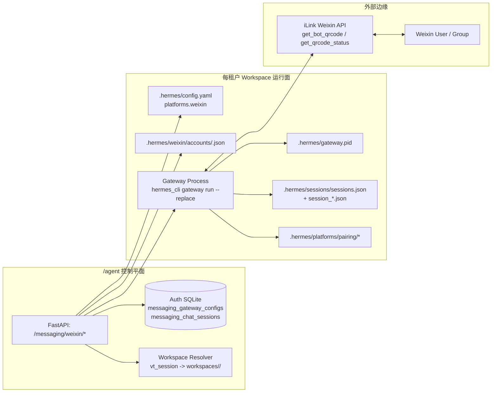
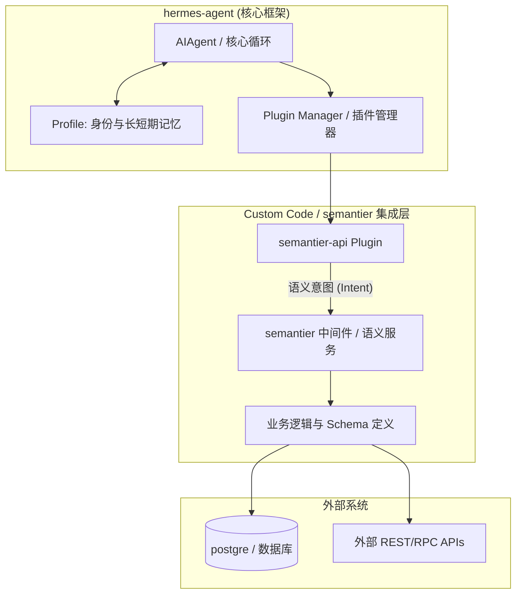
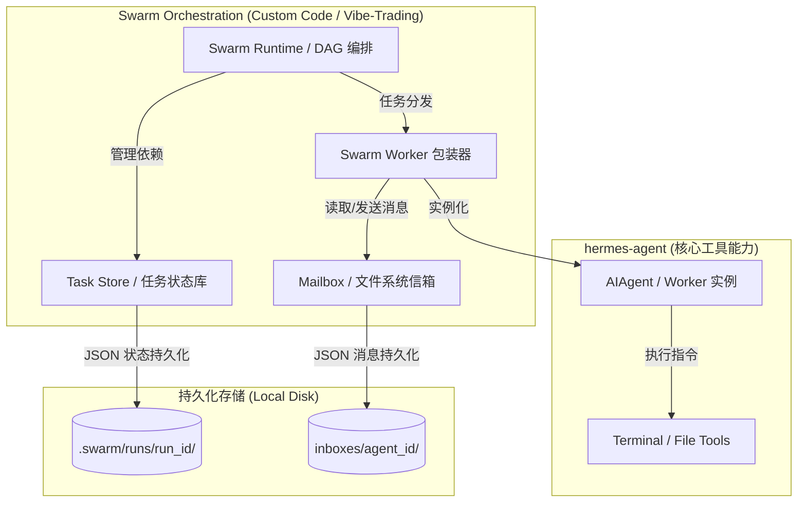
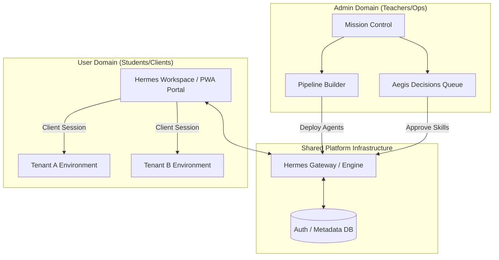
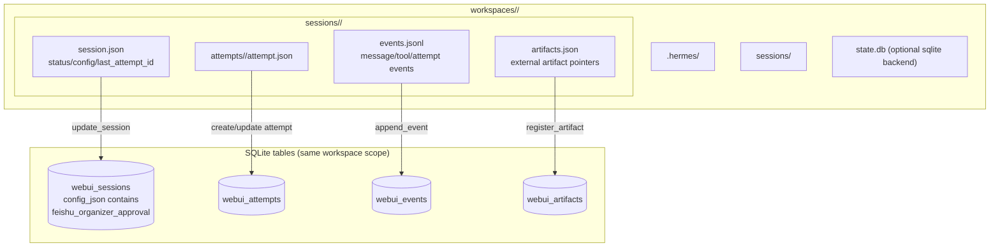
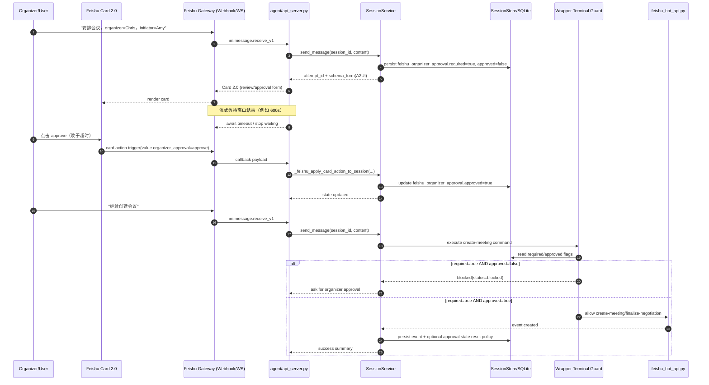

# **Hermes Agent 架构百科 (semantier 实践指南)**

## **1\. 核心概念：Profile vs. Plugin**

在 Hermes 中，**“灵魂”与“躯体能力”是分离的**。

### **1.1 Profile (配置档) \- 身份与记忆容器**

* **本质**：智能体的独立“人格容器”和物理隔离环境。  
* **物理结构**：一个独立的本地目录。  
  * SOUL.md：核心指令、性格与价值观。  
  * MEMORY.md / memory.db：长期记忆与结构化会话历史。  
  * skills/：Agent 进化生成的 JS/Python 函数。  
* **semantier 应用**：用于区分业务角色。例如：财务主管 Profile vs. 审计助手 Profile。

### **1.2 Plugin (插件) - 能力扩展挂载点**

* **本质**：可插拔的代码模块，通过钩子（Hooks）介入生命周期。  
* **物理结构**：全局 plugins/ 目录下的功能代码。  
* **功能**：集成外部 API（如 postgre）、提供新工具调用、处理生命周期钩子。  
* **semantier 应用**：构建通用技术底层。例如：semantier-api 插件用于连接账户与税务接口。**语义契约 (Semantic Contract)**：Hermes 通过插件以“语义意图”而非原始 SQL/REST 调用 semantier，实现 Schema-first 的通信。

### **1.3 核心分层：Orchestrator vs. Middleware**

* **Hermes (Orchestrator)**：负责高层任务规划、意图识别与任务拆解。采用 "Router-Worker" 模式。
* **semantier (Middleware)**：语义中间层，抽象数据访问与业务逻辑。对 Agent 隐藏底层实现细节，提供统一的工具调用桥接。

## ---

**2\. 工作空间与多租户隔离**

### **2.1 Workspace 与状态原则**

Hermes 官方没有显式的 "Workspace" 实体，**Profile 即 Workspace**。

* 它实现了上下文、记忆、工具与环境的完全隔离。  
* **无状态核心，有状态边缘 (Stateless Core, Stateful Edge)**：Agent 推理逻辑保持无状态，由 semantier 管理语义上下文的持久化与按需加载。
* **代谢化建议**：对于 *semantier* 这种灵活系统，若 Profile 过重，可通过 Plugin 在逻辑层（如 SQL tenant\_id 过滤）实现更细粒度的“逻辑工作空间”。

### **2.2 RBAC 与身份绑定**

Hermes 的权限控制通过以下维度实现：

1. **网关层 (Gateway)**：基于用户 ID 的身份准入。  
2. **工具过滤 (Tool Filtering)**：通过插件的 `pre_tool_call` 钩子拦截越权操作。  
3. **身份绑定执行 (Identity-Bound Execution)**：所有动作执行均与 Profile 身份进行“密码学绑定”，防止“混淆代理”攻击。
4. **物理隔离**：不同的角色分配不同的 Profile，且运行在不同的系统隔离环境（如 Docker/Sandbox）下。

### **2.3 Semantier 当前落地：由 /agent 充当 Hermes Dashboard Wrapper**

在 `Vibe-Trading` 当前实现里，我们**不直接修改 upstream `hermes-agent` dashboard 源码**来支持多租户，而是让 `/agent` 作为包装层（wrapper）。

核心做法：

* `agent/api_server.py` 继续作为 **请求级工作空间解析器**，通过 `vt_session` 将用户解析到 `workspaces/<user_id>/`。
* `hermes-workspace` 服务端先调用后端 `/system/paths`，拿到当前用户的 `currentWorkspaceRoot`。
* 随后 `hermes-workspace` 在调用 Hermes Dashboard API 时，额外转发 `X-Hermes-Home: <workspace>/.hermes`。
* 真正消费这个 Header 的不是 upstream dashboard 本体，而是 `agent/hermes_dashboard_wrapper.py` 这个 **ASGI 包装器**：它在每个请求进入时调用 `set_active_hermes_home(...)`，请求结束后再 `reset_active_hermes_home(...)`。
* upstream `hermes-agent` 里的 `SessionDB()`、配置读取、日志与其他 `get_hermes_home()` 消费者因此自动切换到当前用户工作空间下的 `.hermes` 目录。

这条路径的意义是：

* **避免维护 upstream fork 补丁**：`hermes-agent` 可以保持原样升级。
* **保持请求级隔离**：同一个 dashboard 进程可按请求读取不同用户的 `state.db`、`config.yaml` 与其它 Profile 状态。
* **与 Semantier 后端一致**：控制平面仍然由 `agent` 持有，Hermes Dashboard 只被当作被包装的 UI/API 组件。

当前约定：

* Hermes Dashboard 应通过 `agent/hermes_dashboard_wrapper.py` 启动，而不是直接运行 upstream `hermes dashboard`。
* 若直接运行 upstream dashboard，则 `X-Hermes-Home` 会被忽略，Dashboard 会退回单一 `HERMES_HOME` 视图，无法满足多用户隔离。

## ---

**3\. Skill 学习与自进化**

### **3.1 蒸馏与反思机制**

当 Hermes 从对话中生成 Skill 时，会经过**自省节点（Self-reflection Node）**：

* **过滤噪声**：忽略礼貌用语和闲聊。  
* **提取成功路径**：自动跳过失败的尝试，仅记录正确的逻辑。  
* **反思失败**：将用户反馈的“不要这样做”转化为代码中的逻辑判断。

### **3.2 HIL (人机回环) 与角色分层**

为了确保财务与交易逻辑（如 IFRS 审计路径或交易策略）的准确性，建议采用 **“管理端（老师/运维）+ 应用端（学生/客户）”** 的二元角色分层：

*   **管理层 (Teacher/Admin)**：使用 **Mission Control**。负责定义复杂工作流、编写 `SOUL.md`，并通过 **Aegis 质量门禁** 审批 Agent 提交的决策请求或新生成的 Skill。
*   **应用层 (Student/User)**：使用 **Hermes Workspace**。通过精美的 Web UI/PWA 消费经过审批发布的技能，实现会话级的物理隔离。
*   **HIL 策略实现**：
    *   **审批模式**：在 `config.yaml` 中开启 `approvals: mode: manual`。
    *   **预审流水线**：Skill 先写入 `skills/inbox/`，经由管理层在 Mission Control 中 Review 后，再移动至租户的生产目录。
    *   **拦截器插件**：编写拦截 `skill_create` 的插件，强制 Agent 在生成前先口头汇报过滤逻辑，由管理层下发“通行证”。

## ---

**4\. 多 Profile 协作模式**

为了保持 Profile 的“单细胞”特性（职责单一），可采用以下协作架构：

| 模式 | 实现方式 | 适用场景 |
| :---- | :---- | :---- |
| **Supervisor (分级)** | 主管 Profile 调用其他 Profile 的 API | 复杂任务拆解与下发 |
| **Message Bus (总线)** | 通过 Pub/Sub 插件（如 NATS）交换消息 | 异步流水线，符合“代谢流动”理念 |
| **Shared DB (共享)** | 多个 Profile 读写同一个 postgre 实例 | 基于状态改变的联动协作 |

## ---

**5\. 开发建议总结 (Target: semantier.com)**

1. **原子化设计**：让 Profile 保持单一职责（如专门处理 IFRS 15 合规）。  
2. **插件化数据**：将所有 semantier 后端交互封装为标准插件。  
3. **合规性约束**：在 SOUL.md 中增加“监管极（Regulatory Pole）”，强制要求审计追踪日志，严禁 Skill 过滤关键合规步骤。

## ---

**6\. 语义集成策略 (Semantic Integration)**

Hermes 与 semantier 的深度集成依托于 **语义契约 (Semantic Contract)**：

*   **Schema-First 通讯**：集成由严格定义的 Schema 驱动。Hermes 使用“语义意图”查询，而非硬编码 SQL 或 REST 调用。
*   **工具调用桥接 (Tool-Calling Bridge)**：Hermes 利用标准化工具调用接口动态调用 semantier 函数，实现语义动作的“动态发现”。
*   **反馈闭环 (Semantic Refinement)**：Agent 可向 semantier 提供反馈，用于修正或更新已存储的事实，持续优化语义检索的准确率。

### **6.1 网关集成统一架构模式（Feishu / Weixin）**

为避免对 upstream `hermes-agent` 持续打补丁，`semantier` 侧采用统一的「控制平面在 `/agent`，执行平面在 Gateway Adapter」模式。

统一原则：

* `/agent` 负责工作空间解析、配置持久化、网关生命周期控制。
* Gateway 负责平台接入（收发、鉴权、会话路由、工具执行）。
* 默认不做平台特例转发（platform-specific backend delegation），避免 Weixin 与 Feishu 走两套执行架构。

当前落地（关键点）：

* **Feishu**：
    * 配置由 `/agent` 写入 workspace 的 `.hermes/config.yaml`。
    * Gateway 按 adapter 读取 `platforms.feishu.extra`（如 `connection_mode`）执行。
* **Weixin**：
    * 配置由 `/agent` 写入 workspace 的 `.hermes/config.yaml` 与账号缓存文件。
    * Gateway 默认走 adapter 本地执行路径（与 Feishu 一致）。
    * 不保留 platform-specific backend delegation 作为默认或隐式路径。

可选扩展：

* 若未来确有场景需要平台特例（例如灰度迁移），应通过 workspace-scoped env 开关显式开启，并在文档中注明为“临时兼容模式”，而非默认架构。

### **6.2 Weixin Gateway 组件图与运行面（Runtime Surfaces）**

下图描述了当前 `semantier` 中 Weixin 可连通所依赖的核心组件与状态面（control plane + data plane + external edge）：



为保证 Weixin 连通，下面这些运行面都需要一致且可用：

| Runtime Surface | 位置/组件 | 作用 | 失效症状 |
| :---- | :---- | :---- | :---- |
| 控制面配置源 | `Auth SQLite.messaging_gateway_configs` | 存储租户 Weixin 凭据与平台配置，供 `/messaging/platforms` 与保存流程读取 | UI 显示未配置，保存/删除行为不稳定 |
| 聊天会话绑定 | `Auth SQLite.messaging_chat_sessions` | 维护 `session_key -> session_id` 映射，保证同一聊天路由到稳定会话 | 会话漂移、消息落到新会话 |
| 工作空间路由 | `vt_session -> workspaces/<user_id>/` | 将请求绑定到租户专属 `.hermes`，防止串租户 | 读到错误租户配置或单租户视图 |
| 网关平台配置 | `workspaces/<id>/.hermes/config.yaml` 的 `platforms.weixin` | Gateway 启动与运行时读取账号、策略与平台开关 | 网关启动后仍无法鉴权或策略不生效 |
| 账号缓存 | `workspaces/<id>/.hermes/weixin/accounts/<account_id>.json` | 在 `config.yaml` token 缺失或轮换时提供回退凭据 | 偶发鉴权失败、重启后失联 |
| 网关进程实例 | `hermes_cli gateway run --replace` | 真正执行 adapter 收发、pairing、会话写入 | 配置正确但无消息收发 |
| 网关 PID 面 | `workspaces/<id>/.hermes/gateway.pid` | 支持 wrapper 定向重启/替换，确保新配置生效 | 删除/更新配置后仍使用旧连接 |
| 网关会话索引面 | `.hermes/sessions/sessions.json` 与 `session_*.json` | 记录 Weixin chat 的网关会话元数据，供后端回填到 SessionStore | WebUI 不显示或重复回填 Weixin 会话 |
| Pairing 状态面 | `.hermes/platforms/pairing/*` | 承载待审批配对码与审批结果 | 用户无法完成配对或审批无效 |
| 外部 API 边缘 | iLink Weixin API | 提供二维码、状态轮询、消息通道 | 二维码无法确认或消息无法送达 |

连通性最小闭环（建议作为排障顺序）：

1. `/agent` 成功写入 SQLite + workspace `.hermes/config.yaml` / `accounts/*.json`。
2. Gateway 被 `--replace` 重启，`gateway.pid` 更新。
3. iLink `qrcode_status=confirmed` 后凭据被持久化，Gateway 开始可收发。
4. Gateway 写入 `.hermes/sessions`，后端 backfill 到 SessionStore，WebUI 可见。
5. 删除配置时必须同时清理 SQLite + workspace runtime surfaces，并重启 Gateway，避免 stale 凭据继续连通。

### **6.1.1 当前统一策略（2026-04 已落地）**

- `agent` 是工作空间会话与消息历史的唯一控制面；Weixin / Feishu / WebUI 只是入口与投递通道，不应各自维护独立的 canonical transcript store。
- 现状采用双向投影而非双 canonical store：
    - Gateway -> WebUI：`agent/api_server.py` 中 `_sync_gateway_session_messages_to_store(...)` 会把 `.hermes/state.db` 的 gateway 消息增量镜像到 `SessionStore`，并用 `gateway_last_state_message_id` 做游标去重。
    - WebUI -> Gateway：`SessionService` 现在会把 gateway-backed session 上由 WebUI 继续产生的 `user` / `assistant` 消息回写到 workspace `.hermes/state.db`，这样 Weixin/Feishu 恢复上下文时能看到 WebUI 续聊后的会话历史。
- 关键边界：
    - canonical ownership 仍在 `agent`；
    - `.hermes/state.db` 只作为 gateway runtime 恢复历史与跨入口连续性的投影面；
    - 平台差异应落在 `channel`、`gateway_session_key`、delivery cursor 等 metadata，而不是拆成每个平台一份 transcript store。
- 这也解释了此前的问题根因：之前只实现了 Gateway -> SessionStore 的单向同步，所以 WebUI 里继续聊的内容不会出现在 Weixin 恢复历史里。

## ---

**7\. 架构评审 (Review: Vibe-Trading Swarm vs. Hermes)**

在 `/agent/src/swarm` 路径下的实现中，Vibe-Trading 落地了一套基于 **Mailbox (信箱)** 模式的多智能体协作系统。以下是其与 Hermes 建议模式的对比分析：

### **7.1 实现一致性 (Similarities)**
*   **目录即身份 (Directory as Identity)**：Vibe-Trading 为每个 Agent 建立独立的 `inboxes/{agent_id}/` 目录，这与 Hermes "Profile = 独立目录" 的核心哲学高度吻合。
*   **异步解耦 (Asynchronous Decoupling)**：Mailbox 模式实现了非阻塞的通信，类似于 Hermes 建议的 Message Bus (总线) 模式，确保了智能体间的松耦合。
*   **元数据流动 (Metadata-Only Flow)**：Vibe-Trading 的 `SwarmMessage` 仅携带 **Summary (摘要)** 和 **Artifact Paths (产物路径)**，避免了全量上下文传输导致的 "Context Bloat"（上下文膨胀）。这完美践行了文档中提到的“有状态边缘”与“代谢流动”理念。

### **7.2 架构架构对比图 (Architecture Comparison)**

#### **方案 A: 建议的 semantier 语义契约架构**
在这种模式下，Hermes 作为指挥官，通过标准插件与语义中间层交互。



#### **方案 B: Vibe-Trading Swarm 现有的 Mailbox 架构**
在这种模式下，Swarm Runtime 利用文件系统实现基于 DAG 的分布式异步协作。



### **7.3 差异点 (Differences)**
*   **生命周期差异**：Hermes 的 Profile 通常是全局长期的；而 Vibe-Trading 的 Swarm 协作目前主要作用于 **Run (单次运行)** 级别（存储于 `.swarm/runs/{run_id}/`），属于临时性的动态协作。
*   **通信介质**：文档建议使用 NATS (总线) 或 postgre (共享库) 以追求高性能和状态同步；Vibe-Trading 选择了 **JSON 文件系统** 媒介。这种方式虽然在高频并发下略逊于 NATS，但在**可审计性 (Auditability)** 和 **调试透明度** 上具有极高优势。
*   **协作逻辑**：Vibe-Trading 采用了 **DAG (有向无环图)** 驱动的任务编排 (`SwarmTask`)，这在逻辑上介于 Supervisor (分级) 与 Message Bus 之间——既有明确的依赖关系，又有灵活的异步消息触发。

### **7.3 演进建议**
*   **跨 Run 记忆提取**：建议将 Swarm 运行产生的 `Summary` 自动蒸馏回 Hermes Profile 的 `MEMORY.md`，实现从“单次任务协作”到“长期经验积累”的闭环。
*   **Plugin 适配**：将 `Mailbox.send` 封装为标准 Hermes Plugin，允许普通 Profile 通过语义意图直接向 Swarm 发送协作请求。

## ---

**8\. SaaS 多租户架构：Hermes + Mission Control 实践**

基于 `hermes-agent` 的核心能力与 `Vibe-Trading` 的工程实践，我们可以构建一套高可靠、可进化的 **SaaS 多租户量化交易平台**。

### **8.1 架构角色映射与流程 (Business Mapping)**

该架构本质上是一个 **“生产 -> 审批 -> 发布 -> 消费”** 的智能体代谢循环：

*   **管理中枢 (Mission Control)**：对应 **控制平面**（运维/老师）。
    *   **生产与定义**：在此定义复杂的多 Agent 工作流（Pipelines），编写 `SOUL.md`。
    *   **审批门禁**：通过 **Decisions Queue** 监控 Token 消耗、安全审计（防止越狱攻击），并审核 Agent 自主生成的 Skill 是否合规。
*   **用户门户 (Hermes Workspace)**：对应 **租户数据平面**（学生/客户）。
    *   **纯粹消费**：学生通过精美的 Web UI (PWA) 与已发布的 Agent 交互。
    *   **环境隔离**：通过 Session/Workspace 隔离，确保学生只能看到自己的对话历史与个性化产物。

### **8.2 技术栈兼容性与同步策略**

*   **同构技术栈**：两者均采用 **Next.js + TypeScript + Tailwind**，通过 pnpm 管理。视觉风格（Semantier 品牌设计）可通过统一的 Tailwind 配置快速对齐。
*   **状态同步 (State Sync)**：
    *   由于两者都读取 `~/.hermes/profiles` 下的文件，管理层在 Mission Control 中审批通过的一个新 Skill（`.js` 或 `.py` 文件），会立即出现在 Workspace 的租户视图中供其调用。
    *   **多租户隔离**：通过 `hermes gateway` 的 RBAC 或 Nginx 反向代理处理身份校验，实现严格的物理层数据隔离。

### **8.3 SaaS 核心分层拓扑图**



### **8.4 落地挑战与建议**

*   **多租户 RBAC**：需在 `hermes gateway` 层级或通过 API 网关（如 Kong/APISIX）对 `user_id` 进行拦截，确保租户无法访问他人的 Profile。
*   **SSE 鲁棒性**：管理端强行 Kill 任务时，Workspace 端需通过 `vibe-trading` 内置的流式重试机制处理 SSE 断连。

## ---

**9. Kimi 代码评审与集成建议 (outsourc-e/hermes-workspace 借鉴分析)**

基于对 `outsourc-e/hermes-workspace` 仓库的逐文件代码审计，以及与 Vibe-Trading `/agent` 现有实现的对比，以下是可落地的借鉴与集成建议，按优先级排序。

> **框架兼容性说明**：`hermes-workspace` 基于 **TanStack Start**（全栈框架，`src/server/` 代码运行在**服务端 Node.js 进程**，通过 API 为前端提供服务），而 Vibe-Trading `frontend/` 是 **Vite + Vanilla React SPA**（纯浏览器端应用，无 Node.js 服务端层，服务端逻辑全部在 Python FastAPI）。因此：
> - **纯 UI/UX 功能**（Inspector、Smooth Streaming、Canvas 压缩）可直接在前端复刻，无障碍。
> - **服务端逻辑**（事件总线、探测、文件持久化）必须下沉到 Python FastAPI 后端（`agent/`），不能在前端实现。
> - `useSSE.ts` 等 hook 本身已是 vanilla React，无需适配。

### **9.1 高优先级（立竿见影，改动可控）**

#### **9.1.1 Swarm 前端接入 `useSSE` Hook（Bug 修复）**

**现状**：`Agent.tsx` 的 swarm 模式直接使用裸 `EventSource`，无自动重连、无去重、无 `Last-Event-ID`。长时 swarm 任务一旦断连，UI 直接丢失进度。

**建议**：无需从 hermes-workspace 搬运代码——直接复用 Vibe-Trading 已有的 `frontend/src/hooks/useSSE.ts`，将 swarm 的原始 `EventSource` 替换为封装后的 hook。

**集成路径**：
```tsx
// Agent.tsx 中 swarm 路径
// 从：
const source = new EventSource(`/swarm/runs/${runId}/events`);
// 改为：
const { connect, disconnect, status } = useSSE({
  url: `/swarm/runs/${runId}/events`,
  onMessage: (event) => { ... },
  onReconnect: (meta) => { toast.info(`Swarm reconnect #${meta.attempt}`) },
});
```

#### **9.1.2 Smooth Text Streaming（UX 提升）**

**现状**：Vibe-Trading 前端收到 `text_delta` 后直接追加到 DOM，长文本会出现抖动/卡顿。

**借鉴点**：`use-streaming-message.ts` 使用 `requestAnimationFrame` 做步进渲染——不逐字更新，而是按帧批量推进（大步长 `Math.ceil(remaining / 6)`），视觉上是平滑的"打字机"效果。

**集成路径**：在前端 Agent store 或 `Agent.tsx` 中引入类似的 `pushTargetText` + `requestAnimationFrame` 机制，替代直接 `streamingText += delta`。

#### **9.1.3 Inspector / Activity 可观测面板**

**现状**：Vibe-Trading 仅能在聊天流中看到工具调用，没有全局事件时间线，调试流式问题很困难。

**借鉴点**：`activity-store.ts` + `inspector-panel.tsx` 是一个非常轻量的设计：
- 全局 `pushActivity({ type, time, text })` 埋点
- Inspector 侧滑面板分 Tab：**Activity / Artifacts / Files / Memory / Logs**
- 文件路径从 `tool_call` / `file_read` / `file_write` 事件中自动提取

**集成路径**：
1. 前端新增 `activityStore`（Zustand，约 30 行）
2. 在 `Agent.tsx` 的各事件 handler 中插入 `pushActivity()`
3. 新增 `InspectorPanel` 组件挂载在 Layout 右侧

### **9.2 中优先级（架构增强）**

#### **9.2.1 Run 级 SSE 去重 + 服务端 EventBus 增强**

**现状（基于代码审计）**：
- `agent/src/session/events.py` 的 `EventBus` 使用 `_buffers: Dict[str, List[SSEEvent]]`，`replay()` 是 **O(N) 线性扫描**（line 149–170），无索引
- `SSEEvent` 只有 `session_id` / `event_id` / `event_type` / `data`，**无 `run_id` 字段**（line 20–52）
- `event_id` 是随机 `uuid.uuid4().hex[:16]`，**无单调序**，reconnect 时若 ID 找不到则直接丢历史
- `SessionStore.append_event()` 每次事件都执行 `open("a")` / `write` / `close`，**无 debounce**，高频率 `text_delta` 下磁盘压力高

**借鉴点**：`send-run-tracker.ts` + `chat-event-bus.ts` 的三层防御：
```
Client dedup (sendStreamRunIds Set)
    ↓
Server event-bus dedup (active runId 抑制全局广播)
    ↓
Message signature dedup (role + content + attachments)
```

**精确集成路径（Python 后端）**：

**① `agent/src/session/events.py` — EventBus 增强**

```python
# SSEEvent 增加 run_id（line 20 附近）
@dataclass
class SSEEvent:
    event_id: str = ""                          # 改为有序 ID，见下方
    session_id: str = ""
    run_id: Optional[str] = None                # 新增：attempt_id 或 swarm_run_id
    event_type: str = ""
    data: Dict[str, Any] = field(default_factory=dict)
    timestamp: float = field(default_factory=time.time)

class EventBus:
    def __init__(self, max_buffer_size: int = 500):
        # ... 现有字段 ...
        self._index: Dict[str, Dict[str, int]] = {}   # session_id -> {event_id: buffer_index}
        self._active_runs: Dict[str, Set[str]] = {}   # session_id -> {run_id}
        self._seq = 0                                 # 单调序列号（跨实例需持久化）

    def _next_id(self) -> str:
        # 用 (timestamp, seq) 复合 ID 替代随机 UUID，保证可排序、可索引
        self._seq += 1
        return f"{int(self._timestamp_ms()):x}-{self._seq:x}"

    def publish(self, session_id: str, event: SSEEvent) -> None:
        if not event.event_id:
            event.event_id = self._next_id()
        # run 级去重：若该 run 正在被 send-stream 处理，全局 chat-events 跳过
        if event.run_id and event.run_id in self._active_runs.get(session_id, set()):
            # 标记为已接管，不广播到全局订阅者（但写入 buffer 供 replay）
            event.data["_suppressed"] = True
        # ... 现有 buffer append + queue broadcast 逻辑 ...
        # 同时更新索引
        buf = self._buffers[session_id]
        self._index.setdefault(session_id, {})[event.event_id] = len(buf) - 1

    def replay(self, session_id: str, last_event_id: Optional[str] = None) -> List[SSEEvent]:
        if not last_event_id:
            return []
        with self._lock:
            idx_map = self._index.get(session_id)
            if idx_map and last_event_id in idx_map:
                idx = idx_map[last_event_id]
                return self._buffers[session_id][idx + 1:]
            # 降级：回退到 O(N) 扫描（兼容旧客户端）
            return self._fallback_scan(session_id, last_event_id)

    def register_run(self, session_id: str, run_id: str) -> None:
        with self._lock:
            self._active_runs.setdefault(session_id, set()).add(run_id)

    def unregister_run(self, session_id: str, run_id: str) -> None:
        with self._lock:
            self._active_runs.get(session_id, set()).discard(run_id)
```

**② `agent/src/session/service.py` — run 生命周期注册**

在 `_run_with_agent()` 的 attempt 启动前后插入（line 916 附近）：

```python
# attempt 开始前
self.event_bus.register_run(sid, attempt_id)
try:
    # ... 现有 run_in_executor 逻辑 ...
finally:
    self.event_bus.unregister_run(sid, attempt_id)
    # 延迟 5s 注销，防止 late duplicate（与 hermes-workspace 策略一致）
    await asyncio.sleep(5)
    self.event_bus.unregister_run(sid, attempt_id)   # idempotent
```

**③ `agent/src/session/store.py` — 异步 + 批量化写入**

将 `append_event()` 改为 debounced batch flush：

```python
import asyncio
from typing import List

class SessionStore:
    def __init__(self, ...):
        # ... 现有字段 ...
        self._pending: Dict[str, List[SessionEvent]] = {}   # session_id -> buffer
        self._flush_tasks: Dict[str, asyncio.Task] = {}     # session_id -> Task
        self._flush_lock = asyncio.Lock()

    def append_event(self, event: SessionEvent) -> None:
        # 立即同步写入（保证崩溃安全）
        path = self._events_file(event.session_id)
        path.parent.mkdir(parents=True, exist_ok=True)
        with path.open("a", encoding="utf-8") as f:
            f.write(json.dumps(event.to_dict(), ensure_ascii=False) + "\n")
        # 同时触发 debounced 批量写入（可选升级：改用 aiofiles + WAL）
        # ...

    # 进阶：若需要更高吞吐，可改为纯异步 debounced flush
    async def _debounced_flush(self, session_id: str, delay: float = 0.5) -> None:
        await asyncio.sleep(delay)
        async with self._flush_lock:
            batch = self._pending.pop(session_id, [])
            if not batch:
                return
            path = self._events_file(session_id)
            lines = "\n".join(json.dumps(e.to_dict(), ensure_ascii=False) for e in batch) + "\n"
            # aiofiles 替代 blocking write
            import aiofiles
            async with aiofiles.open(path, "a", encoding="utf-8") as f:
                await f.write(lines)
```

> **注意**：上述 `aiofiles` 升级是可选的。当前 immediate sync write 在 500 event buffer 规模下足够，但若后续支持高频流式 token（如每秒数十条 delta），batch flush 可降低 90% 以上的 write syscall。

#### **9.2.2 消息归一化管道**

**现状**：Vibe-Trading 没有处理模型输出的包裹标签（如 `<final>...</final>`、`<thinking>`），可能导致 UI 渲染异常或重复消息。

**借鉴点**：`chat-store.ts` 的消息清洗流水线：
- `stripFinalTags()` — 移除服务端流式完成标记
- `stripInternalTags()` — 在代码块外移除 `<thinking>` / `<antThinking>` / `<thought>`
- 签名去重：`role + content + attachments` 生成签名，防止同一消息渲染两次

**集成路径**：在 `agent/src/session/models.py` 的 `Message` 序列化或前端 `useAgentStore` 的消息追加逻辑中引入。

#### **9.2.3 Swarm SSE 推送机制改造（从轮询到推送）**

**现状（基于代码审计）**：
- `agent/api_server.py` 的 `/swarm/runs/{run_id}/events`（line 2472–2494）使用 **2 秒轮询** `runtime._store.read_events()`，每次读取整个 `events.jsonl` 文件
- `agent/src/swarm/runtime.py` 的 `_emit_event()`（line 128–149）已写入 `SwarmStore`，但 live callback 是单点 `Callable`，无法支持多客户端订阅
- 这与 Session 的 `EventBus`（`asyncio.Queue` 广播）架构不统一

**精确集成路径（Python 后端）**：

**① `agent/src/swarm/runtime.py` — 增加 `asyncio.Queue` 广播**

```python
class WorkflowRuntime:
    def __init__(self, ...):
        # ... 现有字段 ...
        self._swarm_queues: Dict[str, List[asyncio.Queue]] = {}   # run_id -> [Queue]
        self._swarm_lock = asyncio.Lock()

    def _emit_event(self, run_id: str, event: SwarmEvent) -> None:
        # ... 现有 persist 逻辑 ...
        # 增加广播到所有订阅的 SSE consumer
        queues = self._swarm_queues.get(run_id, [])
        for q in queues:
            try:
                q.put_nowait(event)
            except asyncio.QueueFull:
                pass

    async def subscribe(self, run_id: str) -> AsyncGenerator[SwarmEvent, None]:
        """类似 EventBus.subscribe，供 SSE endpoint 使用"""
        queue: asyncio.Queue[SwarmEvent] = asyncio.Queue(maxsize=200)
        async with self._swarm_lock:
            self._swarm_queues.setdefault(run_id, []).append(queue)
        try:
            run = self._store.load_run(run_id)
            # 先 replay 历史事件（用 index 偏移）
            # ...
            while True:
                try:
                    event = await asyncio.wait_for(queue.get(), timeout=2.0)
                    yield event
                except asyncio.TimeoutError:
                    run = self._store.load_run(run_id)
                    if run and run.status.value in ("completed", "failed", "cancelled"):
                        break
        finally:
            async with self._swarm_lock:
                self._swarm_queues.get(run_id, []).remove(queue)
```

**② `agent/api_server.py` — SSE endpoint 改为订阅模式**

```python
@app.get("/swarm/runs/{run_id}/events")
async def swarm_run_events(run_id: str, request: Request, last_index: int = Query(0, ge=0)):
    ctx = _resolve_request_context(request, require_login=True)
    runtime = _get_swarm_runtime(ctx.workspace)

    async def event_stream():
        idx = last_index
        # replay 历史
        for evt in runtime._store.read_events(run_id, after_index=idx):
            idx += 1
            yield f"id: {idx}\nevent: {evt.type}\ndata: {json.dumps(evt.model_dump())}\n\n"
        # 切换为实时推送
        async for evt in runtime.subscribe(run_id):
            if await request.is_disconnected():
                break
            idx += 1
            yield f"id: {idx}\nevent: {evt.type}\ndata: {json.dumps(evt.model_dump())}\n\n"
        yield f"event: done\ndata: {{\"status\": \"{runtime._store.load_run(run_id).status.value}\"}}\n\n"

    return StreamingResponse(event_stream(), media_type="text/event-stream")
```

**收益**：轮询频率从固定 2s/次降为 0（事件驱动），CPU 和 I/O 开销大幅降低；多客户端可同时订阅同一 run。

#### **9.2.4 Health Check 增强**

**现状**：`agent/api_server.py` `/health`（line 851–858）只返回静态字符串 `{"status": "healthy"}`，不检查任何依赖。

**精确集成路径**：

```python
@app.get("/health", response_model=HealthResponse)
async def health_check():
    checks = {
        "event_bus": event_bus._loop is not None and event_bus._loop.is_running(),
        "session_store_writeable": _check_store_writeable(),
        "hermes_agent_available": _check_hermes_path(),
    }
    ok = all(checks.values())
    return HealthResponse(
        status="healthy" if ok else "degraded",
        service="semantier API",
        timestamp=datetime.now().isoformat(),
        checks=checks,
    )

def _check_store_writeable() -> bool:
    try:
        test_path = WORKSPACE_DIR / ".health_test"
        test_path.write_text("ok")
        test_path.unlink()
        return True
    except Exception:
        return False

def _check_hermes_path() -> bool:
    return Path(os.getenv("HERMES_AGENT_PATH", "hermes-agent/agent")).exists()
```

### **9.3 低优先级（锦上添花）**

#### **9.3.1 Canvas 图片压缩（多模态准备）**

**借鉴点**：`attachment-button.tsx` 用 Canvas API 做客户端压缩（最大边 1280px，渐进降低 JPEG quality 到 ~300KB，PNG 保留透明通道）。

**适用场景**：如果 Vibe-Trading 后续需要支持截图/图表上传做量化分析。

#### **9.3.2 Local Session Persistence（离线韧性）**

**借鉴点**：`local-session-store.ts` 将 portable 模式会话持久化到 `.runtime/local-sessions.json`：
- 500 条消息上限，自动截断尾部
- Debounced save（2s 延迟）批量写入

**框架适配**：`hermes-workspace` 基于 TanStack Start，其 `src/server/local-session-store.ts` 运行在**服务端 Node.js 进程**（非浏览器），通过文件系统写 `.runtime/local-sessions.json`。Vibe-Trading `frontend/` 是纯 Vite + React SPA，没有配套 Node.js 服务端层，因此同等功能必须由 Python FastAPI 后端（`agent/`）承接，而非前端直接写文件。替代方案：

**① 前端层**：用 `sessionStorage` 做轻量缓存（line 级别的变化，不影响后端架构）：
- 缓存 `sessionId` + `status`（如 `streaming` / `waiting`）
- 缓存最近 5 条消息摘要（用于刷新后快速渲染骨架屏）
- 120s TTL：若刷新时缓存过期，则视为全新会话

**② 后端层**：复用已有 Python `SessionStore`（`agent/src/session/store.py`），当前已写入 `sessions/<id>/session.json` + `events.jsonl`，仅需优化：
- `append_event()` 当前是 immediate sync write（line 146–154），可改为 **debounced flush**：
  ```python
  # 在 SessionStore.__init__ 中增加
  self._pending_events: Dict[str, List[SessionEvent]] = {}
  self._flush_delays: Dict[str, asyncio.Handle] = {}

  def append_event(self, event: SessionEvent) -> None:
      # 1. 立即写入 WAL（保证崩溃安全）
      self._append_wal(event)
      # 2. 放入 pending batch
      self._pending_events.setdefault(event.session_id, []).append(event)
      # 3. 触发/重置 debounce timer（2s）
      self._reset_flush_timer(event.session_id, delay=2.0)
  ```
- `get_events()` 当前读取整个文件（line 156–165），可改为 **mmap 或 tail read**：只读最后 N 行，避免 `path.read_text()` 加载全量

**适用场景**：增强前端在刷新后的等待状态恢复（Vibe-Trading 目前只有 90s 安全超时，没有刷新恢复）。

### **9.4 快速决策表**

| 借鉴项 | 价值 | 难度 | 推荐切入点 |
|--------|------|------|-----------|
| Swarm 接入 `useSSE` | 🔥 修复断连 Bug | 低 | `Agent.tsx` swarm 路径 |
| Smooth streaming | 🔥 UX 质变 | 低 | 前端 store 渲染逻辑 |
| Inspector 面板 | 🔥 调试效率 | 中 | 新增 `activityStore` + 组件 |
| Run 级去重 + EventBus 索引 | ⭐ 架构健壮 | 中 | `events.py` + `service.py` |
| Swarm SSE 推送改造 | ⭐ 性能提升 | 中 | `runtime.py` + `api_server.py` |
| Health Check 增强 | ⭐ 可运维性 | 低 | `api_server.py` |
| 消息归一化 | ⭐ 稳定性 | 低 | `models.py` / 前端 store |
| Local 持久化 | 💡 离线韧性 | 中 | `sessionStore.py` + `sessionStorage` |
| 图片压缩 | 💡 多模态准备 | 低 | 前端附件组件 |

### **9.5 下一步行动建议**

最推荐的落地顺序：

**第一梯队（当周可上线）**：
1. **Swarm 接入 `useSSE`** — 复用现有 hook，单行改动，修复断连 Bug
2. **Smooth streaming** — 纯前端 `requestAnimationFrame`，无后端依赖
3. **Health Check 增强** — 低侵入，提升部署可观测性

**第二梯队（下一迭代）**：
4. **Run 级去重 + EventBus 索引** — 需要改动 `events.py` 核心数据结构，需充分测试 replay 兼容性
5. **Swarm SSE 推送改造** — 将轮询改为 `asyncio.Queue`，显著降低长时 swarm 的 CPU/I/O 开销
6. **Inspector 面板** — 前端组件开发，可并行进行

**第三梯队（后续优化）**：
7. **消息归一化** + **Local 持久化 debounce** + **Canvas 图片压缩**

---

* [Nous Research: Hermes Agent 介绍](https://www.google.com/search?q=https://www.youtube.com/watch?v%3DR267X9kY6_0)  
* [Agent Skill 验证参考](https://www.google.com/search?q=https://www.youtube.com/shorts/R6X5z0p5K9k)

## ---

**10. Wrapper 级 Trajectory 开关与落盘边界（已实现）**

本节记录当前已落地的实现：`save_trajectories` 由 `/agent` 包装层统一控制，不依赖上游 dashboard settings 页面；并且轨迹文件强制写入 wrapper 作用域，避免落到用户 workspace。

### **10.1 设计目标**

* `SAVE_TRAJECTORIES` 作为后端 wrapper feature switch（可选别名：`HERMES_SAVE_TRAJECTORIES`）。
* 由 `agent` 在构造 `AIAgent(...)` 时显式传递 `save_trajectories`。
* trajectory JSONL 不写入 `workspaces/<user_id>/...`，统一写到 wrapper 的 Hermes Home 目录。
* 保持 upstream `hermes-agent` 最小侵入（不改其核心保存逻辑签名）。

### **10.2 已实现的自定义代码（Custom Code）**

**① runtime_env: 环境变量 -> AIAgent kwargs**

文件：`agent/runtime_env.py`

* 增加布尔解析器 `_bool_from_env(...)`，支持 `1/true/on/yes/enabled` 与 `0/false/off/no/none/disabled`。
* 在 `get_hermes_agent_kwargs()` 中读取：
    * `SAVE_TRAJECTORIES`
    * `HERMES_SAVE_TRAJECTORIES`
* 若解析到显式布尔值，则写入：

```python
kwargs["save_trajectories"] = True | False
```

**② SessionService: wrapper 作用域强制落盘**

文件：`agent/src/session/service.py`

* `AIAgent` 构造前读取 `agent_kwargs = get_hermes_agent_kwargs()`。
* 当 `save_trajectories=True`：
    * 计算落盘目录：`get_hermes_home() / "trajectories"`
    * 创建目录（若不存在）
    * 在 wrapper 内替换 Hermes 轨迹保存函数引用，将默认相对路径写入改为绝对路径写入：

```python
trajectory_samples.jsonl
failed_trajectories.jsonl
```

* 这样即使进程 cwd 变化，也不会把 trajectory 落到用户 workspace。

**③ Regression Tests: 行为锁定**

文件：`agent/tests/regression/test_runtime_env.py`

新增测试：

* `SAVE_TRAJECTORIES=true` -> `kwargs["save_trajectories"] is True`
* `HERMES_SAVE_TRAJECTORIES=0` -> `kwargs["save_trajectories"] is False`

用于防止后续重构丢失 wrapper feature switch 行为。

### **10.3 Effective Storage Location（生效存储位置）**

当 `save_trajectories=true` 时，落盘位置固定为：

* 成功轨迹：`<HERMES_HOME>/trajectories/trajectory_samples.jsonl`
* 失败轨迹：`<HERMES_HOME>/trajectories/failed_trajectories.jsonl`

其中：

* `HERMES_HOME` 若显式配置，则使用该值。
* 未配置时，使用 wrapper 默认值：`agent/.hermes`。

因此默认有效路径为：

* `agent/.hermes/trajectories/trajectory_samples.jsonl`
* `agent/.hermes/trajectories/failed_trajectories.jsonl`

**边界保证**：上述路径均属于 backend wrapper scope，不属于 `workspaces/<user_id>/...` 用户数据域。

### **10.4 与 Session Events 页面导出的关系**

需要区分两类 JSONL：

* Canonical Session Event Log：`sessions/<sid>/events.jsonl`
* Atropos 导出：由 `events.jsonl` 投影生成（按需导出）
* Hermes trajectory_samples：由 `save_trajectories=true` 控制，写入 `<HERMES_HOME>/trajectories/`

三者用途不同，生命周期和存储目录也不同。

### **10.5 运维约定**

* 修改 `.env` 的 `SAVE_TRAJECTORIES` 后，需要重启 backend 进程生效。
* 若部署多实例，建议每实例使用独立 `HERMES_HOME` 或共享可审计卷（按实例/环境分目录）。
* 生产环境建议定期归档 `trajectories/*.jsonl`，避免单文件无限增长。

### **10.6 配置矩阵（Configuration Matrix）**

| 配置项 | 示例值 | 默认行为 | 生效影响 | 存储位置 | 是否需要重启 |
| :---- | :---- | :---- | :---- | :---- | :---- |
| `SAVE_TRAJECTORIES` | `true` / `false` | 未设置时不覆盖 Hermes 默认（等价于关闭） | 控制 wrapper 是否向 `AIAgent` 传递 `save_trajectories` | 成功：`<HERMES_HOME>/trajectories/trajectory_samples.jsonl`；失败：`<HERMES_HOME>/trajectories/failed_trajectories.jsonl` | 是 |
| `HERMES_SAVE_TRAJECTORIES` | `1` / `0` | 作为 `SAVE_TRAJECTORIES` 别名 | 同上；用于兼容不同部署命名习惯 | 同上 | 是 |
| `HERMES_HOME` | `/opt/semantier/.hermes` | 未设置时回退 `agent/.hermes` | 定义 wrapper 级 Hermes home 根目录 | `<HERMES_HOME>/trajectories/*.jsonl` | 是 |

优先级说明：

* trajectory 开关读取顺序为 `SAVE_TRAJECTORIES` -> `HERMES_SAVE_TRAJECTORIES`（取第一个显式布尔值）。
* 轨迹写入路径始终锚定到 `HERMES_HOME`，不随工作目录漂移。

## ---

**11. Bash Tool PTY 增强（Interactive Login Auto-PTY，已实现）**

本节记录 `agent/src/tools/bash_tool.py` 的增强：当命令属于交互式登录/鉴权流程时，wrapper 会自动启用 PTY（pseudo-terminal），使 WebUI 发起的登录体验与原生 CLI 保持一致。

### **11.1 背景与问题定义**

在浏览器会话（WebUI）中，Agent 通过 bash tool 执行登录命令时，默认是非 PTY 子进程。许多 CLI（如 `lark-cli`、`gh`、`firebase`）在无 TTY 环境下会出现：

* 链接打印后阻塞等待，且回调状态不稳定；
* 交互提示不可见或行为退化；
* 与用户在真实终端中的行为不一致。

目标是让“WebUI 发起命令”在交互登录场景中具备与终端一致的 TTY 语义。

### **11.2 设计目标**

* **自动化**：对常见交互登录命令自动开启 PTY，无需调用方显式配置。
* **安全边界清晰**：仅对交互登录类命令触发，不扩大到普通查询命令。
* **可观测**：输出 JSON 中暴露 `used_pty`，便于排障。
* **兼容性**：保留显式参数 `pty` / `timeout_seconds`，与已有调用方兼容。

### **11.3 已实现行为（Custom Code）**

文件：`agent/src/tools/bash_tool.py`

**① 新增 PTY 执行路径**

* 新增 `_run_with_pty(...)`：使用 `pty.openpty()` + `subprocess.Popen(...)` + `select.select(...)` 循环读取输出。
* PTY 模式将 stdout/stderr 合流（TTY 语义），超时或退出后返回统一 JSON。

**② 自动识别交互登录命令**

* 新增 `_should_force_pty_for_command(...)`：
    * 显式匹配（兼容 Feishu）：
        * `lark-cli config init --new`
        * `lark-cli auth login ...`
        * `npx @larksuite/cli config init --new`
        * `npx @larksuite/cli auth login ...`
    * 通用 token 规则：匹配 `login/signin/auth/oauth/sso` 及 `*-login`、`*-auth`。
    * 负向约束：若窗口内出现 `status/list/whoami/doctor/help/-h/--help`，则不强制 PTY。

**③ 超时策略升级**

* 普通命令默认超时：`120s`。
* 交互登录自动 PTY 命令默认超时：`300s`。
* 新增 `timeout_seconds` 参数（上限 `1800s`）支持调用方覆盖。

**④ 超时输出保留**

* 非 PTY 超时场景，保留 `TimeoutExpired` 的部分 stdout/stderr（例如登录 URL）。
* 返回中统一包含：`status/error/stdout/stderr/used_pty`。

**⑤ PTY 环境变量与窗口大小配置**

* **TERM 环境变量**：设置为 `xterm-256color` 以确保 CLI 工具的 TTY 检测顺利通过。许多交互式 CLI 不仅检查 `isatty()`，还检查 `$TERM` 变量。
* **PTY 窗口大小**：通过 `fcntl.ioctl(TIOCSWINSZ)` 设置 PTY 为 24×80 尺寸，使 CLI 工具检测到真实的终端尺寸。
  - 实现位置：`bash_tool.py` 中的 `_set_pty_size()` 函数。
  - 调用时机：进程创建后、关闭 slave FD 后立即调用。

这两项配置确保 Feishu `lark-cli config init --new` 等工具在 WebUI 的伪终端中能够正确识别 TTY 环境，避免"requires a terminal for interactive mode"错误。

### **11.4 行为边界（Non-Goals）**

* 不将所有命令切换到 PTY；仅作用于交互登录类命令。
* 不在 bash tool 层自动“判定登录成功”（例如不隐式执行 `auth status`）。
* 不改变上层会话编排语义（SessionService 事件流保持不变）。

### **11.5 测试与回归锁定**

文件：`agent/tests/test_bash_tool.py`

已覆盖：

* Feishu 命令自动 PTY。
* 通用登录命令（`gh auth login`、`firebase login`、`oauth/sso`）自动 PTY。
* 查询类命令（`auth status`、`login --help`）不触发自动 PTY。
* 超时时保留部分输出。
* 显式 `pty=True` 路径可正常返回输出。

### **11.6 运维与排障建议**

* 若登录流程在 WebUI 中异常，优先检查工具返回 JSON 的 `used_pty` 是否为 `true`。
* 对首次配置类命令（会输出授权链接）建议保留默认 300s；若网络慢可显式传 `timeout_seconds`。
* 若命令属于“仅查询状态”，应避免含有误导 token，或显式设置 `pty=false` 以固定行为。

### **11.7 配置与行为矩阵**

| 命令类型 | 自动 PTY | 默认超时 | 输出特征 |
| :---- | :---- | :---- | :---- |
| 交互登录（如 `gh auth login`） | 是 | 300s | `used_pty=true` |
| Feishu 配置/登录（`lark-cli ...`） | 是 | 300s | `used_pty=true` |
| 状态查询（如 `auth status`） | 否 | 120s | `used_pty=false` |
| 普通 shell 命令 | 否（除非显式 `pty=true`） | 120s | `used_pty=false` |

这项增强的核心价值是：**在不改变上层业务协议的前提下，让 WebUI 的登录交互语义对齐真实终端，降低“浏览器里登录不生效/不可见”的运行差异。**

## ---

**12. Feishu 会议审批状态机（Wrapper-Only Persisted Approval Flag）**

本节定义 Feishu 会议创建在超时与跨轮次场景中的强一致审批机制。

### **12.1 目标与约束**

目标：当会话流程因 Feishu bridge 超时或 Session 超时中断后，后续继续流程必须依赖 Hermes 持久化审批状态，而不是仅依赖模型短期上下文。

约束：

* 仅在 `/agent` wrapper 层实现，不修改 `hermes-agent/` upstream。
* 审批状态必须写入可持久化会话状态（session state），可跨 attempt、跨消息恢复。
* `create-meeting` / `finalize-negotiation` 必须由 wrapper 在执行层进行硬拦截，不依赖 prompt 软约束。

### **12.2 持久化状态模型（Hermes Session State）**

建议在 session config 中维护：

```json
{
  "feishu_organizer_approval": {
     "required": true,
     "approved": false,
     "last_response": "edit|approve|reject",
     "updated_at": "2026-04-25T13:30:00"
  }
}
```

语义：

* `required=true`：当前流程存在 organizer 审批门禁。
* `approved=true`：已取得 organizer 明确同意，可进入创建阶段。
* `approved=false`：审批未完成或被驳回/要求修改，不可创建事件。

### **12.3 状态机定义（State Machine）**

状态集合：

* `IDLE`：`required=false`
* `PENDING_APPROVAL`：`required=true, approved=false`
* `APPROVED`：`required=true, approved=true`

事件与迁移：

1. 进入审批：检测到 organizer 审批门禁（如 organizer/initiator 不一致）
    * `IDLE -> PENDING_APPROVAL`
2. organizer 明确同意（`organizer_approval=approve`）
    * `PENDING_APPROVAL -> APPROVED`
3. organizer 要求修改/拒绝（`organizer_approval=edit|reject`）
    * `APPROVED -> PENDING_APPROVAL`
    * `PENDING_APPROVAL -> PENDING_APPROVAL`
4. 事件创建完成后（可选策略）
    * 复位为 `IDLE` 或保留最近审批结果（按业务策略）

### **12.4 超时场景处理（Feishu Bridge / Session Timeout）**

超时不改变审批真值，只终止当前流式等待：

* Feishu bridge 超时（例如 600s）后，session state 中审批标志保持不变。
* 用户后续消息进入同一会话时，读取持久化 `feishu_organizer_approval` 继续执行。
* 若仍为 `PENDING_APPROVAL`，任何创建命令都必须被阻断并提示继续审批。

这保证了“流程中断可恢复”与“审批门禁不丢失”同时成立。

### **12.5 执行层硬拦截（Wrapper Guard）**

在 wrapper terminal guard 中识别：

* `feishu_bot_api.py create-meeting`
* `feishu_bot_api.py finalize-negotiation`

拦截规则：

* 若 `required=true && approved=false`，返回 `status=blocked`，拒绝执行。
* 若 `approved=true`，允许执行。

该拦截位于工具执行层，不依赖模型是否遵循提示词。

### **12.6 与 A2UI 表单契约协同**

表单负责“采集与确认”，状态机负责“可执行性约束”：

* A2UI `schema_form` 输出 `organizer_approval` 字段用于驱动状态迁移。
* 会话层解析用户提交并持久化到 `session.config`。
* terminal guard 读取持久化标志做最终放行/拦截。

### **12.7 兼容性与落地边界**

* 不要求修改 Hermes 内核；仅在 `agent/src/session/service.py` 和 Feishu wrapper 路径实现。
* 与现有 SessionStore / SQLiteStore 兼容（`config` 字段已可持久化 JSON）。
* 该机制同样适用于“用户回复晚于桥接超时”的恢复路径。

### **12.8 状态持久化文件结构图（File Structure Diagram）**

下图展示了 wrapper 层 state 持久化的双存储面：

* 文件面：`sessions/<session_id>/...`
* SQLite 面：`webui_sessions` / `webui_attempts` / `webui_events`



目录示例：

```text
workspaces/<user_id>/
    .hermes/
        config.yaml
    sessions/
        <session_id>/
            session.json
            events.jsonl
            artifacts.json
            attempts/
                <attempt_id>/
                    attempt.json
    state.db
```

### **12.9 如何使用 SQLite 做状态持久化（How-To）**

本节给出最小可用的运行与排障方法，面向 wrapper 层运维与开发。

**A. 启用与定位数据库**

1. 使用 `SQLiteSessionStore` 作为 `SessionStore` 的 backend 实例。
2. 确保 `db_path` 位于当前 workspace（例如 `workspaces/<user_id>/state.db`）。
3. 保持“同 workspace 同 db”原则，避免跨租户共享 `state.db`。

**B. 关键表与职责**

* `webui_sessions`: 会话主记录（`config_json` 包含审批状态机标志）。
* `webui_attempts`: 每次执行尝试与状态。
* `webui_events`: 事件流（message/tool/attempt）。
* `webui_artifacts`: 会话关联产物索引。

**C. 审批状态查询（只读）**

```sql
SELECT
        session_id,
        json_extract(config_json, '$.feishu_organizer_approval.required') AS approval_required,
        json_extract(config_json, '$.feishu_organizer_approval.approved') AS approval_approved,
        json_extract(config_json, '$.feishu_organizer_approval.last_response') AS last_response,
        updated_at
FROM webui_sessions
WHERE session_id = :session_id;
```

**D. 事件追踪查询（只读）**

```sql
SELECT
        event_id,
        event_type,
        timestamp,
        tool,
        status,
        metadata_json
FROM webui_events
WHERE session_id = :session_id
ORDER BY id DESC
LIMIT 100;
```

**E. 运维建议**

1. 对线上库使用 WAL（当前实现已启用）。
2. 优先通过 wrapper API 变更会话状态，避免手工 SQL 直接写 `config_json`。
3. 若必须手工修复，先备份 `state.db`，并记录修复前后 `session_id` 快照。
4. 定期归档历史 `webui_events`（超大会话）并保留 `session_id` 对应审计链路。

**F. 与超时恢复的关系**

* Feishu bridge 超时后，不应清空 `webui_sessions.config_json` 内审批标志。
* 后续消息到达时，wrapper 从同一 `session_id` 读取审批状态并继续 gate。
* 只有在“流程明确结束”时，才按策略复位为 `IDLE`（`required=false`）。

### **12.10 长流程审批示例：Feishu Gateway + Card 2.0 Callback-to-State Wiring**

下图展示一个“跨超时、跨轮次”的真实审批长流程：

* 首轮由 Agent 输出 Card 2.0（含 `organizer_approval` 选择）。
* 用户晚于流式等待窗口点击卡片，回调事件通过 Feishu gateway 写回 session 持久化状态。
* 后续继续消息触发 create 命令时，wrapper guard 读取同一持久化标志决定放行。



实现要点（与当前 wrapper 路径对齐）：

1. Callback 不直接触发创建动作，只负责写入可审计的 approval state。
2. 创建动作只在后续显式用户继续指令下执行，并经过 terminal guard 二次判定。
3. 审批真值来自持久化 session state（`session.json`/`webui_sessions.config_json`），不依赖模型短期上下文。

