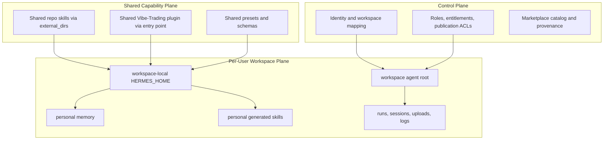
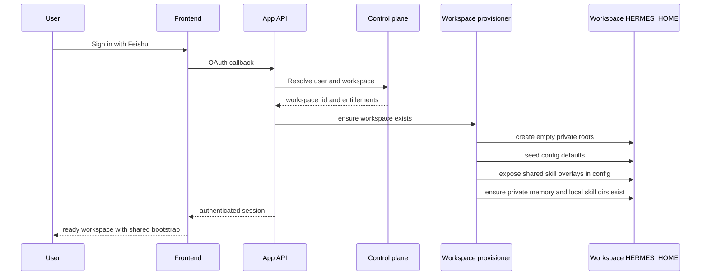
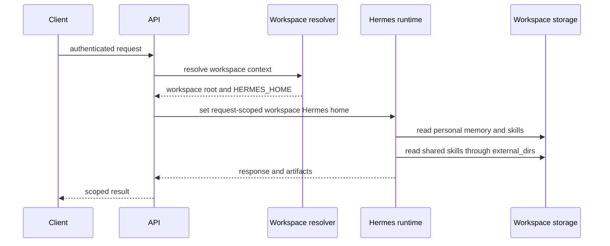
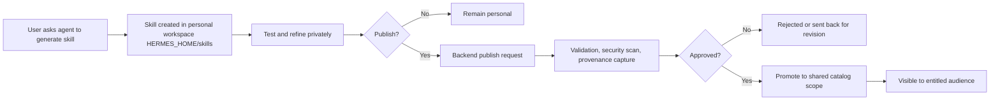

# Multi-Tenant Design

Status: Draft for review

Audience: product, platform, backend, security, and Hermes integration reviewers

Purpose: define what is shared vs personal in a multi-tenant Vibe-Trading deployment, with explicit treatment of security, privacy, and community or market-making concerns before implementation hardens these boundaries.

Relationship to [Add-Login-Plan.md](/home/chris/repo/Vibe-Trading/Add-Login-Plan.md):

- this document is the source of truth for shared vs personal asset boundaries
- [Add-Login-Plan.md](/home/chris/repo/Vibe-Trading/Add-Login-Plan.md) is the rollout and authentication integration plan
- if the two documents diverge, reviewers should update the rollout plan to match the boundary model defined here

## Decisions Snapshot

### Decisions made

- the user workspace is the tenant boundary
- workspace-local `HERMES_HOME` is the default runtime boundary for private state
- built-in Hermes memory is private by default and scoped per workspace
- shared bootstrap skills should be delivered through `skills.external_dirs`
- shared plugin capabilities should be delivered through app-managed installed plugin code
- runtime-generated skills are private until explicitly published
- community sharing requires explicit publication with provenance, moderation, and entitlement checks

### Decisions still open

- which publication scopes ship first: team, tenant, curated-global, or public marketplace
- which shared scopes require human moderation versus automated checks only
- whether marketplace installs should use cached local copies or a managed logical install layer
- whether users should be able to move private generated skills across their own future workspaces
- how paid bundles should separate visibility, installation, and execution entitlements

## 1. Executive Summary

Vibe-Trading should treat the user workspace as the primary tenant boundary.

That means:

- personal runtime state lives inside one workspace-scoped Hermes home per user
- shared capabilities are exposed by deterministic overlays, not by mixing tenant data into the source tree or a global runtime home
- community or market assets must be explicit published artifacts with provenance, moderation, and entitlement checks

Recommended default split:

| Asset class | Default scope | Delivery model | Notes |
| --- | --- | --- | --- |
| identity, sessions, runs, uploads, auth, logs | personal | workspace-local storage | strict tenant boundary |
| built-in Hermes memory | personal | workspace-local `HERMES_HOME` | no implicit sharing |
| user-generated skills | personal | workspace-local `HERMES_HOME/skills` | private until explicitly published |
| approved repo bootstrap skills | shared | `skills.external_dirs` overlay | read-only, versioned with app deploy |
| approved repo plugin tools | shared | installed Hermes entry-point plugin | code capability, not user data |
| org or marketplace skills | shared after approval | explicit publication pipeline | provenance and moderation required |
| marketplace reputation, rankings, entitlements | shared control plane | Postgres | not in Hermes local state |

Core recommendation:

- use `skills.external_dirs` for shared skills
- do not copy template skills into user homes as the long-term model
- keep memory private by default
- make all shared community assets explicit publishable objects, not side effects of runtime generation

## 2. Goals

This design should:

- make the shared vs personal boundary obvious to engineers and reviewers
- preserve strong per-user isolation for security and privacy
- support a future skill marketplace or community exchange model
- let the repo ship shared bootstrap capabilities without weakening tenancy
- support runtime skill generation without accidental leakage into shared scopes

This design should not:

- use Hermes CLI profiles as the SaaS tenant abstraction
- assume any generated user asset is shareable by default
- reload workspace-local `.env` into process-global environment state per request
- treat shared code artifacts and tenant data as the same thing

## 3. Design Principles

1. Tenant data must be private by default.
2. Shared assets must be intentional, reviewable, and attributable.
3. Runtime convenience must not bypass security boundaries.
4. The filesystem boundary and the authorization boundary must agree.
5. Community growth features must be built on explicit publication, not hidden replication.
6. Every asset needs a lifecycle: create, read, update, share, revoke, archive.

## 4. Terms

### User workspace

The app-level tenant boundary. One authenticated user operates inside one workspace root:

`workspaces/<workspace_id>/agent/`

### Workspace Hermes home

The Hermes runtime home for one user workspace:

`workspaces/<workspace_id>/agent/.hermes/`

### Shared bootstrap

Approved repo-managed capabilities that every user may read or invoke, such as:

- shared skills exposed through `skills.external_dirs`
- shared Hermes plugin tools provided by the installed Vibe-Trading plugin entry point
- shared static presets, schemas, and workflow definitions shipped with the app

### Personal asset

An asset whose default visibility is only the owning user or authorized workspace operators.

### Published asset

A previously personal asset that has been promoted into a shared scope through a deterministic backend publication flow with moderation and provenance.

## 5. Asset Taxonomy

### 5.1 Personal assets

These are private by default and must remain inside the workspace boundary.

| Asset | Why personal | Storage model |
| --- | --- | --- |
| `auth.json`, OAuth tokens, provider credentials | direct security exposure | workspace-local Hermes home |
| session history and run logs | reveals prompts, strategies, behavior | workspace sessions and runs |
| uploads and generated reports | may contain proprietary research or client data | workspace uploads and artifacts |
| built-in Hermes memory | captures user preferences, habits, context | workspace-local memories |
| runtime-generated skills | may embed private data, prompts, heuristics, or confidential workflows | workspace-local skills |
| agent plans, scratchpads, drafts | high privacy sensitivity | workspace-local files |

### 5.2 Shared bootstrap assets

These are shipped by the app team and readable by all tenants.

| Asset | Why shared | Delivery model |
| --- | --- | --- |
| app-owned shared skills in `agent/src/skills/app-infra` and `agent/src/skills/domain/vibe-trading` | common starting capability | `skills.external_dirs` |
| vendor or repo skills in `hermes-agent/skills` | common base capability | `skills.external_dirs` |
| Vibe-Trading Hermes plugin tools | shared code capability | installed entry-point plugin |
| preset configs and schemas | common runtime behavior | repo-managed code and config |

### 5.3 Published community assets

These should exist only after explicit publication.

| Asset | Scope options | Requirements |
| --- | --- | --- |
| published skills | team, tenant, global marketplace | approval, provenance, security scan |
| curated prompt packs | team, tenant, global | versioning, moderation |
| strategy templates | team, tenant, global | legal and compliance review may apply |
| ratings, installs, comments | shared control-plane data | abuse controls and auditability |

## 6. Shared vs Personal Decision Matrix

| Concern | Shared bootstrap | Personal workspace state | Published community state |
| --- | --- | --- | --- |
| default visibility | all tenants | owner only | chosen audience |
| mutability by end user | no direct mutation | yes | controlled through publish/update workflow |
| upgrade path | app deploy or migration | user-driven | marketplace release process |
| rollback owner | platform team | user | platform plus publisher |
| audit requirement | medium | medium | high |
| privacy risk | low if content is curated | high | high |
| security risk | code or prompt supply chain | credential or data leakage | both supply chain and leakage |

## 7. Security and Privacy Model

### 7.1 Security boundaries

Security must be enforced in both layers:

1. authorization layer
2. storage and runtime layer

If either layer disagrees, tenancy is weak.

Required rules:

- each authenticated request resolves a workspace before any Hermes runtime work begins
- `HERMES_HOME` must resolve to the workspace-local Hermes home for that request context
- process-global environment mutation must not be used to switch tenant credentials at runtime
- no shared writable directory may be used for private user assets
- publication to shared scopes must go through deterministic backend code, never prompt instructions

### 7.2 Privacy boundaries

Privacy risk is broader than auth risk. The design must prevent:

- one user seeing another user's memory or generated skills
- one user's prompts influencing another user's shared defaults accidentally
- marketplace or analytics systems ingesting unpublished private content
- background workers running with stale workspace context

Default privacy policy:

- memory is per user
- generated skills are per user
- logs are per user
- publication is opt-in and reviewable

### 7.3 Supply chain concerns

Shared skills and shared plugins are supply-chain inputs. They need:

- ownership
- versioning
- review history
- rollback path
- integrity checking where practical

Published community assets need stronger controls because they cross trust boundaries.

## 8. Community and Market Perspective

The product should support two different social models.

### 8.1 Bootstrap commons

The platform ships a common library of skills and tools that every user gets immediately.

Characteristics:

- platform-authored
- versioned with releases
- read-only to end users
- low friction

### 8.2 Publication market

Users may create valuable assets at runtime and later publish them.

Characteristics:

- user-authored first, shared later
- explicit promotion flow
- reputation, moderation, and entitlement aware
- can support free, team-only, tenant-only, premium, or public marketplace scopes

The market model only works if personal and shared assets stay separate. Otherwise the product cannot truthfully explain ownership, privacy, or entitlement.

## 9. User JTBD

### JTBD 1: First-time analyst onboarding

When I sign in for the first time, I want my workspace to feel immediately capable without exposing anyone else's data, so that I can start useful work with confidence.

Success criteria:

- a workspace is provisioned automatically
- shared bootstrap skills are available immediately
- no other user's memory or artifacts are visible
- the product does not ask the user to understand Hermes internals

### JTBD 2: Returning private operator

When I return to my workspace, I want my own memory, skills, sessions, and artifacts to still be there, so that the system feels like my persistent research environment.

Success criteria:

- personal memory is restored only for the correct workspace
- my generated skills remain private unless I publish them
- shared bootstrap stays current without overwriting my personal assets

### JTBD 3: Runtime skill creator

When I generate a skill during a session, I want it to work immediately for me without accidentally making it public, so that I can iterate safely.

Success criteria:

- generated skills land in the personal workspace scope
- they can be edited, tested, and deleted privately
- publication is a separate decision with a clear review step

### JTBD 4: Team lead or community publisher

When I discover a useful skill in my workspace, I want to promote it to a shared audience with provenance and controls, so that others can benefit without inheriting unsafe or private content.

Success criteria:

- the publication target is explicit
- the asset is scanned and reviewed before publish
- ownership and version history are preserved
- users can trust what is shared

### JTBD 5: Security or compliance reviewer

When I audit the platform, I want clear guarantees about where private data lives and how shared assets are promoted, so that I can approve the design with minimal ambiguity.

Success criteria:

- shared and personal scopes are documented and inspectable
- the publish flow is deterministic and auditable
- credentials and private memory never transit through shared scopes by default

## 10. Experience Design

### 10.1 First sign-in experience

The user should experience:

1. sign in with Feishu
2. workspace resolved or created
3. shared bootstrap available instantly
4. empty but private personal memory and skill space
5. first conversation can use shared skills and plugin tools without setup

The user should not experience:

- needing to install core skills manually
- seeing a global shared writable skill folder
- confusing Hermes profile concepts

### 10.2 Returning user experience

The user should experience:

1. their own memory loaded
2. their own private runtime-generated skills available
3. newly deployed shared bootstrap skills visible automatically
4. no surprise overwrites of personal assets

### 10.3 Runtime skill generation experience

The product should make this mental model obvious:

- generate skill -> private draft in your workspace
- test skill -> still private
- publish skill -> explicit review and promotion event

The product should not imply:

- runtime generation means instant org-wide availability
- editing a shared skill locally changes the global version

### 10.4 Asset management experience

Users need separate views for:

- my assets
- shared bootstrap assets
- published marketplace assets

These are different objects with different permissions.

## 11. Architecture Overview

### 11.1 Layer model

### 11.2 Provisioning flow

### 11.3 Request runtime isolation flow

### 11.4 Runtime skill generation and publication lifecycle

## 12. Asset Scope Rules

### 12.1 Skills

Recommended model:

- shared bootstrap skills live in repo-managed directories and are surfaced through `skills.external_dirs`
- personal generated skills live in workspace-local `HERMES_HOME/skills`
- published skills move into explicit shared scopes only through backend publication flows

Why:

- avoids duplicating shared skills into every user home
- keeps user edits local and unsurprising
- makes platform rollouts immediate for shared skills
- gives the marketplace model a clean publish boundary

### 12.2 Memory

Recommended model:

- built-in Hermes memory remains per user and per workspace
- no implicit shared memory in v1
- shared knowledge, if needed later, should be a separate provider or explicit shared knowledge product, not a side effect of local memory

Why:

- memory is highly privacy-sensitive
- users will assume memory is private unless told otherwise
- shared memory requires stronger governance than shared skills

### 12.3 Plugins and tools

Recommended model:

- shared plugin capabilities are app-managed code, typically installed through the repo package entry point
- end users should not install application-level plugins into their workspace-local Hermes homes
- runtime-generated plugins should not be a v1 feature
- workspace-local `HERMES_HOME/plugins` is not a supported tenant extension surface for Vibe-Trading application plugins

Why:

- plugins expand code execution and trust boundaries far more than skills do
- marketplace support for plugins is a later-stage capability than marketplace support for skills

Design decision:

- application-level plugins defined in `agent/src/plugins/` are shared platform code and must load through installed Hermes entry-point plugins
- user workspaces must not provision, copy, discover, or install application-level plugins under workspace-local `HERMES_HOME/plugins`
- if plugin-style extensibility is ever offered to end users later, it must be a separate explicitly designed product surface with its own entitlement and security model, not reuse the current workspace runtime home

## 13. Proposed Provisioning Contract

The workspace provisioner should do only what is necessary.

Recommended responsibilities:

- create workspace directories
- ensure empty private directories exist for memory, skills, logs, home, and profiles
- seed baseline config and safe defaults
- merge shared skill overlay config into the workspace config
- apply entitlements and flags
- run deterministic upgrades for schema changes

Recommended non-responsibilities in the long-term model:

- copying shared bootstrap skills into every workspace
- copying user memory from a shared template
- publishing any personal asset into shared scopes

## 14. Control Plane vs Data Plane

### Control plane

Should live in Postgres or equivalent structured system.

Examples:

- identity mappings
- workspace metadata
- entitlements
- publication approval records
- marketplace catalog metadata
- ratings, installs, visibility scopes, moderation state

### Data plane

Should remain in filesystem or object storage.

Examples:

- personal memory files
- personal skills
- run artifacts
- uploads
- logs
- published skill bundles or package payloads

## 15. Marketplace and Community Model

### 15.1 Publishing scopes

Suggested scope taxonomy:

- personal
- team
- tenant
- curated-global
- public-marketplace

### 15.2 Required metadata for published assets

Every published skill should record:

- publisher workspace
- publisher identity
- source asset hash
- publication time
- moderation decision
- visibility scope
- version
- dependency or compatibility metadata

### 15.3 Review gates

Before publication, require:

- prompt and content scanning
- path validation and deterministic file handling
- optional human approval depending on scope
- license and policy checks if community submission is allowed

## 16. Risks

### Risk 1: stale global runtime state

If request handling relies on process-global environment mutation, one tenant can affect another.

Mitigation:

- keep workspace resolution request-scoped
- avoid per-request `.env` reload into global environment

### Risk 2: confusing users about what is shared

If UI does not distinguish personal and shared assets, users may disclose private material accidentally.

Mitigation:

- separate inventory views and labels
- explicit publish action with confirmation and scope selection

### Risk 3: supply-chain compromise through shared assets

If shared skills or published marketplace assets are not controlled, all tenants are exposed.

Mitigation:

- approval pipeline
- provenance
- rollback and quarantine support

### Risk 4: copying bootstrap assets into personal homes forever

This creates drift, upgrade complexity, and ownership confusion.

Mitigation:

- prefer overlay delivery for shared bootstrap skills
- reserve copying for private empty roots or one-time config defaults

## 17. Recommended Implementation Order

1. finalize the shared vs personal asset contract
2. keep memory private by default
3. move shared bootstrap skills to `skills.external_dirs` only
4. keep shared plugin capability via the installed repo entry-point plugin
5. create clear UI distinctions for personal assets, shared bootstrap, and published assets
6. implement deterministic publication flow for skills
7. add marketplace metadata and moderation systems
8. consider shared knowledge or shared memory only after privacy and publication flows are proven

## 18. Open Questions For Review

1. Should team-scoped publication exist before tenant-scoped publication?
2. Should private user-generated skills be exportable across a user's own workspaces, if multiple workspaces exist later?
3. Which published scopes require human moderation vs automated policy checks only?
4. Should marketplace assets be copied into tenant-local caches at install time, or mounted logically through a managed install layer?
5. When paid bundles exist, should entitlements control visibility, installation, or execution, or all three?

## 19. Review Checklist

Reviewers should explicitly confirm or challenge each item below.

### Product

- is the distinction between personal assets, shared bootstrap assets, and published marketplace assets understandable to end users?
- does the JTBD model match the intended first-run, return-user, and publishing experiences?
- is the publish flow explicit enough to prevent accidental sharing?

### Security

- does the design keep private runtime state inside workspace-local boundaries by default?
- are shared assets introduced only through controlled overlays, installed plugin code, or approved publication flows?
- are there any remaining paths where process-global state could leak data across workspaces?

### Privacy

- is memory private by default with no implicit cross-user sharing?
- do runtime-generated skills remain private until explicit publication?
- are logs, uploads, and artifacts clearly treated as personal workspace state?

### Backend And Platform

- is the workspace-local `HERMES_HOME` model operationally workable for provisioning, upgrades, and debugging?
- is the split between control plane and data plane clear enough to implement without drift?
- are the rollout assumptions in [Add-Login-Plan.md](/home/chris/repo/Vibe-Trading/Add-Login-Plan.md) still consistent with this document?

### Community And Marketplace

- is the publication model strong enough for provenance, moderation, rollback, and entitlement checks?
- should published assets be supported for skills only in v1 marketplace work, with plugins deferred?
- are the proposed publication scopes sufficient for the expected product roadmap?

## 20. Proposed Review Decision

Reviewers should confirm or reject this statement:

"Vibe-Trading uses the user workspace as the tenant boundary; private runtime state stays workspace-local; shared bootstrap is delivered through explicit read-only overlays or app-managed plugin code; and community sharing happens only through explicit publish flows with provenance, moderation, and entitlements."

If reviewers agree with that statement, implementation details can proceed without reopening the core tenancy model on every feature.