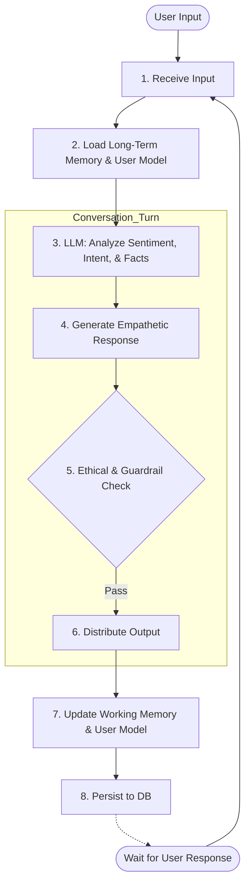
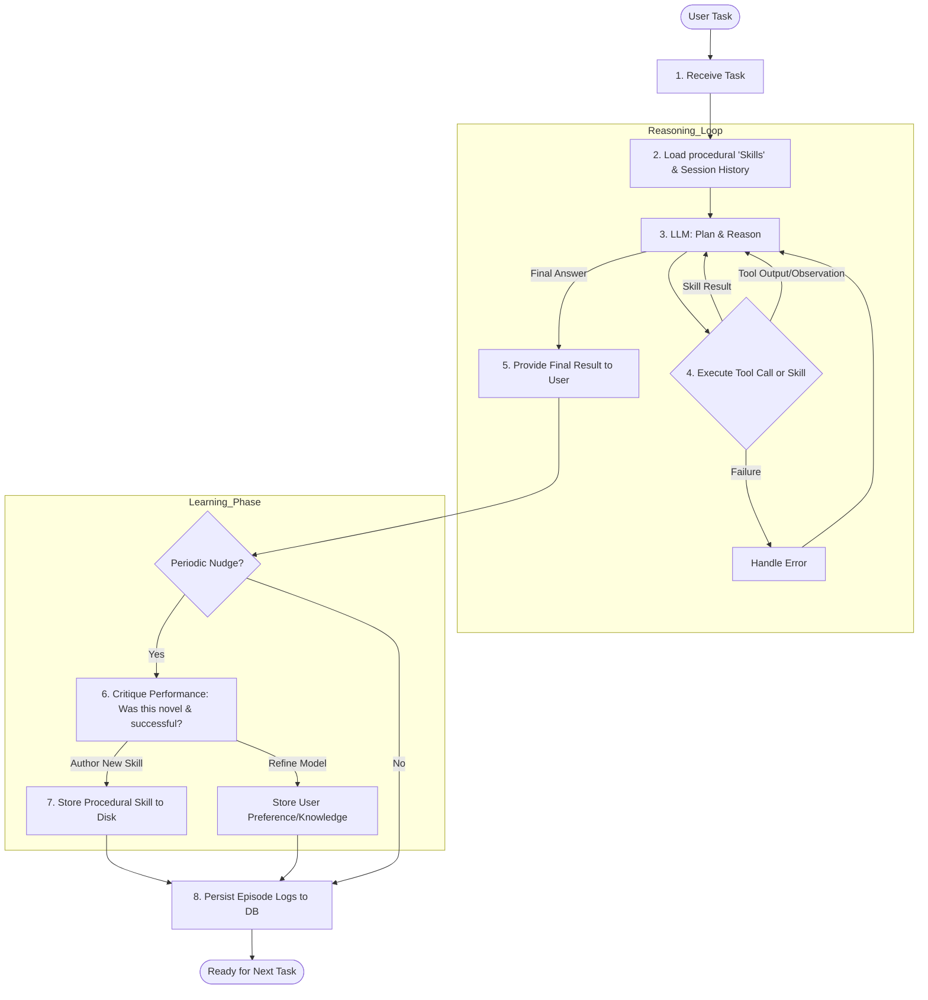

# **代理驾驭框架工程：OpenClaw 与 Hermes Agent 在 Lychee Technology 7 层驾驭框架栈中的深度映射与架构演进研究**

在 2026 年大语言模型向自主智能体（Autonomous Agents）演进的工业化进程中，技术界的共识正发生深刻迁移：智能体的性能瓶颈不再仅仅取决于底层的推理模型权重，而更多地取决于围绕模型构建的软件基础设施——驾驭框架（Harness） 1。正如英伟达（NVIDIA）首席执行官黄仁勋在 2026 年 GTC 大会上所言，驾驭框架工程（Harness Engineering）是决定 AI 能否从“对话框”走向“操作系统”的关键外骨骼 1。为了系统化地评估当前开源社区最顶尖的两个智能体系统——OpenClaw（原名 Clawdbot 与 Moltbot）与 Hermes Agent（由 Nous Research 开发），本研究采用 Lychee Technology 的“7 层驾驭框架栈 (7-Layer Harness Stack)”作为统一分析框架，通过对这两个系统的组件进行精密映射，揭示其在界面、身份、策略、编排、执行、记忆及推理层面的架构逻辑与商业应用潜力 3。

## **1\. 界面层 (Interface Layer)：多模态归一化与交互网关**

界面层作为驾驭框架栈的最外层，承担着信号采集、协议转换与用户触达的核心职能 5。在 OpenClaw 的架构设计中，这一层被体现为一种极度中心化的“网关模式” 6。OpenClaw 的网关组件（Gateway）运行在默认的 18789 端口上，作为 WebSocket 服务器处理来自全球 50 多个通信平台的并发请求，包括 iMessage、Discord、Slack、Telegram 以及国内的飞书、企业微信等 3。其核心技术难点在于“输入归一化”，即通过一系列通道适配器（Channel Adapters），将异构的原始信号（如 WhatsApp 的语音消息、Slack 的富文本、iMessage 的媒体附件）转化为驾驭框架内部统一的消息对象 10。这种归一化确保了后续推理层在处理上下文时，无需感知物理渠道的差异，从而实现了极高的跨平台一致性 10。

与之相比，Hermes Agent 的界面层展现出一种更加倾向于开发者和研究者的“统一运行环境”特征 11。虽然 Hermes 也提供了支持 15 个以上社交平台的网关，但其界面层的核心竞争力在于其深度集成的终端用户界面（TUI）和 ACP（Agent Client Protocol）协议 12。HermesCLI 利用 prompt\_toolkit 和 Rich 库构建了一个具备多行编辑、命令自动补全及实时任务中断能力的专业交互界面 14。更具前瞻性的是其 ACP 适配器层，这使得 Hermes Agent 能够直接嵌入 Zed、JetBrains 或 VS Code 等主流代码编辑器，将“界面”的概念从社交聊天扩展到了生产力软件的上下文之中 16。

在处理实时反馈时，两个系统的界面层均引入了流式输出机制。OpenClaw 利用 EmbeddedBlockChunker 对回复进行分块处理，能够自动剥离推理模型产生的 \<think\> 标签，并解析 \[\[media:url\]\] 等自定义指令以触发界面层的多媒体渲染 18。而 Hermes 则通过 KawaiiSpinner 在 API 调用期间提供动态反馈，确保在界面层实现“思考透明化” 14。

表 1.1：界面层组件映射与协议特征

| 驾驭框架组件分类 | OpenClaw 映射实现 | Hermes Agent 映射实现 | 架构含义 |
| :---- | :---- | :---- | :---- |
| **接入协议** | WebSocket (Port 18789\) 3 | JSON-RPC over stdio / ACP 16 | 决定了驾驭框架的实时性与扩展能力 |
| **渠道适配** | 50+ 通道（含 Feishu, QQ） 8 | 15+ 通道（核心国际平台） 12 | 覆盖用户触达的广度 |
| **输入归一化** | Baileys/grammY 适配层 10 | 统一 MessageEvent 类 20 | 消除多模态输入的歧义性 |
| **流式反馈** | EmbeddedBlockChunker 18 | agent/display.py 回调 20 | 提升交互的感知延迟质量 |

## **2\. 身份层 (Identity Layer)：从静态配置向动态建模的跨越**

身份层是驾驭框架赋予智能体“灵魂”的核心。根据最新技术文档，Hermes Agent 强化了 `SOUL.md` 作为**首席身份文件 (Primary Identity File)** 的地位，这标志着驾驭框架在处理人格一致性方面进入了“基准提示词驱动”阶段。

#### **2.1 SOUL.md：智能体的持久基准**
**OpenClaw 的层级路由模式**：
    OpenClaw 采用基于 `IDENTITY.md` 元数据的中心化路由逻辑。它更像是一个具备 **RBAC（基于角色的访问控制）** 能力的代理网关，将不同的任务领域（如财务、日程）映射到预定义的静态身份上。这种模式适合企业级标准化作业，但在处理跨项目、跨敏感度的私人任务时，往往缺乏物理层面的配置隔离。

在 Hermes 的架构映射中，`SOUL.md` 不仅仅是一个配置文件，它是智能体在每次会话中的**第一槽位 (First Slot) 系统提示词**。
* **全局人格一致性**：与存储项目特定指令的 `AGENTS.md` 不同，`SOUL.md` 对整个 Hermes 实例具有全局效力，确保了跨会话的语气、价值观和交流风格的持久稳定性。
* **原生注入逻辑**：驾驭框架采用“逐字注入 (Verbatim Injection)”模式。经过策略层的安全性扫描和长度截断后，`SOUL.md` 的内容会直接嵌入系统提示词首部，不添加任何包装文本，最大限度地保留了模型对原始人格设定的感知力。
* **自动种子化 (Automatic Seeding)**：为了降低用户门槛，驾驭框架具备自引导能力，在初始运行时若未检测到身份文件，会自动创建一个起始模板供用户即时编辑。

#### **2.2 基于 Profile 的身份隔离机制**
为了解决多任务场景下的“人格污染”问题，Hermes 引入了 **Profiles (配置文件系统)** 来增强身份层的物理边界：
* **角色去污染**：每个 Profile 拥有独立的 `SOUL.md`。例如，“编程专家” Profile 的身份设定绝不会干扰到“学术研究员” Profile 的逻辑判断。
* **运行时物理隔离**：这种隔离不仅限于文本，还延伸至底层的记忆数据库和凭证池。通过运行 `hermes --profile <name>`，驾驭框架可以瞬间完成从“企业审计员”到“私人助理”的完全身份热切换。

## **3\. 策略层 (Policy Layer)：安全性约束与执行红线**

策略层是驾驭框架栈的“免疫系统”，它必须在赋予智能体自主执行能力的同时，确保其行为不超越安全红线 9。在 OpenClaw 的演进历程中，策略层的加固是一个被动的过程。早期的 OpenClaw 由于缺乏严格的策略约束，被曝出 CVE-2026-25253 漏洞，攻击者可通过恶意链接诱导代理执行任意 Shell 指令 3。为此，OpenClaw 在策略层引入了基于“指令允许列表”的硬约束，即只有预先定义的命令（如 npm、git）才能被执行，且驾驭框架会通过解析 Shell 结构来阻断重定向（\>）操作，以防止代理覆盖关键系统文件 32。

Hermes Agent 的策略层则展现出一种“防御性设计”的系统性思考，其核心是七层安全模型 33。这一层级不仅包含了传统的命令审批（Approvals），还引入了名为“Tirith”的预执行扫描器 33。 策略层的运行逻辑如下：当编排层提交一个工具调用请求时，策略层首先会检查当前的审批模式。如果是 manual 模式，驾驭框架会挂起任务并向界面层发送批准请求；如果是 smart 模式，驾驭框架会调用一个轻量级的辅助模型（如 Gemini Flash）进行语义层面的意图审计 34。这种“模型审计模型”的机制极大地降低了安全成本。同时，针对复杂环境中的凭证泄露风险，Hermes 的策略层具备自动脱敏功能（redact.py），能够实时扫描并从输出流中抹除类似于 API 密钥或私钥的文本模式，防止这些敏感信息泄露到社交平台的聊天记录中 36。

在隔离技术上，两者的策略层均映射到了 Docker 级沙箱，但 Hermes 提供了更灵活的后端支持，包括 Singularity（适用于 HPC 环境）和 Modal（适用于无服务器 GPU 场景） 37。这种多后端的策略配置能力，使得驾驭框架能够根据任务的风险等级动态选择隔离强度 36。

表 3.1：策略层安全控制参数对比

| 策略控制维度 | OpenClaw 实现细节 | Hermes Agent 实现细节 | 风险缓解目标 |
| :---- | :---- | :---- | :---- |
| **沙箱粒度** | Off / Non-main / All 9 | Local / Docker / Modal / SSH 38 | 物理环境逃逸防护 |
| **危险指令过滤** | 正则表达式模式匹配 32 | tirith 预检 \+ 结构化分析 33 | 恶意脚本注入阻断 |
| **凭证治理** | .env 环境变量注入 3 | 凭证池管理 \+ 自动脱敏 36 | 长期资产泄露防护 |
| **人机交互阈值** | 固定 /exec 指令权限调节 9 | 基于风险评分的 smart 模式 34 | 减少审批疲劳 39 |

## **4\. 编排层 (Orchestration Layer)：思维循环与迭代控制**

编排层是驾驭框架栈的“大脑皮层”，负责驱动智能体循环（Agent Loop），将复杂的长期目标拆解为原子化的思维步进 20。OpenClaw 的编排层创新性地引入了“车道队列 (Lane Queue)”系统 32。在驾驭框架栈中，每一个会话被映射为一个独立的“车道”，编排器通过串行化执行来保证状态的一致性 10。 这种设计的深层考量在于：智能体在操作文件系统或调用有副作用的 API 时，并发操作会导致不可预知的竞态条件。OpenClaw 的 Orchestrator 组件在这一层级扮演了交通警察的角色，确保即使在高并发的消息涌入下，特定代理的思维链路也不会发生交织 5。

Hermes Agent 的编排层则更具算法深度，其核心是 AIAgent 类的同步递归循环 40。编排层通过 IterationBudget 对象严格控制模型的迭代成本。 在编排逻辑上，Hermes 引入了“预算压力提醒”机制：当迭代次数接近上限（默认为 90 次）时，编排层会在工具返回的 JSON 载荷中隐式注入“时间/预算不足”的警告，从而在不增加对话轮数的前提下，引导推理层尽快收敛到最终结论 40。此外，Hermes 的编排层支持“子代理委派”：主代理可以生成带有独立迭代上限（通常为 50 次）的子代理来处理并行支线任务，如主代理负责架构规划，子代理负责具体的代码实现和测试，这种层级化的编排模式显著提升了处理超大规模任务的能力 14。

在上下文控制方面，OpenClaw 的编排层集成了 Context Window Guard，它会实时监控当前的 Token 计数，在窗口溢出前强行触发摘要逻辑或停止循环，以防止模型产生幻觉 32。Hermes 则在编排层使用了“预检压缩”策略，在每次 API 调用前，如果历史记录超过窗口的 50%，则自动调用辅助模型进行中间轮次的语义压缩 41。

## **5\. 执行层 (Execution Layer)：确定性管道与自主技能演化**

执行层是驾驭框架将推理转化为现实影响的物理边界。OpenClaw 的执行层通过 Lobster 引擎实现了从“概率性行为”向“确定性自动化”的跨越 43。Lobster 在驾驭框架栈中被定位为一种“工作流外壳”，它允许将原本需要 LLM 反复规划的多步任务封装为 YAML 或 JSON 定义的硬逻辑管道 43。 例如，在一个“每日财务简报”的任务中，执行层可以直接运行 Lobster 定义的 fetch\_inbox | categorize\_json | post\_slack 管道。这样做的好处是显而易见的：它完全消除了 LLM 在每一步的推理延迟和潜在失误，将 Token 消耗降低了约 25,000 个（单次运行），同时保证了任务执行的 100% 可预测性 45。

Hermes Agent 的执行层组件则展现了驾驭框架栈中最具创新性的特性——“闭环学习系统 (Closed Learning Loop)” 15。这一层通过 skill\_manage 工具，赋予了代理“自我编写代码库”的能力 47。 Hermes 的执行层逻辑分为四个阶段：

1. **执行 (Enforcement)**：利用 47 个内置工具完成具体任务 26。  
2. **评估 (Evaluation)**：任务完成后，驾驭框架会分析执行轨迹的成功率 25。  
3. **创建 (Create)**：如果该任务序列具有通用性（如一种特殊的 K8s 部署策略），执行层会自主总结出一套遵循 agentskills.io 开放标准的 SKILL.md 文档 47。  
4. **演化 (Improvement)**：在后续的任务中，执行层会优先通过语义搜索加载这些自建技能，实现能力的指数级增长 25。

这种自演化的执行层架构，使得 Hermes 能够随着使用次数的增加而“记住”复杂的工程流程，真正解决了 AI 代理“每次都从零开始思考”的低效难题 23。

表 5.1：执行层组件与工作流模式对比

| 执行组件 | OpenClaw Lobster 模式 | Hermes Agent 技能模式 | 技术价值 |
| :---- | :---- | :---- | :---- |
| **逻辑类型** | 确定性 YAML 管道 50 | 自主生成的 Python/Markdown 技能 47 | 推理与执行的解耦 |
| **恢复机制** | 基于 Resume Token 的挂起与恢复 43 | 状态持久化到 SQLite 会话库 26 | 处理长时任务的稳定性 |
| **扩展路径** | ClawHub 插件市场 (5k+ 技能) 8 | 自动学习 \+ 社区技能 Hub 52 | 生态系统的增长动力 |
| **典型案例** | 每日定时爬虫与健康监控 46 | 复杂的跨库代码重构与环境部署 26 | 任务复杂度的上限 |

## **6\. 记忆层 (Memory Layer)：分层存储与 Token 经济学**

记忆层负责管理智能体的时空连续性，它是防止驾驭框架栈陷入“认知断层”的关键。OpenClaw 的记忆层组件采用了 TGAA（分层全球锚点架构） 6。 由于 Anthropic 等提供商的提示词缓存（Prompt Caching）通常只有 5-10 分钟的有效期，OpenClaw 通过 TGAA 将核心身份规则固定在“顶部锚点”，并对中间的历史会话进行滑动窗口式的处理，从而最大限度地提高缓存命中率 6。此外，OpenClaw 引入了“语义快照”技术，通过抓取网页的 Accessibility Tree 而非截屏，将网页记忆的 Token 成本从数兆字节降低到 50KB 以内，这对于在驾驭框架内运行大规模网页调研任务至关重要 32。

Hermes Agent 的记忆层组件遵循严密的“金字塔结构”，由三层互补的存储机制构成 55：

1. **工作记忆 (Working Memory)**：存储在 RAM 中，负责当前任务的实时上下文，通过动态摘要进行精简 55。  
2. **情节记忆 (Episodic Memory)**：基于 SQLite 和 FTS5 全文搜索，记录用户过去数月的所有对话轨迹，支持按关键词瞬间找回历史细节 55。  
3. **程序记忆 (Procedural Memory)**：独立存储的技能库（Skills），这是驾驭框架栈中最高级的记忆形式，代表了“知识的固化” 55。 为了防止记忆层演变为杂乱无章的日志堆，Hermes 引入了“定期推送 (Periodic Nudge)”机制：驾驭框架会在后台静默唤醒模型，询问其最近的交互中哪些事实值得存入 MEMORY.md，哪些冗余信息可以彻底丢弃 57。这种主动的记忆整理，确保了记忆层始终处于高信息密度状态，同时也大幅降低了由于上下文膨胀导致的 Token 溢出风险 56。

## **7\. 推理层 (Reasoning Layer)：模型路由与强化学习反馈**

推理层位于驾驭框架栈的最底部，是所有逻辑决策的源头。OpenClaw 在这一层的映射实现是嵌入式的 Pi SDK 18。OpenClaw 并不直接调用 OpenAI API，而是通过 pi-ai 抽象层来实现对不同提供商（Anthropic、Google、DeepSeek）的透明兼容 18。 推理层最核心的功能是“故障转移 (Failover)”：驾驭框架会维护一个模型优先级列表，当主模型出现 429 速率限制或 5xx 服务器错误时，推理层会自动进行凭据刷新并切换到备用模型，确保任务执行的连续性 18。

Hermes Agent 的推理层则带有浓厚的“训练基因”，其核心组件是 Tinker-Atropos RL 管道 58。 驾驭框架栈不仅作为一个执行环境，还作为一个“轨迹生成器”。推理层会将每一次成功的工具调用序列记录为符合 ShareGPT 格式的训练数据，并通过 Atropos 协调环境交互，利用 Tinker 服务进行实时或离线的强化学习优化 58。 这种架构意味着：驾驭框架不仅是在消耗智能，它还在生产智能。此外，推理层还集成了针对特定模型的“微调适应器”，如专门为解决数学问题的 GRPO 策略，这使得驾驭框架在执行高精度的逻辑推理任务（如代码调试或金融建模）时，其推理精度远超通用的 API 代理 59。

## **8\. 综合映射：对比表格与 Mermaid 堆栈图**

通过上述各层的解构，我们可以将 OpenClaw 和 Hermes Agent 的完整驾驭框架栈组件进行横向对比，以明确其架构设计的差异化重心。

### **8.1 驾驭框架栈架构映射对比表**

| 驾驭框架栈层级 (7-Layer) | 功能职能 | OpenClaw (网关优先) | Hermes Agent (运行环境优先) |
| :---- | :---- | :---- | :---- |
| **推理层** | 逻辑生成 | Model Resolver (自动降级), Pi SDK 适配器 18 | Tinker-Atropos RL 管道, DSPy 提示演化引擎 58 |
| **记忆层** | 知识存储 | TGAA 缓存架构, 语义快照文本树 32 | 三层记忆 (情节/程序), 后台 Nudge 机制 55 |
| **执行层** | 环境交互 | Lobster 工作流引擎, ClawHub (5k+ 静态技能) 43 | execute\_code RPC 框架, 自主技能创建循环 26 |
| **编排层** | 任务管理 | 串行 Lane Queue, 全局 Orchestrator 控制器 32 | AIAgent 递归循环, IterationBudget 迭代预算 14 |
| **策略层** | 安全治理 | 三级隔离设置, Shell 语义阻塞, CVE 补丁 9 | 7 层安全网, tirith 预检, redact.py 脱敏 33 |
| **身份层 (Identity)** | 人格定义与隔离 | 基于 `IDENTITY.md` 的层级路由与 RBAC 权限管理 | **以 `SOUL.md` 为核心的全局人格注入**；通过 **Profiles** 实现身份与环境的物理热切换 |
| **界面层** | 交互连接 | 18789 网关, 50+ 归一化通道适配器 9 | 统一运行环境, 专业 TUI, ACP 跨应用协议 16 |

## **9\. 深度架构透视：确定性控制与演化式自治的博弈**

通过对 Lychee 7 层栈的映射，我们可以观察到这两个智能体系统在核心设计哲学上的本质分歧。这一分歧决定了它们在企业级部署与个人化应用中的不同走向。

### **9.1 OpenClaw：基于“控制平面”的工业化路线**

**OpenClaw** 在身份层依然坚持“工业化管理”路径，其多代理路由更像是一个组织架构图，强调权限的集中控制与可审计性。而 **Hermes Agent** 通过 **Profiles** 展现了“单兵作战”的极致灵活性：它允许代理在不同的专业领域之间无缝迁移，同时保证每个领域（Profile）都能通过闭环学习系统积累独立的“程序记忆”。

这种差异意味着：如果您需要为整个公司构建一套遵循严格角色的 AI 职员体系，OpenClaw 是首选；但如果您需要一个能够同时处理深度技术开发（Profile A）和私人敏感财务分析（Profile B）且互不干扰的“全能专家”，Hermes 的多 Profile 架构更具优势。

### **9.2 Hermes Agent：基于“演化闭环”的单兵进化路线**

Hermes Agent 的架构重心则垂直切入驾驭框架栈的“中间核心层”：即执行层（技能生成）与推理/记忆层（自我优化） 23。Hermes 的驾驭框架不再仅仅是一个“壳”，而是一个“实验室”。每一次任务失败触发的调试过程，都会通过驾驭框架的闭环学习系统转化为一项新的技能 25。 这种“驾驭框架即知识工厂”的逻辑，使得 Hermes 特别适合需要高度定制化能力的场景，如高级软件工程辅助、个性化科研助理或复杂的财务建模 23。对于资深极客而言，Hermes Agent 展现了一种“复利效应”：运行的时间越长，其自建技能库就越丰富，推理层的响应质量就越具备环境感知力 8。然而，其在界面广度和多租户隔离上的缺失，使其在需要大规模、多渠道协同的企业办公场景中，暂时落后于 OpenClaw 65。

### **9.3 二阶洞察：驾驭框架成本与“Token 饥饿”问题**

研究发现，一个被忽视的维度是驾驭框架栈对 Token 的消耗模式。OpenClaw 的静态注入模式在复杂任务中往往会导致 Prompt 迅速触及窗口上限，产生所谓“工作区文件问题”：随着 AGENTS.md 和 SOUL.md 的内容增加，有效的推理空间被极度挤压 6。 Hermes 采用的“渐进式披露”记忆策略有效缓解了这一矛盾，但引入了驾驭框架内部的“索引延迟” 55。2026 年的驾驭框架设计趋势正向着“零注入（Zero-Injection）”演进，即尽可能通过外部 RAG 和热切换提示词（Hot-swapping Prompts）来降低推理层的常态负荷 11。

## **10\. 未来展望：从驾驭框架对立走向协议融合**

随着 2026 年末技术的收敛，OpenClaw 与 Hermes Agent 之间的界限正在变得模糊。Nous Research 发布的官方 hermes claw migrate 工具标志着两者在底层数据交换上的初步统一，允许用户将 OpenClaw 的 SOUL.md 和 MEMORY.md 顺滑导入到 Hermes 的辩证建模系统中 69。 同时，OpenClaw 社区也在积极引入“自我学习”插件，试图复刻 Hermes 的技能演化机制 71。

最终，驾驭框架栈的成熟将决定 AI 智能体能否实现其终极承诺——即从一个“需要人类不断矫正的工具”，演变为一个“能够独立解决问题并自主积累经验的实体” 72。对于开发者而言，选择哪个驾驭框架栈取决于其业务场景对“确定性”与“进化力”的权重分配：OpenClaw 是稳定运行的网关，而 Hermes Agent 是不断进化的灵魂 66。在这种架构竞争中，Lychee Technology 提出的 7 层框架为衡量智能体的工程化成熟度提供了一把至关重要的标尺。

#### **Works cited**

1. Agent Harness for Large Language Model Agents: A Survey\[v2\] | Preprints.org, accessed April 18, 2026, [https://www.preprints.org/manuscript/202604.0428](https://www.preprints.org/manuscript/202604.0428)  
2. Everything That Happened in AI This Week (Mar 8–13, 2026\) \- The Neuron, accessed April 18, 2026, [https://www.theneuron.ai/ai-news-digests/around-the-horn-digest-everything-that-happened-in-ai-this-week-mar-813-2026/](https://www.theneuron.ai/ai-news-digests/around-the-horn-digest-everything-that-happened-in-ai-this-week-mar-813-2026/)  
3. What Is OpenClaw? Why Developers Are Obsessed With This AI Agent, accessed April 18, 2026, [https://www.clarifai.com/blog/what-is-openclaw/](https://www.clarifai.com/blog/what-is-openclaw/)  
4. Hermes Agent Tutorial: Install & Set Up Your First Self-Improving AI (2026) | NxCode, accessed April 18, 2026, [https://www.nxcode.io/resources/news/hermes-agent-tutorial-install-setup-first-agent-2026](https://www.nxcode.io/resources/news/hermes-agent-tutorial-install-setup-first-agent-2026)  
5. The Ultimate Guide to OpenClaw Architecture in 2026 \- Skywork, accessed April 18, 2026, [https://skywork.ai/skypage/en/openclaw-architecture-guide/2036393045240942592](https://skywork.ai/skypage/en/openclaw-architecture-guide/2036393045240942592)  
6. OpenClaw: The AI Agent That Burns Through Your API Budget (And ..., accessed April 18, 2026, [https://medium.com/@reza.ra/openclaw-the-ai-agent-that-burns-through-your-api-budget-and-how-to-fix-it-050fc57552c9](https://medium.com/@reza.ra/openclaw-the-ai-agent-that-burns-through-your-api-budget-and-how-to-fix-it-050fc57552c9)  
7. Deploy OpenClaw on AWS or Hetzner Securely with Pulumi and Tailscale, accessed April 18, 2026, [https://www.pulumi.com/blog/deploy-openclaw-aws-hetzner/](https://www.pulumi.com/blog/deploy-openclaw-aws-hetzner/)  
8. Hermes Agent vs OpenClaw: Personal Super-Agent Infrastructure Compared (2026), accessed April 18, 2026, [https://pickaxe.co/post/hermes-agent-vs-openclaw](https://pickaxe.co/post/hermes-agent-vs-openclaw)  
9. OpenClaw security: architecture and hardening guide \- Nebius, accessed April 18, 2026, [https://nebius.com/blog/posts/openclaw-security](https://nebius.com/blog/posts/openclaw-security)  
10. How OpenClaw Works: Understanding AI Agents Through a Real Architecture, accessed April 18, 2026, [https://bibek-poudel.medium.com/how-openclaw-works-understanding-ai-agents-through-a-real-architecture-5d59cc7a4764](https://bibek-poudel.medium.com/how-openclaw-works-understanding-ai-agents-through-a-real-architecture-5d59cc7a4764)  
11. Hermes Agent vs OpenClaw in 2026: Deep Analysis of Runtime, Memory, and Agent Design, accessed April 18, 2026, [https://docs.kanaries.net/articles/hermes-agent-vs-openclaw](https://docs.kanaries.net/articles/hermes-agent-vs-openclaw)  
12. Hermes Agent Documentation, accessed April 18, 2026, [https://hermes-agent.nousresearch.com/docs/](https://hermes-agent.nousresearch.com/docs/)  
13. AI 101: Hermes Agent – OpenClaw's Rival? Differences and Best Use Cases \- Turing Post, accessed April 18, 2026, [https://www.turingpost.com/p/hermes](https://www.turingpost.com/p/hermes)  
14. Architecture \- Hermes Agent \- Mintlify, accessed April 18, 2026, [https://www.mintlify.com/NousResearch/hermes-agent/developer-guide/architecture](https://www.mintlify.com/NousResearch/hermes-agent/developer-guide/architecture)  
15. Hermes Agent: The Self-Improving AI That Just Blew My Mind \- Medium, accessed April 18, 2026, [https://medium.com/@ishank.iandroid/hermes-agent-the-self-improving-ai-that-just-blew-my-mind-11fcfec8c30e](https://medium.com/@ishank.iandroid/hermes-agent-the-self-improving-ai-that-just-blew-my-mind-11fcfec8c30e)  
16. Feature: Agent Client Protocol (ACP) Server Mode — Run Hermes in Zed, JetBrains, Neovim, Toad & Any ACP-Compatible Editor \#569 \- GitHub, accessed April 18, 2026, [https://github.com/NousResearch/hermes-agent/issues/569](https://github.com/NousResearch/hermes-agent/issues/569)  
17. RPC Mode for Programmatic Integration & Model Hot-Swapping (inspired by Pi) · Issue \#360 · NousResearch/hermes-agent · GitHub, accessed April 18, 2026, [https://github.com/NousResearch/hermes-agent/issues/360](https://github.com/NousResearch/hermes-agent/issues/360)  
18. Pi Integration Architecture \- OpenClaw, accessed April 18, 2026, [https://docs.openclaw.ai/pi](https://docs.openclaw.ai/pi)  
19. Agent Loop \- OpenClaw Docs, accessed April 18, 2026, [https://docs.openclaw.ai/concepts/agent-loop](https://docs.openclaw.ai/concepts/agent-loop)  
20. Architecture | Hermes Agent \- nous research, accessed April 18, 2026, [https://hermes-agent.nousresearch.com/docs/developer-guide/architecture](https://hermes-agent.nousresearch.com/docs/developer-guide/architecture)  
21. Paperclip: The Open-Source Operating System for Zero-Human Companies \- Towards AI, accessed April 18, 2026, [https://pub.towardsai.net/paperclip-the-open-source-operating-system-for-zero-human-companies-2c16f3f22182](https://pub.towardsai.net/paperclip-the-open-source-operating-system-for-zero-human-companies-2c16f3f22182)  
22. Skills \- OpenClaw Docs, accessed April 18, 2026, [https://docs.openclaw.ai/tools/skills](https://docs.openclaw.ai/tools/skills)  
23. Hermes Agent: Self-Improving AI with Persistent Memory | YUV.AI Blog, accessed April 18, 2026, [https://yuv.ai/blog/hermes-agent](https://yuv.ai/blog/hermes-agent)  
24. Hermes Agent \+ Honcho \- Honcho, accessed April 18, 2026, [https://docs.honcho.dev/v3/guides/integrations/hermes](https://docs.honcho.dev/v3/guides/integrations/hermes)  
25. What Is Hermes Agent? The OpenClaw Alternative with a Built-In Learning Loop, accessed April 18, 2026, [https://www.mindstudio.ai/blog/what-is-hermes-agent-openclaw-alternative](https://www.mindstudio.ai/blog/what-is-hermes-agent-openclaw-alternative)  
26. Hermes Agent: A Self-Evolving AI Agent \- Wcowin's Blog, accessed April 18, 2026, [https://wcowin.work/develop/AI/hermes-agent/](https://wcowin.work/develop/AI/hermes-agent/)  
27. OpenClaw Architecture Diagram (2026) Explained \- Valletta Software, accessed April 18, 2026, [https://vallettasoftware.com/blog/post/openclaw-architecture-diagram-2026](https://vallettasoftware.com/blog/post/openclaw-architecture-diagram-2026)  
28. Hermes Agent vs OpenClaw: Which AI Agent Runtime Should You Choose? \- Userorbit, accessed April 18, 2026, [https://userorbit.com/blog/hermes-agent-vs-openclaw](https://userorbit.com/blog/hermes-agent-vs-openclaw)  
29. Hermes Agent vs OpenClaw: Which AI Agent Should You Choose for Real Work?, accessed April 18, 2026, [https://powerdrill.ai/blog/hermes-agent-vs-openclaw-which-ai-agent-should-you-choose-for-real-work](https://powerdrill.ai/blog/hermes-agent-vs-openclaw-which-ai-agent-should-you-choose-for-real-work)  
30. Running OpenClaw safely: identity, isolation, and runtime risk | Microsoft Security Blog, accessed April 18, 2026, [https://www.microsoft.com/en-us/security/blog/2026/02/19/running-openclaw-safely-identity-isolation-runtime-risk/](https://www.microsoft.com/en-us/security/blog/2026/02/19/running-openclaw-safely-identity-isolation-runtime-risk/)  
31. How Autonomous Ai Agents Like Openclaw are Reshaping Enterprise Identity Security \- Palo Alto Networks Blog, accessed April 18, 2026, [https://www.paloaltonetworks.com/blog/identity-security/how-autonomous-ai-agents-like-openclaw-are-reshaping-enterprise-identity-security/](https://www.paloaltonetworks.com/blog/identity-security/how-autonomous-ai-agents-like-openclaw-are-reshaping-enterprise-identity-security/)  
32. OpenClaw Architecture Guide | High-Reliability AI Agent Framework \- Vertu, accessed April 18, 2026, [https://vertu.com/ai-tools/openclaw-clawdbot-architecture-engineering-reliable-and-controllable-ai-agents/](https://vertu.com/ai-tools/openclaw-clawdbot-architecture-engineering-reliable-and-controllable-ai-agents/)  
33. Security | Hermes Agent \- nous research, accessed April 18, 2026, [https://hermes-agent.nousresearch.com/docs/user-guide/security](https://hermes-agent.nousresearch.com/docs/user-guide/security)  
34. Security \- Hermes Agent \- Mintlify, accessed April 18, 2026, [https://www.mintlify.com/NousResearch/hermes-agent/user-guide/security](https://www.mintlify.com/NousResearch/hermes-agent/user-guide/security)  
35. Feature: Inline Security Risk Self-Annotation — Zero-Cost LLM-Assessed Command Safety · Issue \#577 · NousResearch/hermes-agent \- GitHub, accessed April 18, 2026, [https://github.com/NousResearch/hermes-agent/issues/577](https://github.com/NousResearch/hermes-agent/issues/577)  
36. Security \- NousResearch/hermes-agent \- GitHub, accessed April 18, 2026, [https://github.com/NousResearch/hermes-agent/security](https://github.com/NousResearch/hermes-agent/security)  
37. Hermes Agent: A Self-Improving AI Agent That Runs Anywhere \- DEV Community, accessed April 18, 2026, [https://dev.to/arshtechpro/hermes-agent-a-self-improving-ai-agent-that-runs-anywhere-2b7d](https://dev.to/arshtechpro/hermes-agent-a-self-improving-ai-agent-that-runs-anywhere-2b7d)  
38. Hermes Agent: The Self-Improving AI Agent That Learns From Every Task \- webvise, accessed April 18, 2026, [https://webvise.io/blog/hermes-agent-self-improving-ai](https://webvise.io/blog/hermes-agent-self-improving-ai)  
39. Don't Let AI Agents YOLO Your Files: Shifting Information and Control to Filesystems for Agent Safety and Autonomy \- arXiv, accessed April 18, 2026, [https://arxiv.org/pdf/2604.13536](https://arxiv.org/pdf/2604.13536)  
40. Architecture \- Hermes Agent \- Mintlify, accessed April 18, 2026, [https://mintlify.com/NousResearch/hermes-agent/developer-guide/architecture](https://mintlify.com/NousResearch/hermes-agent/developer-guide/architecture)  
41. Agent Loop Internals | Hermes Agent \- nous research, accessed April 18, 2026, [https://hermes-agent.nousresearch.com/docs/developer-guide/agent-loop](https://hermes-agent.nousresearch.com/docs/developer-guide/agent-loop)  
42. Hermes Agent 2026: The Self-Improving Open-Source AI Agent Outpacing OpenClaw \- AI.cc, accessed April 18, 2026, [https://www.ai.cc/blogs/hermes-agent-2026-self-improving-open-source-ai-agent-vs-openclaw-guide/](https://www.ai.cc/blogs/hermes-agent-2026-self-improving-open-source-ai-agent-vs-openclaw-guide/)  
43. Lobster \- OpenClaw Docs, accessed April 18, 2026, [https://docs.openclaw.ai/tools/lobster](https://docs.openclaw.ai/tools/lobster)  
44. lobster/VISION.md at main · openclaw/lobster \- GitHub, accessed April 18, 2026, [https://github.com/openclaw/lobster/blob/main/VISION.md](https://github.com/openclaw/lobster/blob/main/VISION.md)  
45. lobster-jobs | Skills Marketplace \- LobeHub, accessed April 18, 2026, [https://lobehub.com/skills/openclaw-skills-lobster-jobs](https://lobehub.com/skills/openclaw-skills-lobster-jobs)  
46. Feature: New cron kind \`exec\`/\`lobster\` — run pipelines without LLM, trigger agent only on condition · Issue \#29907 \- GitHub, accessed April 18, 2026, [https://github.com/openclaw/openclaw/issues/29907](https://github.com/openclaw/openclaw/issues/29907)  
47. Skills System | Hermes Agent \- nous research, accessed April 18, 2026, [https://hermes-agent.nousresearch.com/docs/user-guide/features/skills](https://hermes-agent.nousresearch.com/docs/user-guide/features/skills)  
48. Adding tools \- Hermes Agent \- Mintlify, accessed April 18, 2026, [https://mintlify.com/NousResearch/hermes-agent/developer-guide/adding-tools](https://mintlify.com/NousResearch/hermes-agent/developer-guide/adding-tools)  
49. Hermes Agent Guide: Beyond OpenClaw, Boosting Productivity by 100 Times | Odaily星球日报 on Binance Square, accessed April 18, 2026, [https://www.binance.com/en/square/post/312090900924370](https://www.binance.com/en/square/post/312090900924370)  
50. The Ultimate Guide to OpenClaw Lobster: Features, Alternatives, and Future Trends \- Skywork, accessed April 18, 2026, [https://skywork.ai/skypage/en/openclaw-lobster-guide/2037014641565765632](https://skywork.ai/skypage/en/openclaw-lobster-guide/2037014641565765632)  
51. VoltAgent/awesome-openclaw-skills \- GitHub, accessed April 18, 2026, [https://github.com/VoltAgent/awesome-openclaw-skills](https://github.com/VoltAgent/awesome-openclaw-skills)  
52. Skills system \- Hermes Agent \- Mintlify, accessed April 18, 2026, [https://mintlify.com/NousResearch/hermes-agent/user-guide/features/skills](https://mintlify.com/NousResearch/hermes-agent/user-guide/features/skills)  
53. A curated list of awesome skills, tools, integrations, and resources for Hermes Agent by Nous Research \- GitHub, accessed April 18, 2026, [https://github.com/0xNyk/awesome-hermes-agent](https://github.com/0xNyk/awesome-hermes-agent)  
54. Hermes Self Evolving AI Agent Keeps Learning From Your Work : r/AISEOInsider \- Reddit, accessed April 18, 2026, [https://www.reddit.com/r/AISEOInsider/comments/1s7ffmr/hermes\_self\_evolving\_ai\_agent\_keeps\_learning\_from/](https://www.reddit.com/r/AISEOInsider/comments/1s7ffmr/hermes_self_evolving_ai_agent_keeps_learning_from/)  
55. What Is Hermes Agent? \- Tencent Cloud, accessed April 18, 2026, [https://www.tencentcloud.com/techpedia/143930](https://www.tencentcloud.com/techpedia/143930)  
56. Hermes Agent Persistent Memory Changes How AI Learns Your Workflow \- Reddit, accessed April 18, 2026, [https://www.reddit.com/r/AISEOInsider/comments/1s9emaa/hermes\_agent\_persistent\_memory\_changes\_how\_ai/](https://www.reddit.com/r/AISEOInsider/comments/1s9emaa/hermes_agent_persistent_memory_changes_how_ai/)  
57. I looked into Hermes Agent architecture to dig some details : r/LocalLLM \- Reddit, accessed April 18, 2026, [https://www.reddit.com/r/LocalLLM/comments/1scglgq/i\_looked\_into\_hermes\_agent\_architecture\_to\_dig/](https://www.reddit.com/r/LocalLLM/comments/1scglgq/i_looked_into_hermes_agent_architecture_to_dig/)  
58. RL Training | Hermes Agent, accessed April 18, 2026, [https://hermes-agent.nousresearch.com/docs/user-guide/features/rl-training](https://hermes-agent.nousresearch.com/docs/user-guide/features/rl-training)  
59. Nous Research Hermes Agent: Setup and Tutorial Guide \- DataCamp, accessed April 18, 2026, [https://www.datacamp.com/tutorial/hermes-agent](https://www.datacamp.com/tutorial/hermes-agent)  
60. NousResearch/hermes-agent-self-evolution \- GitHub, accessed April 18, 2026, [https://github.com/NousResearch/hermes-agent-self-evolution](https://github.com/NousResearch/hermes-agent-self-evolution)  
61. Code Execution | Hermes Agent, accessed April 18, 2026, [https://hermes-agent.nousresearch.com/docs/user-guide/features/code-execution](https://hermes-agent.nousresearch.com/docs/user-guide/features/code-execution)  
62. CVE-2026-27007: OpenClaw Config Integrity Vulnerability \- SentinelOne, accessed April 18, 2026, [https://www.sentinelone.com/vulnerability-database/cve-2026-27007/](https://www.sentinelone.com/vulnerability-database/cve-2026-27007/)  
63. OpenClaw vs Hermes Agent: What Reddit Actually Says (2026) | Kilo, accessed April 18, 2026, [https://kilo.ai/articles/openclaw-vs-hermes-what-reddit-says](https://kilo.ai/articles/openclaw-vs-hermes-what-reddit-says)  
64. Hermes Agent vs OpenClaw: one is agent-first, the other gateway-first \- screenshot API, accessed April 18, 2026, [https://screenshotone.com/blog/hermes-agent-versus-openclaw/](https://screenshotone.com/blog/hermes-agent-versus-openclaw/)  
65. OpenClaw vs Hermes Agent \- Medium, accessed April 18, 2026, [https://medium.com/data-science-in-your-pocket/openclaw-vs-hermes-agent-5eca4021dfb1](https://medium.com/data-science-in-your-pocket/openclaw-vs-hermes-agent-5eca4021dfb1)  
66. Creating Skills | Hermes Agent \- nous research, accessed April 18, 2026, [https://hermes-agent.nousresearch.com/docs/developer-guide/creating-skills](https://hermes-agent.nousresearch.com/docs/developer-guide/creating-skills)  
67. NousResearch/hermes-agent: The agent that grows with you \- GitHub, accessed April 18, 2026, [https://github.com/nousresearch/hermes-agent](https://github.com/nousresearch/hermes-agent)  
68. OnlyTerp/hermes-optimization-guide: Hermes Agent setup, migration, LightRAG, Telegram, and skill creation guide \- GitHub, accessed April 18, 2026, [https://github.com/OnlyTerp/hermes-optimization-guide](https://github.com/OnlyTerp/hermes-optimization-guide)  
69. I tried Hermes so you don't have to. : r/openclaw \- Reddit, accessed April 18, 2026, [https://www.reddit.com/r/openclaw/comments/1se64gt/i\_tried\_hermes\_so\_you\_dont\_have\_to/](https://www.reddit.com/r/openclaw/comments/1se64gt/i_tried_hermes_so_you_dont_have_to/)  
70. What Is OpenClaw? A Practical Guide to the Agent Harness Behind the Hype \- Zylon Blog, accessed April 18, 2026, [https://www.zylon.ai/resources/blog/what-is-openclaw-a-practical-guide-to-the-agent-harness-behind-the-hype](https://www.zylon.ai/resources/blog/what-is-openclaw-a-practical-guide-to-the-agent-harness-behind-the-hype)

Both **Pi Agent** (often referring to lightweight, single-task agents deployed on edge devices like Raspberry Pi, but can also refer to Inflection AI's "Pi" model which uses a highly conversational, stateful, empathetic loop) and **Hermes Agent** (Nous Research) use persistent loops, but their design goals, memory handling, and lifecycle methods differ significantly.

* **Inflection Pi (Empathetic AI)** focuses on a continuous, multi-turn, conversational state where the *relationship* is maintained.
* **Edge Pi Agents (Generic IoT)** usually use a standard sensory-motor loop: sensory input → rule-based action → actuator output.
* **Nous Research Hermes Agent** is designed explicitly as a **self-improving system**. It adds a specialized "Learning/Skill Creation" phase *after* task completion to convert experiences into persistent "skills."

This comparison focuses on the distinction between a classic stateful, continuous conversational loop (like Inflection's Pi) and the specialized self-improving loop of Hermes Agent.

---

### High-Level Comparison of Loop Designs

| Feature | Pi Agent (Inflection/Empathetic Style) | Hermes Agent (Nous Research) |
| :--- | :--- | :--- |
| **Primary Goal** | Sustained empathy, user relationship, continuous multi-turn engagement. | Task completion efficiency, autonomous self-improvement, skill accumulation. |
| **Loop Structure** | **Conversational:** Input $\rightarrow$ Retrieve Context $\rightarrow$ Generate $\rightarrow$ Output $\rightarrow$ Update Context. | **Action-Learning:** Input $\rightarrow$ Plan $\rightarrow$ Execute/Observe $\rightarrow$ Return Result $\rightarrow$ **Critique/Learn.** |
| **Memory Focus** | Long-term personal context, emotional state, shared history. | Procedural skills (how-to), episodic database (searchable), user preference model. |
| **Self-Improvement**| Generally passive, updating context variables. Starts fresh each session if persistence isn't explicitly managed by a platform wrapper. | **Active & Native:** Explicit phase that converts completed tasks into reusable skill functions/files. |
| **Tools/Action** | Primarily conversational actions; limited tool use. | Heavy reliance on code execution, web browsing, and self-authored skills. |

---

### 1. Pi Agent Loop Design (Inflection/Empathetic)

This design prioritizes the **continuity of the conversation**. The "loop" doesn't necessarily end when a question is answered; it only resets when the user explicitly changes the topic or ends the interaction. It is a state machine heavily weighted toward updating the emotional and factual model of the user to provide better future responses.

#### Mermaid Diagram: Pi Agent Loop

#### Key Characteristics:
* **Step 2 & 7:** Memory is central. It doesn't just store logs; it updates a structured "User Model."
* **Step 3:** The LLM's primary role is analyzing the user's state, not just planning a technical task.
* **Continuous Nature:** The loop is designed to handle multiple turns on the same topic seamlessly.

---

### 2. Hermes Agent Loop Design (Nous Research Self-Improving)

The Hermes Agent is a specialized **runtime** that treats every task as an episodic experience. Its defining characteristic is the addition of a final **critique/learning phase**. If the agent successfully completes a novel task, it has the autonomy to formalize the *method* used into a permanent "skill" (often a Python snippet or precise prompt) stored on disk for future use.

#### Mermaid Diagram: Hermes Agent Loop

#### Key Characteristics:
* **The Learning Phase (6, 7):** This is the game-changer. After the user receives the output, the agent takes extra time to evaluate its *own* performance and autonomously expand its capabilities.
* **Procedural Memory (Skills):** It differentiates between *what happened* (episode logs) and *how to do it* (reusable skills).
* **Nudge Mechanism:** The learning phase is sometimes triggered periodically or by a specific "nudge" rather than after *every* single minor turn, optimizing token usage.

---

### Key Architectural Differences in the Loop

| Concept | Pi Agent Loop | Hermes Agent Loop |
| :--- | :--- | :--- |
| **Handling Success** | Stores the turn in history; may update state. "We had a successful talk." | Converts the *method* of success into code. "I now know how to scrape that specific website." |
| **The "Think" Phase**| Primarily about synthesis and tone matching. | Primarily about planning, tool selection, and code generation. |
| **Session End** | Conversation ends, state is saved. Next session resumes context. | Episode ends. Capabilities have permanently changed for all future episodes. |

在 Hermes Agent 的载具工程实践中，`execute_code` 工具的设计初衷是处理 **运行时动态生成（Runtime Generated）** 的逻辑，但通过载具栈的 **技能系统（Skills System）**，它实际上实现了对“预生成代码”的工程化支持。

以下是关于这两类代码执行模式的深度解析：

### 1. 运行时动态生成 (Runtime Generated)
这是 `execute_code` 最基本的使用模式。当 Agent 面对复杂的、无法通过单一工具调用的任务时，它会实时编写 Python 脚本。
* **即时性**：Agent 根据当前的上下文（如文件列表、搜索结果）即时生成脚本。
* **逻辑折叠**：主要用于将 3 个以上且中间带有处理逻辑的工具调用折叠为一个回合（Turn），以节省 Token 并提高成功率。
* **临时环境**：Hermes 会在 staging 目录中自动生成 `hermes_tools.py` 存根，脚本运行后该目录会被清理。

### 2. 预生成代码的执行 (Pre-generated/Stored Code)
虽然 `execute_code` 本身倾向于动态生成，但 Hermes 通过以下两种方式支持执行“预先存在”的代码逻辑：

#### **A. 技能系统 (Skills System) —— 知识与脚本的固化**
这是执行预生成逻辑的**标准工业路径**。当 Agent 发现某个复杂的 Python 逻辑具有重复使用价值时，它可以利用 `skill_manage` 将其保存为“技能”。
* **脚本存储**：技能目录下的 `scripts/` 文件夹可以存放预先写好的 Python 或 Shell 脚本。
* **过程调用**：在 `SKILL.md` 的 Procedure 部分，可以显式指令 Agent 运行这些预设脚本。
* **确定性**：这种方式将“概率性的推理”转化为了“确定性的技能执行”。

#### **B. 终端工具 (Terminal Tool) —— 直接文件运行**
如果代码已经以文件形式存在于当前工作目录（Project directory）中，Agent 倾向于使用 `terminal` 工具直接运行，而不是通过 `execute_code`。
* **区分标准**：`execute_code` 专用于**需要程序化调用 Hermes 内部工具**的脚本；而 `terminal` 则用于运行**不依赖工具 RPC 的标准 Python 脚本**或构建/测试套件。

### 总结对比

| 特性 | `execute_code` (Runtime) | Skills System (Pre-generated) |
| :--- | :--- | :--- |
| **生成时机** | 对话过程中根据需求即时生成 | 预先定义或通过 `skill_manage` 固化 |
| **主要用途** | 处理临时、非标的复杂逻辑 | 执行高频、标准化的业务流程 |
| **存储位置** | 临时 staging 目录（执行后删除） | `~/.hermes/skills/` 持久化目录 |
| **工具交互** | 通过 Unix 域套接字调用内部工具 | 结合 `skill_view` 加载参考资料并运行脚本 |

**结论**：`execute_code` 工具本身是一个**动态执行容器**。如果你想执行预生成的 Python 代码，最佳实践是将其封装进 **Skills** 中，或者在具备逻辑处理需求时，让 Agent 通过 `execute_code` 加载并运行已有的模块。